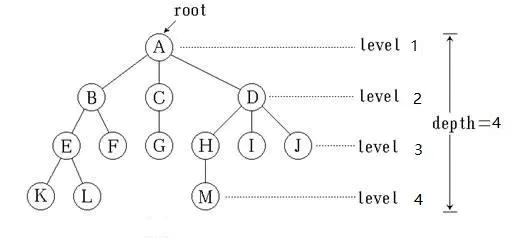
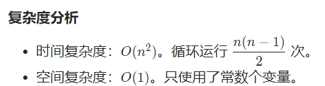
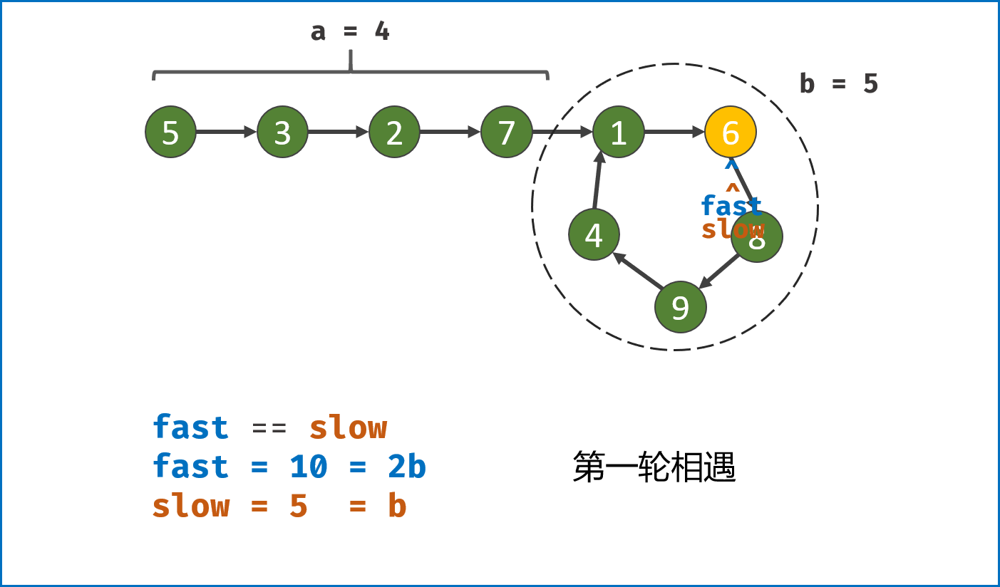
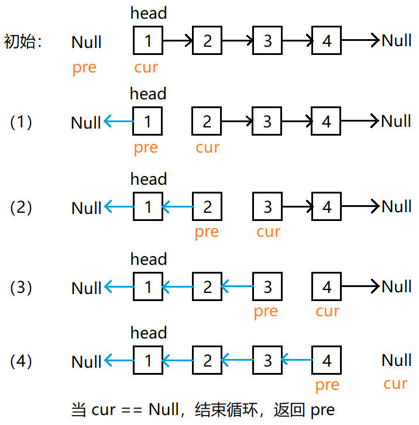
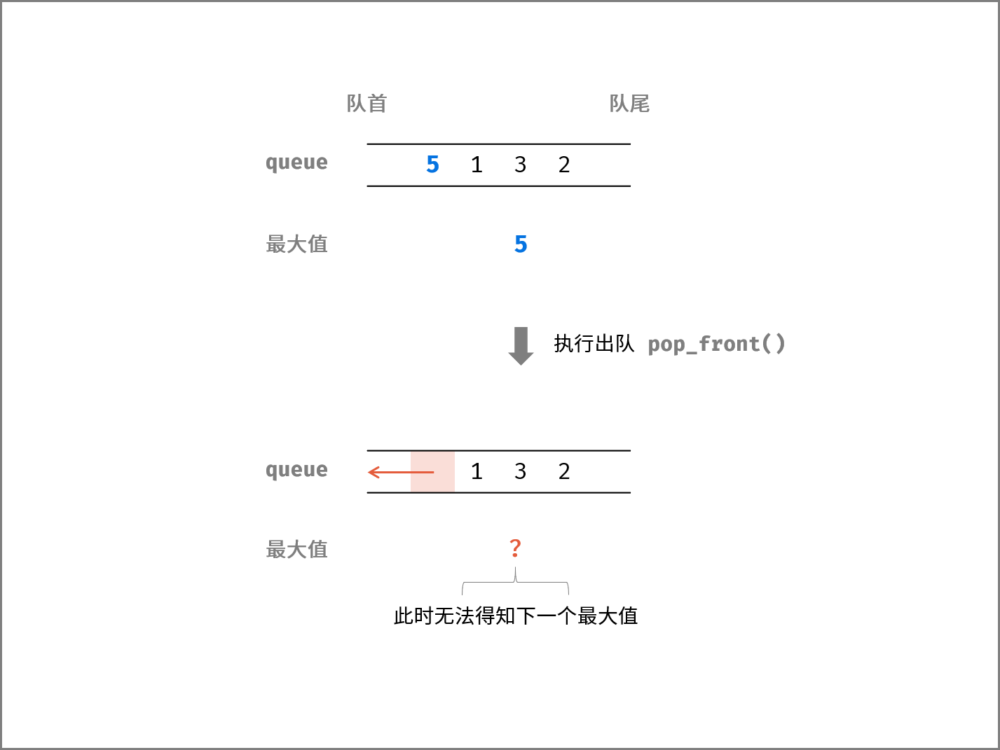
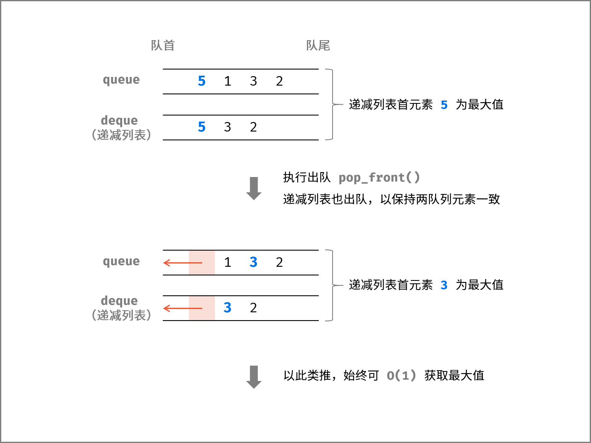

刷剑指Offer,然后是DP(刷完就不怕了),二分,字符串算法等


###### DP动态规划问题:5

python 树:binarytree模块以实现：

树的分支仍是树，因此**递归**有奇效

 树（Tree）是.svg+xml)个结点的有限集。在任意一棵树中：（1）有且仅有一个特定的称为根（Root）的节点；（2）当时，其余节点可分为个互不相交的有限集其中每一个集合本身又是一棵树，并且称为根的子树（SubTree）



树的**结点**包含一个数据元素(A)及若干指向其子树的分支(分支BCD)。节点拥有的子树数(**分支数**)量称为**节点的度**（Degree）。在图1中，A的度为3，B的度为2，C的度为1，F的度为0。度为0的结点称为**叶子（Leaf）结点**。在图1中，K,L,F,G,M,I,J都是该树的叶子。度不为0的结点称为**分支结点**。**树的度**是指树内各个结点的度的**最大值**。


结点的子树的根称为该结点的**孩子（Child）**，相应地，该结点称为孩子的**双亲（Parent）**。在图1,中，D是A的孩子，A是D的双亲。同一个双亲的孩子之间互称**兄弟（Sibling）**。在图1中，H,I,J互为兄弟。结点的**祖先**是从根到该结点所经分支上的所有结点。在图1中，M的祖先为A,D,H。对应地，以某结点为根的子树中的任一结点都称为该结点的**子孙**。在图1中，B的子孙为E,F,K,L。


树的**层次(Level)**是从根开始，根为第一层，根的孩子为第二层等。双亲在同一层的结点互为**同兄弟**，在图1中，K,L,M互为堂兄弟。树中结点的最大层次称为树的**深度(Depth)或高度**，在图1中，树的深度为4。
  如果将树中结点的各子树看成从左到右是**有次序的**（即不能交换），则称该树为**有序树**，否则为**无序树**。
  **森林（Forest）**是)棵**互不相交的树**的集合。**对树中每个结点而言，其子树的集合即为森林。**在机器学习模型中，决策树为树型结构，而随机森林为森林，是由若干决策树组成的森林。


**二叉树（Binary Tree）**是一种特殊的树型结构，它的特点是每个结点至多有两棵子树（即二叉树中不存在度大于2的结点），且二叉树的子树有左右之分，其次序不能任意颠倒（有序树）。

性质1）在二叉树的第层上至多有个结点.svg+xml)。
性质2）深度为的二叉树至多有个结点-164801422163513.svg+xml)。
性质3）对任何一棵二叉树，如果其叶子节点数为,度为2的结点数为，则。


在下图2中，（a）为满二叉树，（b）为完全二叉树。


满二叉树是完全二叉树的子集


二叉树的遍历:

**先序遍历**的操作定义为：若二叉树为空，为空操作；否则（1）访问根节点；（2）先序遍历左子树；（3）先序遍历右子树。
  **中序遍历**的操作定义为：若二叉树为空，为空操作；否则（1）中序遍历左子树；（2）访问根结点；（3）中序遍历右子树。
  **后序遍历**的操作定义为：若二叉树为空，为空操作；否则（1）后序遍历左子树；（2）后序遍历右子树；（3）访问根结点。
  **层序遍历**的操作定义为：若二叉树为空，为空操作；否则从上到下、从左到右按层次进行访问。

 关于二叉树的存储结构，可以选择**链式存储结构**。用于表示二叉树的链表中的结点至少包含3个域：**数据域和左、右指针**。


```css
先序遍历为:
18 7 3 4 11 5 1 3 6 2 4 
中序遍历为:
3 7 4 18 1 5 3 11 2 6 4 
后序遍历为:
3 4 7 1 3 5 2 4 6 11 18 
层序遍历为:
[[18], [7, 11], [3, 4, 5, 6], [1, 3, 2, 4]]
```

籍此对比一下不同遍历的情况


python堆：

Python没有独立的堆类型，而只有一个包含一些堆操作函数的模块。这个模块名为heapq（其中的q表示[队列](https://so.csdn.net/so/search?q=队列&spm=1001.2101.3001.7020)），它包含6个函数，其中前4个与堆操作直接相关。必须使用列表来表示堆对象本身。


模块heapq中一些重要的函数
                                          函 数                                                           描 述
            heappush(heap, x)                                        将x压入堆中
            heappop(heap)                                      从堆中弹出最小的元素
            heapify(heap)                                           让列表具备堆特征
            heapreplace(heap, x)                            弹出最小的元素，并将x压入堆中
            nlargest(n, iter)                                       返回iter中n个最大的元素
            nsmallest(n, iter)                                   返回iter中n个最小的元素

元素的排列顺序并不像看起来那么随意。它们虽然不是严格排序的，但必须保证一点：位置i处的元素总是大于位置i // 2处的元素（反过来说就是小于位置2 * i和2 * i + 1处的元素）。这是底层堆算法的基础，称为堆特征（heap property）。

比喻成在tree上，则结点处的数字必然大于其父节点，压入值时不断调整直至符合


删除则是删除结点然后找到最小的数字向上走


#### 排序算法：

- **比较类排序**：通过比较来决定元素间的相对次序，由于其时间复杂度不能突破O(nlogn)，因此也称为非线性时间比较类排序。
- **非比较类排序**：不通过比较来决定元素间的相对次序，它可以突破基于比较排序的时间下界，以线性时间运行，因此也称为线性时间非比较类排序。 


- **不稳定**：如果a原本在b的前面，而a=b，排序之后 a 可能会出现在 b 的后面。


昨日遗留:https://www.cnblogs.com/onepixel/articles/7674659.html排序实现原理:看 冒泡排序 插入排序 选择排序 归并排序 快速排序

https://leetcode-cn.com/problems/merge-k-sorted-lists/合并k个升序链表以及堆的用法和实现


**归并排列算法**:


```伪代码
MERGE_SORT(A, p, r)  
    if p < r  
        q = (p + r) / 2  
        MERGE_SORT(A, p, q)  
        MERGE_SORT(A, q + 1, r)  
        MERGE(A, p, q, r) 
```

分治过程操作：

分解：分解待排序的n个元素序列成各具n/2个元素的两个子序列。

解决：使用归并排序递归的排序两个子序列。

合并：合并两个已排序的子序列以产生已排序的答案,示意图参考上面


没做出来的题目:36,73，383


10不要做

做题顺序:后面的更考技巧,

first:

可以先做数据结构方面的题:

1.数组
2.栈
3.树
4.链表
5.堆/优先队列heap


second:

算法:

利用4种基础的数据结构 dict array tuple list

python 切片

python class, self

树:递归,迭代

堆:最小堆,最大堆,	始终保持第一个元素是最小或最大

https://www.cnblogs.com/wangchaowei/p/8288216.html

完全二叉树:本层不填满就不会有下一层

所以插入只需要O(log n)


collections


一些常见知识点

1. recursion（树->递归）
2. 堆heap，最小堆最大堆 collections
3. 滑动窗口
4. dfs/bfs
5. 双指针

6. 二分


注意做题的时候不懂得知识点


大厂实习:

1. Linkedin, 实习僧(不大靠谱,用来看有没有岗位,再投简历), 官方
2. b,a,字节,

小厂没有培养计划

**有可能就投简历**,别用qq邮箱,投完就刷算法,准备以前做过的项目(机器学习相关,人脸识别系统等等),

大厂能去贴钱也没关系

简历写标准模板,然后针对性改一下就行


考核模式

1.OA 电脑做笔试

2.打电话或者视频聊天


问算法和计算机基础(没啥用的)


简历写完发乐哥看看


有意思的题目：

数据结构：	53	229(难)	147 142	131	523	221	370  1762 -> 84 -> 85

算法

## 1.两数之和

除了暴力for循环以外，使用2哈希表记录数据，**以空间换时间,一般而言时间优先**


```python
class Solution:
    def twoSum(self, nums: List[int], target: int) -> List[int]:
        hash = dict()
        for i, num in enumerate(nums):
            if target - num in hash:
                return [hash[target - num], i]
            hash[nums[i]] = i
        return []
```

使用enumerate() 方法，记录了List中各值,实例如下

```python
>>> seq = ['one', 'two', 'three']
>>> for i, element in enumerate(seq):
...     print i, element
...
0 one
1 two
2 three
```

和for对比,空间从O(1)变成O(N),时间从O(N^2)变成O(N) (只要遍历一次)	,省大量时间

###### 反向索引表,文字对应索引

hash本身是方法,别用来做变量名


**提示：**

- `2 <= nums.length <= 10^4`
- `-109 <= nums[i] <= 109`
- `-109 <= target <= 109`

#### 这种题目

计算次数10^4

#### 计算复杂度一般不大于10^9,这里为10^4,故On^2可以过判断

## 2.两数相加

```python
# Definition for singly-linked list.
# class ListNode:
#     def __init__(self, val=0, next=None):
#         self.val = val
#         self.next = next
class Solution:
    def addTwoNumbers(self, l1: ListNode, l2: ListNode) -> ListNode:
        res=ListNode(0)
        c=res
        v=0
        up=0
        while l1 or l2 or up:           
            if  l1:
                v = l1.val 
                l1 = l1.next
            if  l2:
                v += l2.val 
                l2 = l2.next
            v=v+up
            v,up=v%10,v//10
            c.next = ListNode(v)

            c = c.next
            v=0

        return res.next
```

上面的类仅有两个方法,只能调用上面两个方法获取后面的值(不是list能直接相加),up用于记录进位操作,v用于记录数值,使用while保持循环,如果up大于0,还得记得进一位


### [3. 无重复字符的最长子串](https://leetcode-cn.com/problems/longest-substring-without-repeating-characters/)

使用python内置的set函数解答此问题

**set()** 函数创建一个无序不重复元素集，可进行关系测试，删除重复数据，还可以计算交集、差集、并集等。

```python
class Solution:
    def lengthOfLongestSubstring(self, s: str) -> int:
        # 哈希集合，记录每个字符是否出现过
        occ = set()
        n = len(s)
        # 右指针，初始值为 -1，相当于我们在字符串的左边界的左侧，还没有开始移动
        rk, ans = -1, 0
        for i in range(n):
            if i != 0:
                # 左指针向右移动一格，移除一个字符
                occ.remove(s[i - 1])
            while rk + 1 < n and s[rk + 1] not in occ:
                # 不断地移动右指针
                occ.add(s[rk + 1])
                rk += 1
            # 第 i 到 rk 个字符是一个极长的无重复字符子串
            ans = max(ans, rk - i + 1)
        return ans
```

官方解答,并不是一开始想的使用第一题的dict()方法,而且字典删重复字符左边的也不好删,使用set()函数滑动

for循环部分,有重复字符就不会进入while中,从重复字符的前一个开始remove,直至重复字符被删去

rk记录指针向右移的次数,i

 - 关键字：重复字符一〉出现1次
 • 模式识别1: 一旦涉及出现次数，需要用到散列表
 - 构造子串，散列表存下标
 - 模式识别2:涉及子串，考虑滑动窗口

```python
class Solution:
    def lengthOfLongestSubstring(self, s: str) -> int:
        hash=dict()
        m=0
        count=0
        for i,word in enumerate(s) :
            if word in hash:
                m=max(m,len(hash))
                for j in range(count,i):
                    del hash[j+1]
                    if word not in hash :
                        count=j
                        break
            hash[i]=word
        m=max(m,len(hash))
        return m
```


dic.pop(key)	删除方法,比用del好

array.pop(idx)	也是删除

remove(element)	删除键


### [217. 存在重复元素](https://leetcode-cn.com/problems/contains-duplicate/)

1.和twosum一样，使用哈希表做

2.

```python
class Solution:
    def containsDuplicate(self, nums: List[int]) -> bool:
        return not len(set(nums))==len(nums)
        #set() 函数创建一个无序不重复元素集，可进行关系测试，删除重复数据，还可以计算交集、差集、并集等。
        
        #方法2：先排序，然后判断相邻的两个元素是否相等，如果相等则说明存在重复的元素
        # nums.sort()
        # j = 1
        # while j < len(nums):
        #     if nums[j-1] == nums[j]:
        #         return True
        #     else:
        #         j += 1
        # return False

```

利用set不能存在重复元素的方法,简单解决问题,想法很巧妙


### [53. 最大子数组和](https://leetcode-cn.com/problems/maximum-subarray/)

比较简单,可以直接去网站上看


### [88. 合并两个有序数组](https://leetcode-cn.com/problems/merge-sorted-array/)

```python
class Solution:
    def merge(self, nums1: List[int], m: int, nums2: List[int], n: int) -> None:
        """
        Do not return anything, modify nums1 in-place instead.
        """
        sorted = []
        p1, p2 = 0, 0
        while p1 < m or p2 < n:
            if p1 == m:
                sorted.append(nums2[p2])
                p2 += 1
            elif p2 == n:
                sorted.append(nums1[p1])
                p1 += 1
                #上面两个是在其中一个数组耗尽时直接插入另外一个数组
            elif nums1[p1] < nums2[p2]:
                sorted.append(nums1[p1])
                p1 += 1
            else:
                sorted.append(nums2[p2])
                p2 += 1
                #比较两个待插入数的大小(原来以及排好序)
                #但是这样就用多了一个空间装sorted
                             
        nums1[:] = sorted
```

nums1的后半部分是空的，可以直接覆盖而不会影响结果。因此可以指针设置为从后向前遍历，每次取两者之中的较大者放进nums1的最后面。

*m*+*n*−*p*1−1≥*m*−*p*1−1+*n*−*p*2−1

等价于

p_2≥−1

即所谓的逆向双指针法,从后往前迭代

```python
class Solution:
    def merge(self, nums1: List[int], m: int, nums2: List[int], n: int) -> None:
        """
        Do not return anything, modify nums1 in-place instead.
        """
        p1, p2 = m - 1, n - 1
        tail = m + n - 1
        while p1 >= 0 or p2 >= 0:
            if p1 == -1:
                nums1[tail] = nums2[p2]
                p2 -= 1
            elif p2 == -1:
                nums1[tail] = nums1[p1]
                p1 -= 1
            elif nums1[p1] > nums2[p2]:
                nums1[tail] = nums1[p1]
                p1 -= 1
            else:
                nums1[tail] = nums2[p2]
                p2 -= 1
            tail -= 1
```


### [350. 两个数组的交集 II](https://leetcode-cn.com/problems/intersection-of-two-arrays-ii/)

自己的解法:根据进阶的提示,先排序然后使用双指针法

```python
class Solution:
    def intersect(self, nums1: List[int], nums2: List[int]) -> List[int]:
        mark_list=[]
        nums2.sort()
        nums1.sort()
        n=len(nums1)
        m=len(nums2)
        p1=n-1
        p2=m-1
        while p1>=0 or p2>=0:
            if p1==-1 or p2 ==-1:
                break
            if nums1[p1]>nums2[p2]:
                p1-=1
            elif nums1[p1]<nums2[p2]:
                p2-=1
            else:
                mark_list.append(nums1[p1])
                p1-=1
                p2-=1
        return mark_list

```

刚学的双指针就用上了,先用.sort排序然后从后往前反向用指针从而找到相同的数字


```python
class Solution:
    def intersect(self, nums1: List[int], nums2: List[int]) -> List[int]:
        hashtable=dict()
        res=[]
        for i in nums1:
            if i in hashtable:
                hashtable[i]+=1
            if not i in hashtable:
                hashtable[i]=1
        for j in nums2:
            if j in hashtable and hashtable[j]>0:
                hashtable[j]-=1
                res.append(j)
        return res

```

参考答案,先使用哈希表记录数值及其对应的出现次数,再递减使得进入res(list)的次数为二者次数最小值,仅参考思路

当然,先比较二者的长度,选用较短者作为哈希表的记录值更为恰当

```python
class Solution:
    def intersect(self, nums1: List[int], nums2: List[int]) -> List[int]:
        if len(nums1) > len(nums2):
            return self.intersect(nums2, nums1)
        #找出更短者
        m = collections.Counter()
        for num in nums1:
            m[num] += 1
        #记录
        intersection = list()
        for num in nums2:
            if (count := m.get(num, 0)) > 0:
                intersection.append(num)
                m[num] -= 1
                if m[num] == 0:
                    m.pop(num)
        
        return intersection

```

**collections**:**高性能容量数据类型**。

collections.Counter()是一个dict子类，主要是用来对你访问的对象的频率进行计数。其他用法具体看以下网站

https://www.cnblogs.com/dianel/p/10787693.html#counter

而这里的用法和上面list的用法也差不多


### [121. 买卖股票的最佳时机](https://leetcode-cn.com/problems/best-time-to-buy-and-sell-stock/)

```python
class Solution:
    def maxProfit(self, prices: List[int]) -> int:
        hashtable=dict()
        min_in=int(le9)
        #此处设为le9会更好,大数避免出现错误
        max_sell=prices[0]
        max_rich=0
        for i  in prices:
            if i<min_in:
                min_in=i
                max_sell=0
            elif i>=max_sell:
                max_sell=i1
                max_rich=max(max_rich,max_sell-min_in)            
        return max_rich

```

类似**滑动算法**,仅记录最小值(此时将最大值归0)和最大值(有新最大值则差可能要更新),从而不断向后滑动即可

方法二可以看做一种动态规划，只不过对空间复杂度进行了优化。考虑每次如何获取最大收益？第i天的最大收益只需要知道前i天的最低点就可以算出来了。而第i天以前（包括第i天）的最低点和i-1天的最低点有关，至此我们的动态方程就出来了。

- 时间复杂度：O(n)*O*(*n*)，只需要遍历一次。
- 空间复杂度：O(1)*O*(1)，只使用了常数个变量。


注意,此题目使用暴力法会超时(因为这个拖我老久了)




### [566. 重塑矩阵](https://leetcode-cn.com/problems/reshape-the-matrix/)

```python
class Solution:
    def matrixReshape(self, mat: List[List[int]], r: int, c: int) -> List[List[int]]:
        l1=len(mat[0])
        l2=len(mat)
        res=list()
        res_1=list()
        if l1*l2 != r*c:
            return mat
        #验证大小是否合法
        for i in range(r):
            res_1=list()
            for j in range(c):
                res_1.append(mat[(i*c+j)//l1][(i*c+j)%l1])
            res.append(res_1)
        return res

```


按照答案的方法，分别用//和%进行换行定位操作，但是使用了两个list，空间较大


```python
class Solution:
    def matrixReshape(self, mat: List[List[int]], r: int, c: int) -> List[List[int]]:
        l1=len(mat[0])
        l2=len(mat)
        res=list()
        if l1*l2 != r*c:
            return mat
        res = [[0] * c for _ in range(r)]
        for j in range(l1*l2):
            res[j//c][j%c]=(mat[j//l1][j%l1])
        return res
```

官方直接定义二维数组,少用一个list,但是定义数组的时候还是要for,所以时间差不多

时间复杂度：O(1)

空间复杂度：O(1)。这里的空间复杂度不包含返回的重塑矩阵需要的空间。


### [118. 杨辉三角](https://leetcode-cn.com/problems/pascals-triangle/)

```python
class Solution:
    def generate(self, numRows: int) -> List[List[int]]:
        res=list()
        res1=list()
        for i in range(numRows):
            res=list()
            for j in range(i+1):
                if j==0 or j==i:
                    res.append(1)
                else:
                    res.append(res1[i-1][j-1]+res1[i-1][j])
            res1.append(res)
        return res1
```

这里不直接构建二维list(因为每一层的大小不一样,不好搞),做法和上面一样


### [36. 有效的数独](https://leetcode-cn.com/problems/valid-sudoku/)

验证目前填的空有没有问题，然而自己写的代码有问题，

```python
class Solution:
    def isValidSudoku(self, board: List[List[str]]) -> bool:
        # 1、先生成三个数组
        rows = [[0] * 9 for _ in range(9)]
        columns = [[0] * 9 for _ in range(9)]   #9个1*9
        subboxes = [[[0] * 9 for _ in range(3)] for _ in range(3)]  #9个3*3数组
        # 遍历行
        
        for i in range(9):
            for j in range(9):
                c = board[i][j]
                if c != '.':
                    c = int(c) - 1
                    rows[i][c] += 1
                    columns[j][c] += 1
                    subboxes[int(i/3)][int(j/3)][c] += 1
                    #用数组位置进行计数，位置代表数字，数值代表出现次数
                    #下面做判断，如果>1，即出现超过一次，就报false
                    if rows[i][c] > 1 or columns[j][c]>1 or subboxes[int(i/3)][int(j/3)][c]>1:
                        return False
        return True
```


### [73. 矩阵置零](https://leetcode-cn.com/problems/set-matrix-zeroes/)


通过标记点处理数组,最少仅需一个标记点(复杂度O(1))即可处理数据

标准答案:

法1:所有需要归零的地方变为true,其余为false,空间为m*n

```python
class Solution:
    def setZeroes(self, matrix: List[List[int]]) -> None:
        m, n = len(matrix), len(matrix[0])
        row, col = [False] * m, [False] * n

        for i in range(m):
            for j in range(n):
                if matrix[i][j] == 0:
                    row[i] = col[j] = True
#标记位置

        for i in range(m):
            for j in range(n):
                if row[i] or col[j]:
                    matrix[i][j] = 0
#变0
```

复杂度分析

时间复杂度：O(mn)O(mn)，其中 mm 是矩阵的行数，nn 是矩阵的列数。我们至多只需要遍历该矩阵两次。

空间复杂度：O(m+n)O(m+n)，其中 mm 是矩阵的行数，nn 是矩阵的列数。我们需要分别记录每一行或每一列是否有零出现。


方法二：使用两个标记变量
思路和算法

我们可以用矩阵的第一行和第一列代替方法一中的两个标记数组，以达到 O(1)O(1) 的额外空间。但这样会导致原数组的第一行和第一列被修改，无法记录它们是否原本包含 00。因此我们需要额外使用两个标记变量分别记录第一行和第一列是否原本包含 00。

在实际代码中，我们首先预处理出两个标记变量，接着使用其他行与列去处理第一行与第一列，然后反过来使用第一行与第一列去更新其他行与列，最后使用两个标记变量更新第一行与第一列即可。

```python
class Solution:
    def setZeroes(self, matrix: List[List[int]]) -> None:
        m, n = len(matrix), len(matrix[0])
        flag_col0 = any(matrix[i][0] == 0 for i in range(m))
        flag_row0 = any(matrix[0][j] == 0 for j in range(n))
        #先看看第一行和第一列有没有0
        for i in range(1, m):
            for j in range(1, n):
                if matrix[i][j] == 0:
                    matrix[i][0] = matrix[0][j] = 0
        #从第二行(列)开始,遇到0就将当前行和列的第一位变成0
        for i in range(1, m):
            for j in range(1, n):
                if matrix[i][0] == 0 or matrix[0][j] == 0:
                    matrix[i][j] = 0
        #遇到边上(行和列第一位)是0的,将其余位变成0
        if flag_col0:
            for i in range(m):
                matrix[i][0] = 0
        
        if flag_row0:
            for j in range(n):
                matrix[0][j] = 0
		#第一行和第一列有可能有0但是刚刚没考虑到,所以补回去
```

复杂度分析

时间复杂度：**O(mn)**，其中 mm 是矩阵的行数，nn 是矩阵的列数。我们至多只需要遍历该矩阵两次。

空间复杂度：**O(1)**。我们只需要常数空间存储若干变量。

any()详见:,仅返回一个True或者False,刚刚好就用来最后迭代整行或者整列

https://www.runoob.com/python/python-func-any.html


#### 方法三：使用一个标记变量

就是法二的修改版

```python
class Solution:
    def setZeroes(self, matrix: List[List[int]]) -> None:
        m, n = len(matrix), len(matrix[0])
        flag_col0 = False
        
        for i in range(m):
            if matrix[i][0] == 0:
                flag_col0 = True
                #标记T F判断第一行是否需要更新
            for j in range(1, n):
                if matrix[i][j] == 0:
                    matrix[i][0] = matrix[0][j] = 0
        
        for i in range(m - 1, -1, -1):
            for j in range(1, n):
                if matrix[i][0] == 0 or matrix[0][j] == 0:
                    matrix[i][j] = 0
            if flag_col0:
                matrix[i][0] = 0
```

但为了防止每一列的第一个元素被提前更新，我们需要从最后一行开始，倒序地处理矩阵元素。

和法二比,仅采用第一行作为标记,无需提前记下第一列的标记(从前向后变0,标记就不会受到影响,所以可以直接迭代,需要记录标记少了列的)),少用一个变量


### [387. 字符串中的第一个唯一字符](https://leetcode-cn.com/problems/first-unique-character-in-a-string/)

#### 方法一：使用哈希表存储频数

**思路与算法**

直接用collections.Counter()做，因为Counter会按出现顺序记录，直接迭代即可

```python
class Solution:
    def firstUniqChar(self, s: str) -> int:
        a=collections.Counter(s)        
        for i, ch in enumerate(s):
            if a[ch] == 1:
                return i
        return -1

```

复杂度分析

时间复杂度：O(n)，其中 n是字符串 s的长度。我们需要进行两次遍历。

空间复杂度：O(∣Σ∣)，其中Σ 是字符集，在本题中 s只包含小写字母，因此 ∣Σ∣≤26。我们需要 O(∣Σ∣) 的空间存储哈希映射。


##### **方法二：使用哈希表存储索引

思路与算法**

我们可以对方法一进行修改，使得第二次遍历的对象从字符串变为哈希映射。

具体地，对于哈希映射中的每一个键值对，键表示一个字符，值表示它的首次出现的索引（如果该字符只出现一次）或者 −1（如果该字符出现多次）。当我们第一次遍历字符串时，设当前遍历到的字符为 c，如果 c 不在哈希映射中，我们就将 cc 与它的索引作为一个键值对加入哈希映射中，否则我们将 c 在哈希映射中对应的值修改为 −1。

在第一次遍历结束后，我们只需要再遍历一次哈希映射中的所有值，找出其中不为 −1 的最小值，即为第一个不重复字符的索引。如果哈希映射中的所有值均为 -1，我们就返回 -1。

```python
class Solution:
    def firstUniqChar(self, s: str) -> int:
        position = dict()
        n = len(s)
        for i, ch in enumerate(s):
            if ch in position:
                position[ch] = -1
            else:
                position[ch] = i
        first = n
        for pos in position.values():
            if pos != -1 and pos < first:
                first = pos
        if first == n:
            first = -1
        return first
```

用value值i来记录顺序,-1代表重复出现,从而实现哈希表迭代(dict没有顺序)

时间复杂度和空间复杂度与上面基本相同,主要区别在于迭代哈希表的值

```
for pos in position.values()
```

而非迭代原list


###### 当然,因为这里只有26个字符,所以原则上使用list建表,然后利用ASKNII码将 值与各个框对应会更快,因为省去了建表的时间


```python
class Solution:
    def firstUniqChar(self, s: str) -> int:
        position = dict()
        q = collections.deque()
        n = len(s)
        for i, ch in enumerate(s):
            if ch not in position:
                position[ch] = i
                q.append((s[i], i))
            else:
                position[ch] = -1
                while q and position[q[0][0]] == -1:
                    q.popleft()
        return -1 if not q else q[0][1]
```

q = collections.deque()双向列表,使得可以操作队列左边的字符,q同时记录(s[i], i)两个数据

position记录出现超过一次的字符

每一次for结尾时循环左删除(如果左边字母已重复)

最后输出则必然是位置i或者-1

时间复杂度：O(n)，其中 n 是字符串 s 的长度。遍历字符串的时间复杂度为 O(n)，而在遍历的过程中我们还维护了一个队列，由于每一个字符最多只会被放入和弹出队列最多各一次，因此维护队列的总时间复杂度为 O(∣Σ∣)，由于 s 包含的字符种类数一定小于 s 的长度，因此 O(∣Σ∣) 在渐进意义下小于O(n)，可以忽略。

空间复杂度：O(∣Σ∣)，其中 \SigmaΣ 是字符集，在本题中 s 只包含小写字母，因此∣Σ∣≤26。我们需要O(∣Σ∣) 的空间存储哈希映射以及队列


### [383. 赎金信](https://leetcode-cn.com/problems/ransom-note/)

collections.Counter()的又一运用

```python
class Solution:
    def canConstruct(self, ransomNote: str, magazine: str) -> bool:
        a=collections.Counter(ransomNote)
        b=collections.Counter(magazine)
        return not b-a
```

直接利用字典加减判断是否全大于，简单题


### [242. 有效的字母异位词](https://leetcode-cn.com/problems/valid-anagram/)

自己的做法：

```python
class Solution:
    def isAnagram(self, s: str, t: str) -> bool:
       
        if collections.Counter(s)-collections.Counter(t)==Counter() and collections.Counter(t)-collections.Counter(s)==Counter():
           return True
        return False
```

方法二：哈希表
从另一个角度考虑，t 是 s的异位词等价于「两个字符串中字符出现的种类和次数均相等」。所以建立一个哈希表,记录出现种类和次数,另外一个表出现则递减,最后所有value==0就行

### [141. 环形链表](https://leetcode-cn.com/problems/linked-list-cycle/)

链表!!!

```python
# Definition for singly-linked list.
# class ListNode:
#     def __init__(self, x):
#         self.val = x
#         self.next = None

class Solution:
    def hasCycle(self, head: Optional[ListNode]) -> bool:
        q=[]

        while head:
            if head in q:
                return True
            q.append(head)
            head=head.next
        return False
```

list记录经过的数值，向前迭代直至遇到之前的数值

```python
# Definition for singly-linked list.
# class ListNode:
#     def __init__(self, x):
#         self.val = x
#         self.next = None

class Solution:
    def hasCycle(self, head: Optional[ListNode]) -> bool:
        first = head
        second = head
        while(first and first.next and first.next.next):
            first = first.next
            first = first.next
            second = second.next
            if(first == second) :
                return True
        return False
```

快慢双指针,循环则必能遇上


### [21. 合并两个有序链表](https://leetcode-cn.com/problems/merge-two-sorted-lists/)

题目要求返回一个链表

递归法合并链表:

```python
class Solution:
    def mergeTwoLists(self, l1: ListNode, l2: ListNode) -> ListNode:
        if l1 is None:
            return l2
        elif l2 is None:
            return l1
        elif l1.val < l2.val:
            l1.next = self.mergeTwoLists(l1.next, l2)
            return l1
        else:
            l2.next = self.mergeTwoLists(l1, l2.next)
            return l2

```

时间复杂度：O(*m*+*n*)

空间复杂度：O(*m*+*n*)。

图解:

原表格

完成递归


递归返回


如果 l1 或者 l2 一开始就是空链表 ，那么没有任何操作需要合并，所以我们只需要返回非空链表。否则，我们要判断 l1 和 l2 哪一个链表的头节点的值更小，然后递归地决定下一个添加到结果里的节点。如果两个链表有一个为空，递归结束。


链表:当前节点指向下一个节点,下一个节点再指向下一个节点

```python
# Definition for singly-linked list.
# class ListNode:
#     def __init__(self, val=0, next=None):
#         self.val = val
#         self.next = next
class Solution:
    def mergeTwoLists(self, l1: ListNode, l2: ListNode) -> ListNode:
        prehead = ListNode(-1)

        prev = prehead
        while l1 and l2:
            if l1.val <= l2.val:
                prev.next = l1
                l1 = l1.next
            else:
                prev.next = l2
                l2 = l2.next            
            prev = prev.next

        # 合并后 l1 和 l2 最多只有一个还未被合并完，我们直接将链表末尾指向未合并完的链表即可
        prev.next = l1 if l1 is not None else l2

        return prehead.next
```

传统法

时间复杂度：*O*(*n*+*m*)

空间复杂度：*O*(1)


### [203. 移除链表元素](https://leetcode-cn.com/problems/remove-linked-list-elements/)

指针法

```python
# Definition for singly-linked list.
# class ListNode:
#     def __init__(self, val=0, next=None):
#         self.val = val
#         self.next = next
class Solution:
    def removeElements(self, head: ListNode, val: int) -> ListNode:
        dummy = ListNode(0,head)
        p = dummy
        while  p is  not None:
            if p.next and p.next.val==val:
                p.next==p.next.next
            else:
                p=p.next
        return dummy.next
```

时间复杂度: *O*(*n*)
空间复杂度: O*(1)*

```python
# Definition for singly-linked list.
# class ListNode:
#     def __init__(self, val=0, next=None):
#         self.val = val
#         self.next = next
class Solution:
    def removeElements(self, head: ListNode, val: int) -> ListNode:
        if head is None:
            return head
        head.next=self.removeElements(head.next,val)
        if head.val==val:
            next_nood=head.next
        else:
            next_nood=head
        return next_nood

```

https://leetcode-cn.com/problems/remove-linked-list-elements/solution/chi-xiao-dou-python-di-gui-die-dai-shuan-fayy/

借此参考迭代法

时间复杂度: O(n)
空间复杂度: O(1)


### [206. 反转链表](https://leetcode-cn.com/problems/reverse-linked-list/)


```python
# Definition for singly-linked list.
# class ListNode:
#     def __init__(self, val=0, next=None):
#         self.val = val
#         self.next = next
def reverseList(self, head: ListNode) -> ListNode:
    prev, curr = None, head
    while curr is not None:
        next = curr.next	#记录前移方向
        curr.next = prev	#指针向后指
        prev = curr			
        curr = next			##指针向前移动
    return prev
```

使用了3个指针，分别指向当前位置，前一位置和下一位置


next指针使得curr能向前移动(因为head.next已经被修改)


迭代：

```python
class Solution(object):
	def reverseList(self, head):
		"""
		:type head: ListNode
		:rtype: ListNode
		"""
		# 递归终止条件是当前为空，或者下一个节点为空，即第一次返回和
        #最后一次返回都在这里
		if(head==None or head.next==None):
			return head
		# cur接收每层递归函数的回传
		cur = self.reverseList(head.next)
		#head.next 的next 指向head	反转链表指向
		head.next.next = head
		# 防止链表循环，需要将head.next设置为空(断开循环)
		head.next = None
		# 每层递归函数都返回cur，也就是最后一个节点
		return cur
```

1. 递归上来就先写终止条件：如果head为空或者head.next为空，返回head
2. 新头结点newHead指向尾结点，此处进入递归，递归一直到遍历到尾结点时才会返回
3. 每一层递归，该层递归中的head会让下一个节点指向自己，head.next.next = head；然后head自己指向空。以此达到反转的目的。
4. 返回新链表的头结点newHead

https://leetcode-cn.com/problems/reverse-linked-list/solution/dong-hua-yan-shi-206-fan-zhuan-lian-biao-by-user74/

这里还总结了许多链表相关的题目

递归的前进用黑色画出，递归的返回用红色画出


### [19. 删除链表的倒数第 N 个结点](https://leetcode-cn.com/problems/remove-nth-node-from-end-of-list/)

双指针同时前进找到倒数第n个节点，然后替换掉就行

```python
# Definition for singly-linked list.
# class ListNode:
#     def __init__(self, val=0, next=None):
#         self.val = val
#         self.next = next
class Solution:
    def removeNthFromEnd(self, head: ListNode, n: int) -> ListNode:
        li=ListNode(0,head)
        l1=li
        l2=li.next
        for i in range(n):
            l2=l2.next
        while l2:
            l1=l1.next
            l2=l2.next
        l1.next=l1.next.next
        return li.next            
```


答案2：栈

```python
class Solution:
    def removeNthFromEnd(self, head: ListNode, n: int) -> ListNode:
        dummy = ListNode(0, head)
        stack = list()
        cur = dummy
        while cur:
            stack.append(cur)
            cur = cur.next
        
        for i in range(n):
            stack.pop()

        prev = stack[-1]
        prev.next = prev.next.next
        return dummy.next

```

使用栈的思想先进后出,找到倒数第n个结点

### [23. 合并K个升序链表](https://leetcode-cn.com/problems/merge-k-sorted-lists/)

暴力法1,直接迭代,数据放进list里面,然后再放进链表里面去

暴力法2:多次两两合并链表直至lists迭代完毕

```python
class Solution:
    def mergeKLists(self, lists: List[ListNode]) -> ListNode:
        if not lists: return None
        res = None #设置初始结果为空
        for listi in lists: #逐个遍历 两两合并
            res = self.mergeTwoLists(res, listi)
        return res
    def mergeTwoLists(self, l1: ListNode, l2: ListNode) -> ListNode:
        dummy = ListNode(0) #构造虚节点
        move = dummy #设置移动节点等于虚节点
        while l1 and l2: #都不空时
            if l1.val < l2.val:
                move.next = l1 #移动节点指向数小的链表
                l1 = l1.next
            else:
                move.next = l2
                l2 = l2.next
            move = move.next
        move.next = l1 if l1 else l2 #连接后续非空链表
        return dummy.next #虚节点仍在开头
```


最后的两链表合并部分不变，上部的两两合并改成归并形式的递归操作。

```python
class Solution:
    def mergeKLists(self, lists: List[ListNode]) -> ListNode:
        if not lists: return None
        n = len(lists) #记录子链表数量
        return self.mergeSort(lists, 0, n - 1) #调用归并排序函数
    
    def mergeSort(self, lists: List[ListNode], l: int, r: int) -> ListNode:
        if l == r:
            return lists[l]
        m = (l + r) // 2
        L = self.mergeSort(lists, l, m) #循环的递归部分
        R = self.mergeSort(lists, m + 1, r)
        return self.mergeTwoLists(L, R) #调用两链表合并函数
    
    def mergeTwoLists(self, l1: ListNode, l2: ListNode) -> ListNode:
        dummy = ListNode(0) #构造虚节点
        move = dummy #设置移动节点等于虚节点
        while l1 and l2: #都不空时
            if l1.val < l2.val:
                move.next = l1 #移动节点指向数小的链表
                l1 = l1.next
            else:
                move.next = l2
                l2 = l2.next
            move = move.next
        move.next = l1 if l1 else l2 #连接后续非空链表
        return dummy.next #虚节点仍在开头

```

归并部分时间复杂度:O(nlogn)


3.优先级队列(堆)

时间复杂度：O*(*nlog(k))，`n` 是所有链表中元素的总和，`k` 是链表个数。

这里记得复习!!!!!!

```python
# Definition for singly-linked list.
# class ListNode:
#     def __init__(self, x):
#         self.val = x
#         self.next = None

class Solution:
    def mergeKLists(self, lists: List[ListNode]) -> ListNode:
        import heapq
        dummy = ListNode(0)
        p = dummy
        head = []
        for i in range(len(lists)):
            if lists[i] :
                heapq.heappush(head, (lists[i].val, i))
                lists[i] = lists[i].next
        while head:
            val, idx = heapq.heappop(head)
            p.next = ListNode(val)
            p = p.next
            if lists[idx]:
                heapq.heappush(head, (lists[idx].val, idx))
                lists[idx] = lists[idx].next
        return dummy.next
```

将链表的第一个值和链表在list中的位置填入堆中，提取最小堆的第一个值填入链表

删除堆最小的值，找到这个最小值所在链表，然后填入链表的下一个值(如果有的话)

这里借用了最小堆的性质，实际上用max也不是不行

但是注意方法：**使用了元组记录当前值所在的链表**

heapq.heappush(head, (lists[idx].val, idx))	

这行代码重新将当前链表的下一个值压入堆中(if lists[idx]:的情况下，如果不是就不压)

```python
# Definition for singly-linked list.
# class ListNode:
#     def __init__(self, val=0, next=None):
#         self.val = val
#         self.next = next
class Solution:
    def mergeKLists(self, lists: List[Optional[ListNode]]) -> Optional[ListNode]:
        import heapq
        hashtable=ListNode(0)
        p=hashtable#避免指针变动
        lis_=[]
       # heapq.heapify(lis_)    
        for i in range (len(lists)):
            heapq.heappush(lis_,(lists[i].val,i))
            lists[i] = lists[i].next
        
        while lis_:
            it,where=heapq.heappop(lis_)
            hashtable.next=ListNode(it)
            hashtable=hashtable.next
            if lists[where]:
                heapq.heappush(lis_,(lists[where].val,where))
                lists[where]=lists[where].next
        return p.next
                

```

按照上面代码写的，吸收思想(虽然大体一致了)


### [83. 删除排序链表中的重复元素](https://leetcode-cn.com/problems/remove-duplicates-from-sorted-list/)

```python
# Definition for singly-linked list.
# class ListNode:
#     def __init__(self, val=0, next=None):
#         self.val = val
#         self.next = next
class Solution:
    def deleteDuplicates(self, head: ListNode) -> ListNode:
        hashtable=dict()
        q=ListNode(0,head)
        p=q
        while  q.next is not None:
            if q.next and q.next.val in hashtable  :
                q.next=q.next.next
            else:
                hashtable[q.next.val]=1
                q=q.next
            
        return p.next
            
```

哈希表算法，记得is not None
然后head=head.next 和head.next=head.next.next二选一即可

复习链表知识和哈希表标记


### [20. 有效的括号](https://leetcode-cn.com/problems/valid-parentheses/)

```python
class Solution:
    def isValid(self, s: str) -> bool:
        dic = {')':'(',']':'[','}':'{'}
        stack = []
        for i in s:
            if stack and i in dic:
                if stack[-1] == dic[i]: stack.pop()
                else: return False
            else: stack.append(i)
            
        return not stack

```

使用哈希表记录左括号对应的右括号

如果找到最后一个输入的对应括号则删掉最后一个输入(栈——FILO)

如果stack空 或 i不是那三个括号，则将i加入栈(反正如果不对应会判False)

最后如果为空(所有左括号均有右括号与其对应)则返回True

简单的栈的思想(FILO),借助哈希表得以完成判断


### [232. 用栈实现队列](https://leetcode-cn.com/problems/implement-queue-using-stacks/)

题目要求用两个栈实现FIFO队列

```python
class MyQueue:

    def __init__(self):
        self.stack1=list()
        self.stack2=list()

    def push(self, x: int) -> None:
        self.stack1.append(x)

    def pop(self) -> int:
        if self.stack2==[]:
            while self.stack1:
               self.stack2.append(self.stack1.pop())
        return self.stack2.pop()

    def peek(self) -> int:
        if self.stack2==[]:
            while self.stack1:
               self.stack2.append(self.stack1.pop())
        return self.stack2[-1]

    def empty(self) -> bool:
        return self.stack1==[] and self.stack2==[]

# Your MyQueue object will be instantiated and called as such:
# obj = MyQueue()
# obj.push(x)
# param_2 = obj.pop()
# param_3 = obj.peek()
# param_4 = obj.empty()
```

参考答案,利用栈的性质,两个栈(in和out)实现输入和输出


总结一下，在二叉树的前序、中序、后序遍历中，递归实现的伪代码为：


迭代实现的伪代码为：


树的四序遍历及前中后递归迭代输出https://leetcode-cn.com/problems/binary-tree-preorder-traversal/solution/tu-jie-er-cha-shu-de-si-chong-bian-li-by-z1m/


### [144. 二叉树的前序遍历](https://leetcode-cn.com/problems/binary-tree-preorder-traversal/)根左右

我们使用栈来进行迭代，过程如下：

**深度优先搜索：**先找到最深的地方

初始化栈，并将根节点入栈；
当栈不为空时：
		弹出栈顶元素 node，并将值添加到结果中；
		如果 node 的右子树非空，将右子树入栈；
		如果 node 的左子树非空，将左子树入栈；

```python
# Definition for a binary tree node.
# class TreeNode:
#     def __init__(self, val=0, left=None, right=None):
#         self.val = val
#         self.left = left
#         self.right = right
class Solution:
    def preorderTraversal(self, root: Optional[TreeNode]) -> List[int]:
        lis_=[]

        def fun(root):
            nonlocal lis_
            if not root:
                return

            lis_.append(root.val)
            fun(root.left)
            fun(root.right)
        fun(root)
        return lis_
```

递归处理二叉树,先传入值,然后迭代先左后右即可

```python
# Definition for a binary tree node.
# class TreeNode:
#     def __init__(self, val=0, left=None, right=None):
#         self.val = val
#         self.left = left
#         self.right = right
class Solution:
    def preorderTraversal(self, root: Optional[TreeNode]) -> List[int]:
        if not root:
            return []
        res,stack=[root],[]
        while res:
            nood=res.pop()
            if nood:
                stack.append(nood.val)
                if nood.right:
                    res.append(nood.right)
                if nood.left:
                    res.append(nood.left)
        return stack
```

由于栈是“先进后出”的顺序，所以入栈时先将右子树入栈，这样使得前序遍历结果为 “根->左->右”的顺序。(入栈顺序为 右 左,出栈顺序为左,右,从而实现前序遍历)


### [94. 二叉树的中序遍历](https://leetcode-cn.com/problems/binary-tree-inorder-traversal/)左根右

```python
# Definition for a binary tree node.
# class TreeNode:
#     def __init__(self, val=0, left=None, right=None):
#         self.val = val
#         self.left = left
#         self.right = right
class Solution:
    def inorderTraversal(self, root: Optional[TreeNode]) -> List[int]:
        lis_=[]
        def fun(root):
            nonlocal lis_
            if not root:
                return
            fun(root.left)
            lis_.append(root.val)
            fun(root.right)
        fun(root)
        return lis_
```


迭代法

```python
# Definition for a binary tree node.
# class TreeNode:
#     def __init__(self, val=0, left=None, right=None):
#         self.val = val
#         self.left = left
#         self.right = right
class Solution:
    def inorderTraversal(self, root: Optional[TreeNode]) -> List[int]:
        if not root:
            return
        cur,stack,res=root,[],[]
        while cur or stack: #提供循环条件	stack部分使得右子存在也能循环 
            while cur:#1.循环将左子入栈 2.判断有无右子(有则找其左子)
                stack.append(cur)
                cur=cur.left
            tmp=stack.pop()	#提出栈顶元素    
            res.append(tmp.val)	#放到res中
            cur=tmp.right		#返回本元素的右子(右子存在进第二while)

            
        
        return lis_
```


### [145. 二叉树的后序遍历](https://leetcode-cn.com/problems/binary-tree-postorder-traversal/)左右根

```python
# Definition for a binary tree node.
# class TreeNode:
#     def __init__(self, val=0, left=None, right=None):
#         self.val = val
#         self.left = left
#         self.right = right
class Solution:
    def postorderTraversal(self, root: Optional[TreeNode]) -> List[int]:
        lis_=[]
        def fun(root):
            nonlocal lis_
            if not root:
                return 
            fun(root.left)
            fun(root.right)
            lis_.append(root.val)
        fun(root)
        return lis_

        
```

后序,迭代

```python
# Definition for a binary tree node.
# class TreeNode:
#     def __init__(self, val=0, left=None, right=None):
#         self.val = val
#         self.left = left
#         self.right = right
class Solution:
    def postorderTraversal(self, root: Optional[TreeNode]) -> List[int]:
        if not root:
            return []
        res,stack=[root],[]
        while res:
            nood=res.pop()
            if nood:
                stack.append(nood.val)
                if nood.left:
                    res.append(nood.left)
                if nood.right:
                    res.append(nood.right)
        return stack[::-1]
```

左右根，即根右左[::-1]，借用前序迭代的代码换一下位置即可


### [102. 二叉树的层序遍历](https://leetcode-cn.com/problems/binary-tree-level-order-traversal/)

层次遍历：

前面的三种遍历都采用了深度优先搜索的方式，而层次遍历使用了广度优先搜索，广度优先搜索主要使用**队列**实现，所以需要一个额外的参数*level*来记录层数

**广度优先搜索**的步骤为：

初始化队列 q，并将根节点 root 加入到队列中；
当队列不为空时：
	队列中弹出节点 node，加入到结果中；
	如果左子树非空，左子树加入队列；
	如果右子树非空，右子树加入队列；

```python
class Solution:
    def levelOrder(self, root: TreeNode) -> List[List[int]]:
        if not root:
            return []
        level=0
        
        res,q=[],[root]
        while q:
            n=len(q)
            
            for i in range(n):
                node=q.pop(0)#这里q相当于一个队列(从前面开始删除)
                level.append(node.val)
                if node.left:
                    q.append(node.left)
                if node.right:
                    q.append(node.right)
            res.append(level)
        return res
```

level.append(node.val)和res.append(level)使得列表之间分层(题目要求)


输入:[1,2,3,4,5,6,7]

输出:[[1],[2,3],[4,5,6,7]]


### [104. 二叉树的最大深度](https://leetcode-cn.com/problems/maximum-depth-of-binary-tree/)

递归法(深度优先)：

```python
class Solution:
    def maxDepth(self, root: Optional[TreeNode]) -> int:
        if not root:
            return 0
        else:
            lef_= self.maxDepth(root.left)
            right_= self.maxDepth(root.right)
            return max(lef_,right_)+1
```

使用递归法，直至找出最深层并返回


非递归的深度优先：

```python
# Definition for a binary tree node.
# class TreeNode:
#     def __init__(self, val=0, left=None, right=None):
#         self.val = val
#         self.left = left
#         self.right = right
class Solution:
    def maxDepth(self, root: Optional[TreeNode]) -> int:
        if root is None:
            return 0
        cur,stack,res=[(root,0)],[],[]
        while cur:
            node,level=cur.pop()
            if node.left:
                cur.append((node.left,level+1))
            if node.right:
                cur.append((node.right,level+1))
            res.append(level)
        return max(res)+1
        
```

### [101. 对称二叉树](https://leetcode-cn.com/problems/symmetric-tree/)

递归法，简单粗暴

```python
# Definition for a binary tree node.
# class TreeNode:
#     def __init__(self, val=0, left=None, right=None):
#         self.val = val
#         self.left = left
#         self.right = right
class Solution:
    def isSymmetric(self, root: TreeNode) -> bool:

        if not root:
            return True
        
        def fun(left,right):
            # 递归的终止条件是两个节点都为空
			# 或者两个节点中有一个为空
			# 或者两个节点的值不相等
            if not(left or right):
                return True
            if not (left and right):
                return False
            if left.val!=right.val:
                return False
            return fun(left.left,right.right) and fun(right.left,left.right)

        return fun(root.left,root.right) 
```

迭代法：队列思想,左边是左树,右边是右树

```python
# Definition for a binary tree node.
# class TreeNode:
#     def __init__(self, val=0, left=None, right=None):
#         self.val = val
#         self.left = left
#         self.right = right
class Solution:
    def isSymmetric(self, root: TreeNode) -> bool:
        if not root or not (root.left or root.right) :
            return True

        cur,stack,res=[root.left,root.right],[],[]
        cur=collections.deque(cur)
        while cur:

            node_r=cur.pop()
            node_l=cur.popleft()        
            if not(node_l or node_r):
                continue
            if not(node_l and node_r):
                return False
            if node_l.val!=node_r.val:
                return False
            cur.appendleft(node_l.right)
            cur.appendleft(node_l.left)
            cur.append(node_r.left)
            cur.append(node_r.right)
        return True
```


### [226. 翻转二叉树](https://leetcode-cn.com/problems/invert-binary-tree/)

```python
# Definition for a binary tree node.
# class TreeNode:
#     def __init__(self, val=0, left=None, right=None):
#         self.val = val
#         self.left = left
#         self.right = right
class Solution:
    def invertTree(self, root: TreeNode) -> TreeNode:
        if not root:
            return root
        
        left=self.invertTree(root.left)
        right=self.invertTree(root.right)
        root.left,root.right=right,left
        return root
```


### [ 二叉搜索树中的插入操作](https://leetcode-cn.com/problems/insert-into-a-binary-search-tree/)


二叉搜索树的定义如下：(示意图如上)

对于树上任意节点 node

1. node 的左子树结点值一定小于 node 的值
2. node 的右子树结点值一定大于 node 的值
3. node 的左右子树均为二叉搜索树

根据该定义，就可以获得一个递归思路。如果根节点的值小于 val，则将根节点的右子树结点作为根节点继续搜索。否则将左子树的结点作为根节点继续搜索。

要注意处理结点为空的特殊情况，此时返回一个新结点，进行插入操作即可。

###### 迭代法

```python
# Definition for a binary tree node.
# class TreeNode:
#     def __init__(self, val=0, left=None, right=None):
#         self.val = val
#         self.left = left
#         self.right = right
class Solution:
    def insertIntoBST(self, root: TreeNode, val: int) -> TreeNode:
        if not root:
            return TreeNode(val)
        if(root.val<val):
            root.right=self.insertIntoBST(root.right,val)
        else:
            root.left =self.insertIntoBST(root.left, val)
        return root
```

###### 模拟法：

因此，当将 val 插入到以 root 为根的子树上时，根据val 与 root.val 的大小关系，就可以确定要将val 插入到哪个子树中。

如果该子树不为空，则问题转化成了将val 插入到对应子树上。
否则，在此处新建一个以val 为值的节点，并链接到其父节点root 上。

```python
class Solution:
    def insertIntoBST(self, root: TreeNode, val: int) -> TreeNode:
        if not root:
            return TreeNode(val)
        p=root
        while root:
            if val>root.val:
                if not root.right:
                    root.right=TreeNode(val)
                    break
                else :
                    root=root.right
            if val<root.val:
                if not root.left:
                    root.left=TreeNode(val)
                    break
                else:
                    root=root.left
        return p
```


### [98. 验证二叉搜索树](https://leetcode-cn.com/problems/validate-binary-search-tree/)

1.中序遍历为左中右，**有效** 二叉搜索树定义如下：

- 节点的左子树只包含 **小于** 当前节点的数。

- 节点的右子树只包含 **大于** 当前节点的数。

- 所有左子树和右子树自身必须也是二叉搜索树。

  所以可以直接迭代输出所有元素至一个list，后面的元素大于前面所有的元素，

1:遍历：时间为O(n)

2.后面的元素与前面最大的元素比较	时间O(∑nlogn)

所以时间复杂度为O(∑nlogn)

 

递归法：

```python
class Solution:
    def isValidBST(self, root: TreeNode) -> bool:
        def helper(node, lower = float('-inf'), upper = float('inf')) -> bool:
            if not node:
                return True
            
            val = node.val
            if val <= lower or val >= upper:
                return False
            #最上层root层符合判断
            if not helper(node.right, val, upper):#node.right>val
                return False
            if not helper(node.left, lower, val):#node.left<val
                return False
            return True#小于左大于右才返回Tr
        #返回True则在上层继续做判断,返回False,如果其中一个不符合
        #则if val <= lower or val >= upper:处直接返回False
        #从而不断返回False直至

        return helper(root)
```


迭代法

```python
class Solution:
    def isValidBST(self, root: TreeNode) -> bool:
        stack, inorder = [], float('-inf')
        
        while stack or root:
            while root:
                stack.append(root)
                root = root.left
            root = stack.pop()
            # 如果中序遍历得到的节点的值小于等于前一个 inorder，说明不是二叉搜索树
            if root.val <= inorder:
                return False
            inorder = root.val#记录上一节点
            root = root.right

        return True
```

借助中序迭代的性质,比较该节点和上一节点


### [148. 排序链表](https://leetcode-cn.com/problems/sort-list/)

分治例题:::

简单描述分治思想：

\> 把一个复杂的问题分成两个或更多的相同或相似的子问题，直到最后子问题可以简单的直接求解，原问题的解即子问题的解的合并


###### 方法一：**自顶向下归并排序**

对链表自顶向下归并排序的过程如下。

通过递归实现链表归并排序，有以下两个环节：

分割 cut 环节： 找到当前链表中点，并从中点将链表断开（以便在下次递归 cut 时，链表片段拥有正确边界）；
我们使用 fast,slow 快慢双指针法，奇数个节点找到中点，偶数个节点找到中心左边的节点。
找到中点 slow 后，执行 slow.next = None 将链表切断。
递归分割时，输入当前链表左端点 head 和中心节点 slow 的下一个节点 tmp(因为链表是从 slow 切断的)。
cut 递归终止条件： 当head.next == None时，说明只有一个节点了，直接返回此节点。
合并 merge 环节： 将两个排序链表合并，转化为一个排序链表。
双指针法合并，建立辅助ListNode h 作为头部。
设置两指针 left, right 分别指向两链表头部，比较两指针处节点值大小，由小到大加入合并链表头部，指针交替前进，直至添加完两个链表。
返回辅助ListNode h 作为头部的下个节点 h.next。
时间复杂度 O(l + r)，l, r 分别代表两个链表长度。

空间复杂度*O*(log*n*)

当题目输入的 head == None 时，直接返回None
链接：https://leetcode-cn.com/problems/sort-list/solution/sort-list-gui-bing-pai-xu-lian-biao-by-jyd/

```python
# Definition for singly-linked list.
# class ListNode:
#     def __init__(self, val=0, next=None):
#         self.val = val
#         self.next = next
class Solution:
    def sortList(self, head: Optional[ListNode]) -> Optional[ListNode]:
        if not head or not head.next:#中止条件
            return head
        slow,fast=head,head.next
        while fast and fast.next:
            slow,fast=slow.next,fast.next.next
        mid=slow.next#中间点作为后半部分的起始点
        slow.next=None#切断链表
        left,right=self.sortList(head),self.sortList(mid)
        #下层递归传至上层
        h=res=ListNode(0)
        
        
        while left and right:
            if left.val<right.val:
                h.next, left = left, left.next
            else:
                h.next, right = right, right.next
            h=h.next
        #判断合并
        if left:
            h.next=left
        else:
            h.next=right
        #剩下没判断完的也接回去
        
        
        return res.next
```


###### 解答二：归并排序（从底至顶直接合并）

对于非递归的归并排序，需要使用迭代的方式替换cut环节：
我们知道，cut环节本质上是通过二分法得到链表最小节点单元，再通过多轮合并得到排序结果。
每一轮合并merge操作针对的单元都有固定长度intv，例如：
第一轮合并时intv = 1，即将整个链表切分为多个长度为1的单元，并按顺序两两排序合并，合并完成的已排序单元长度为2。
第二轮合并时intv = 2，即将整个链表切分为多个长度为2的单元，并按顺序两两排序合并，合并完成已排序单元长度为4。
以此类推，直到单元长度intv >= 链表长度，代表已经排序完成。
根据以上推论，我们可以仅根据intv计算每个单元边界，并完成链表的每轮排序合并，例如:
当intv = 1时，将链表第1和第2节点排序合并，第3和第4节点排序合并，……。
当intv = 2时，将链表第1-2和第3-4节点排序合并，第5-6和第7-8节点排序合并，……。
当intv = 4时，将链表第1-4和第5-8节点排序合并，第9-12和第13-16节点排序合并，……。
此方法时间复杂度O(nlogn)O(nlogn)，空间复杂度O(1)O(1)。


省下了空间(递归的栈省下了)

```python
class Solution:
    def sortList(self, head: ListNode) -> ListNode:
        h, length, intv = head, 0, 1
        while h: h, length = h.next, length + 1 #算长度
        res = ListNode(0)
        res.next = head
        # merge the list in different intv.
        while intv < length:#比总长短就可以了
            pre, h = res, res.next
            while h:
                # get the two merge head `h1`, `h2`
                h1, i = h, intv
                while i and h: 
                    h, i = h.next, i - 1
                if i: 
                    break # no need to merge because the `h2` is None.
                h2, i = h, intv
                while i and h: 
                    h, i = h.next, i - 1
                c1, c2 = intv, intv - i # the `c2`: length of `h2` can be smaller than the `intv`.
                # merge合并 the `h1` and `h2`.
                while c1 and c2:#传完其中一个链表
                    if h1.val < h2.val: 
                        pre.next, h1, c1 = h1, h1.next, c1 - 1
                    else: 
                        pre.next, h2, c2 = h2, h2.next, c2 - 1
                    pre = pre.next
                if c1 :#接上剩下的另外一个链表
                    pre.next = h1
                else :
                    pre.next = h2
                while c1 > 0 or c2 > 0: 
                    pre, c1, c2 = pre.next, c1 - 1, c2 - 1
                pre.next = h 
            intv *= 2
        return res.next
```

时间:O(nlogn)

空间*O*(1)(全是链表自己的空间,递归产生的栈就省下了)


### [653. 两数之和 IV - 输入 BST](https://leetcode-cn.com/problems/two-sum-iv-input-is-a-bst/)

借助中序遍历，迭代将值放入hashtables里面，直至找到值，再将True递归出来

```python
class Solution:
    def findTarget(self, root: Optional[TreeNode], k: int) -> bool:
        res=[]
        count=0
        def fun(root):
            if not root:
                return False
            left=fun(root.left)
            if k-root.val in res:
                return True
            else:
                res.append(root.val)
            right=fun(root.right)
            return left or right
            
        return fun(root)    
```

- 时间复杂度：O*(*n)
- 空间复杂度：O*(*n)
- 当然官方做法是先迭代出来然后用**双指针**在迭代器中移动(我觉得不大行,全部找出来内存浪费())


### [235. 二叉搜索树的最近公共祖先](https://leetcode-cn.com/problems/lowest-common-ancestor-of-a-binary-search-tree/)

利用搜索树的定义,左右找路径,用列表记录,然后再找一处,即**两次遍历**

```python
class Solution:
    def lowestCommonAncestor(self, root: 'TreeNode', p: 'TreeNode', q: 'TreeNode') -> 'TreeNode':
        if not root:
            return None
        
        def path(root,val):
            lis_=[]
            node=root
            while node!=val:
                lis_.append(node)
                if node.val<val.val:
                    node=node.right
                else:
                    node=node.left 
            lis_.append(node)
            return path

        path1=path(root,p)     
        path2=path(root,q)
        for u in len(path1):
            if path1[u]==path2[u]:
                ancestor = path1[u]
            else:
                break
        
        return ancestor

```

由此也可以得出一次遍历的方法:即不同时走向左树或右树的节点为最近共同祖先

因为是搜索二叉树,所以上面的定律成立

```python
class Solution:
    def lowestCommonAncestor(self, root: 'TreeNode', p: 'TreeNode', q: 'TreeNode') -> 'TreeNode':
        if not root:
            return None
        mark=TreeNode(0)
        node=root
        while node!=p and node!=q:
            mark=node
            if node.val<p.val and node.val<q.val:
                node=node.right
            elif node.val>p.val and node.val>q.val: 
                node=node.left 
            else:
                break
        return node
```

- 时间复杂度：*O*(*n*)，其中 n*n* 是给定的二叉搜索树中的节点个数。分析思路与方法一相同。
- 空间复杂度：*O*(1)。


### [136. 只出现一次的数字](https://leetcode-cn.com/problems/single-number/)

reduce() 函数会对参数序列中元素进行累积。

函数将一个数据集合（链表，元组等）中的所有数据进行下列操作：用传给 reduce 中的函数 function（有两个参数）先对集合中的第 1、2 个元素进行操作，得到的结果再与第三个数据用 function 函数运算，最后得到一个结果。

```python
class Solution:
    def singleNumber(self, nums: List[int]) -> int:
        return reduce(lambda x, y: x ^ y, nums)
```

^异或运算满足**交换律，a^b^a=a^a^b=b**     ,所以前面的都变成0,而只出现过一次的元素（0^任意值=任意值）,即如上

异或符号在c和c++用的多(求二进制的补码)


### [169. 多数元素](https://leetcode-cn.com/problems/majority-element/)

找出现次数大于n/2的数：

1.hashtable法

用哈希表和collections.Counter()算出现次数，找到出现次数最多的那个

时间O(n)

空间O(n)

2.排序法：出现次数大于n/2，排序后中间的数必然是它

时间O(nlogn)

空间O(logn)(语言自带的排序算法)  O(1)(自己写堆算法)

3.随机化：

因为超过 n/2的数组下标被众数占据了，这样我们随机挑选一个下标对应的元素并验证，有很大的概率能找到众数

我们随机挑选一个下标，检查它是否是众数，如果是就返回，否则继续随机挑选。

期望的时间复杂度为 *O*(*n*)。 (O(n)检验是否为众数，随机抽取的期望O(2)=O(1))

空间复杂度:O(1)

4.投票法：

```python
class Solution:
    def majorityElement(self, nums: List[int]) -> int:
        count = 0
        candidate = None

        for num in nums:
            if count == 0:
                candidate = num
            count += (1 if num == candidate else -1)

        return candidate
```

相同投1,不同投-1,因为大于n/2,所以众数的count一定是正的,等于0时则换一个人上擂台，因为众数>n/2，所以最后剩下的必然是众数而且算法仅需遍历nums一次

复杂度分析

时间复杂度：O(n)。Boyer-Moore 算法只对数组进行了一次遍历。

空间复杂度：O(1)。Boyer-Moore 算法只需要常数级别的额外空间。

5. 分治法

   a是nums的众数,则至少是分成两部分后**其中一部分的众数**

我们使用经典的分治算法递归求解，直到所有的子问题都是长度为 1 的数组。长度为 1 的子数组中唯一的数显然是众数，直接返回即可。如果回溯后某区间的长度大于 1，我们必须将左右子区间的值合并。如果它们的众数相同，那么显然这一段区间的众数是它们相同的值。否则，我们需要比较两个众数在整个区间内出现的次数来决定该区间的众数。

```python
class Solution:
    def majorityElement(self, nums: List[int]) -> int:
        def majority_element_rec(lo, hi) -> int:
            # base case; the only element in an array of size 1 is the majority剩一个元素的时候返回
            # element.
            if lo == hi:
                return nums[lo]

            # recurse on left and right halves of this slice.
            mid = (hi - lo) // 2 + lo
            left = majority_element_rec(lo, mid)
            right = majority_element_rec(mid + 1, hi)

            # if the two halves agree on the majority element, return it.
            if left == right:
                return left

            # otherwise, count each element and return the "winner".
            left_count = sum(1 for i in range(lo, hi + 1) if nums[i] == left)
            right_count = sum(1 for i in range(lo, hi + 1) if nums[i] == right)

            return left if left_count > right_count else right

        return majority_element_rec(0, len(nums) - 1)
```


### [15. 三数之和](https://leetcode-cn.com/problems/3sum/)

```python
class Solution:
    def threeSum(self, nums: List[int]) -> List[List[int]]:
        a,b,c=0,1,2
        n=len(nums)
        res=[]
        while a!=n-2:
            
            if nums[a]+nums[b]+nums[c]==0:
                res.append([nums[a],nums[b],nums[c]])
            c+=1
            if c==n:
                b+=1
                c=b+1
            if b==n-1:
                a+=1
                b=a+1
                c=b+1
        return res
```

直接循环遍历，但是遇到list中有相同元素时会有重复三元组

1「不重复」的本质是什么？我们保持三重循环的大框架不变，只需要保证：

· 第二重循环枚举到的元素不小于当前第一重循环枚举到的元素；

· 第三重循环枚举到的元素不小于当前第二重循环枚举到的元素。

同时，对于每一重循环而言，相邻两次枚举的元素不能相同，否则也会造成重复。举个例子，如果排完序的数组为

```
[0, 1, 2, 2, 2, 3]
 ^  ^  ^
```

我们使用三重循环枚举到的第一个三元组为 (0, 1, 2)(0,1,2)，如果第三重循环继续枚举下一个元素，那么仍然是三元组 (0, 1, 2)(0,1,2)，产生了重复。因此我们需要将第三重循环「跳到」下一个不相同的元素，即数组中的最后一个元素 33，枚举三元组 (0, 1, 3)(0,1,3)


改进:

将第三重循环变成一个从数组最右端开始向左移动的指针,从而看成第一个数固定的双指针法，多个数字组合时也同理

而双指针法的时间复杂度为O(n),故

时间复杂度:O(n^2)   (排序的O(nlogn)和下面的是并列的,去大值)

空间复杂度:O(logn)	(排序算法所需的栈空间)

### 75.[ 颜色分类](https://leetcode-cn.com/problems/sort-colors/)

**原地**对它们进行排序，使得相同颜色的元素相邻

自己做法:用变量记录其出现次数(O(1)),清空list然后再重新按次数输入进去

collections.Counter()

当然,这显然是不符合规范的(毕竟要求原地更改)\


所以答案使用的是指针法:

1.单指针:

```python
class Solution:
    def sortColors(self, nums: List[int]) -> None:
        """
        Do not return anything, modify nums in-place instead.
        """
       
        n=len(nums)
        head =0
        for i in range(n):
            if nums[i]==0:
                nums[i],nums[head]=nums[head],nums[i]
                head+=1
        for j in range(n):
            if nums[j]==1:
                nums[j],nums[head]=nums[head],nums[j]
                head+=1
```

一个指针向前迭代遍历两次,head头标记记住当前头部位置

- 时间复杂度：*O*(*n*)
- 空间复杂度：*O*(1)。

2.双指针:

既然用一个指针能确定头部位置,为什么不多用一个确定尾部位置呢

```python
class Solution:
    def sortColors(self, nums: List[int]) -> None:
        """
        Do not return anything, modify nums in-place instead.
        """
       
        n=len(nums)
        head =0
        last =n-1
        for i in range(n):
            if nums[i]==0:
                nums[i],nums[head]=nums[head],nums[i]
                head+=1
            if nums[i]==2:
                nums[i],nums[last]=nums[last],nums[i]
                last-=1
```

但是,如果直接这样改显然是有问题的,可以发现，对于第二种情况，当我们将 nums[i] 与 [p2] 进行交换之后，新的nums[i] 可能仍然是 2，也可能是 0。然而此时我们已经结束了交换，开始遍历下一个元素nums[i+1]，不会再考虑nums[i] 了，这样我们就会得到错误的答案。

所以:当我们找到 2 时，我们需要**不断地将其与nums[p2] 进行交换，直到新的 num[i] 不为 2**。此时，如果nums[i] 为 0，那么对应着第一种情况；如果 nums[i] 为 1，那么就不需要进行任何后续的操作

```python
class Solution:
    def sortColors(self, nums: List[int]) -> None:
        n = len(nums)
        p0, p2 = 0, n - 1
        i = 0
        while i <= p2:
            while i <= p2 and nums[i] == 2:
                nums[i], nums[p2] = nums[p2], nums[i]
                p2 -= 1
            if nums[i] == 0:
                nums[i], nums[p0] = nums[p0], nums[i]
                p0 += 1
            i += 1
```

前后指针相遇,则遍历完成,所以

时间复杂度O(n)

空间复杂度O(1)


### [56. 合并区间](https://leetcode-cn.com/problems/merge-intervals/)

```python
class Solution:
    def merge(self, intervals: List[List[int]]) -> List[List[int]]:
        intervals.sort()
        i=1
        res=[]
       # res.append([intervals[0]])
        for i in intervals:
            if not res or res[-1][1]<i[0]:
                res.append(i)
            else:
                
                res[-1][1]=max (i[1],res[-1][1])
            
        return res
```

没啥难的,就是注意二维数组的格式即可


### [119. 杨辉三角 II](https://leetcode-cn.com/problems/pascals-triangle-ii/)

```python
class Solution:
    def getRow(self, rowIndex: int) -> List[int]:
        if rowIndex==0:
            return [1]
        res=[1]
        
        for i in range(rowIndex):
            #回来再改，记得设中间变量
            res.append(1)
            for j in range(1,i+1):        
                if j == 1:
                    temp = res[j]
                    res[j] = res[j] + 1
                else:
                    temp0=res[j]
                    res[j]=temp +res[j]
                    temp=temp0           
        return res
```

杨氏三角：因为只需要输出第n层，所以直接在res上进行修改，仅需要

空间复杂度O(n)

时间复杂度O(n^2)

### [48. 旋转图像](https://leetcode-cn.com/problems/rotate-image/)(原地旋转)

对于矩阵中第 i 行的第 j 个元素，在旋转后，它出现在倒数第 i 列的第 j个位置。

我们将其翻译成代码。由于矩阵中的行列从 00 开始计数，因此对于矩阵中的元素 matrix[row] [col]，在旋转后，它的新位置为 matrix _new[col] [n-row-1]

所以我们需要一个临时变量temp来记住被覆盖的值，而旋转90°是4次为循环的

所以对于每一个元素的操作，我们只需要重复4次即可

还有一个重要的问题在于：我们应该枚举哪些位置(row,col) 进行上述的原地交换操作呢？由于每一次原地交换四个位置

- 当 n*n* 为偶数时，我们需要枚举 n^2 / 4 = (n/2) \times (n/2)*n*2/4=(*n*/2)×(*n*/2) 个位置，可以将该图形分为四块，以 4 \times 44×4 的矩阵为例：
- 
- 当 n*n* 为奇数时，由于中心的位置经过旋转后位置不变，我们需要枚举 (n^2-1) / 4 = ((n-1)/2)* ((n+1)/2)个位置，需要换一种划分的方式，以 5×5 的矩阵为例：


从而实现全部旋转

```python
class Solution:
    def rotate(self, matrix: List[List[int]]) -> None:
        """
        Do not return anything, modify matrix in-place instead.
        """

   
        n = len(matrix)
        for i in range(n // 2):
            for j in range((n + 1) // 2):#偶数不影响，奇数符合条件
                matrix[i][j], matrix[n - j - 1][i], matrix[n - i - 1][n - j - 1], matrix[j][n - i - 1] \
                    = matrix[n - j - 1][i], matrix[n - i - 1][n - j - 1], matrix[j][n - i - 1], matrix[i][j]

```

下面是对于每个模块的迭代(偶数则整个/4，奇数则宽+1//2,长//2)

##### 法二：使用数学理解

对于一个90°顺时针旋转，等价于水平翻转+主对角线翻转

主对角线翻转：[r] [c]->[c] [r]

水平翻转：[r] [c]->[n-r-1] [c]		range(n//2)

```python
class Solution:
    def rotate(self, matrix: List[List[int]]) -> None:
        n = len(matrix)
        # 水平翻转
        for i in range(n // 2):
            for j in range(n):
                matrix[i][j], matrix[n - i - 1][j] = matrix[n - i - 1][j], matrix[i][j]
        # 主对角线翻转
        for i in range(n):
            for j in range(i):
                matrix[i][j], matrix[j][i] = matrix[j][i], matrix[i][j]

```


### [59. 螺旋矩阵 II](https://leetcode-cn.com/problems/spiral-matrix-ii/)

```python
class Solution:
    def generateMatrix(self, n: int) -> List[List[int]]:
        dirs = [(0, 1), (1, 0), (0, -1), (-1, 0)]
        matrix = [[0] * n for _ in range(n)]
        row, col, dirIdx = 0, 0, 0
        for i in range(n * n):
            matrix[row][col] = i + 1
            dx, dy = dirs[dirIdx]
            r, c = row + dx, col + dy
            if r < 0 or r >= n or c < 0 or c >= n or matrix[r][c] > 0:
                dirIdx = (dirIdx + 1) % 4   # 顺时针旋转至下一个方向
                dx, dy = dirs[dirIdx]
            row, col = row + dx, col + dy
        
        return matrix

```

直接迭代n^2次,按顺序遍历

##### 法二:


```python
class Solution:
    def generateMatrix(self, n: int) -> List[List[int]]:
        matrix = [[0] * n for _ in range(n)]
        num = 1
        left, right, top, bottom = 0, n - 1, 0, n - 1

        while left <= right and top <= bottom:
            for col in range(left, right + 1):
                matrix[top][col] = num
                num += 1
            for row in range(top + 1, bottom + 1):
                matrix[row][right] = num
                num += 1
            if left < right and top < bottom:
                for col in range(right - 1, left, -1):
                    matrix[bottom][col] = num
                    num += 1
                for row in range(bottom, top, -1):
                    matrix[row][left] = num
                    num += 1
            left += 1
            right -= 1
            top += 1
            bottom -= 1

        return matrix

```

如上图,使用4个标记,按层从外向里填入元素


### [240. 搜索二维矩阵 II](https://leetcode-cn.com/problems/search-a-2d-matrix-ii/)

```python
class Solution:
    def searchMatrix(self, matrix: List[List[int]], target: int) -> bool:
        for row in matrix:
            for element in row:
                if element == target:
                    return True
        return False

```

暴力遍历

- 时间复杂度：O(mn)
- 空间复杂度：O(1)


2.二分法

直接找每行中间的值,因为从左到右递增,直接中间分开然后看看在哪边

时间复杂度：O(m \log n)O(mlogn)。对一行使用二分查找的时间复杂度为 O(\log n)O(logn)，最多需要进行 mm 次二分查找。

空间复杂度：O(1)O(1)。

```python
class Solution:
    def searchMatrix(self, matrix: List[List[int]], target: int) -> bool:
        for row in matrix:
            idx = bisect.bisect_left(row, target)
            if idx < len(row) and row[idx] == target:
                return True
        return False
```

bisect是 python 的内置模块，主要用来排序,在使用其内置函数之前请先排序

#### 方法三：Z 字形查找

从右上角开始,走到左下角或越界结束

target<*matrix*[*x*,*y*]则向左走

target>*matrix*[*x*,*y*]则向下走

直至筛选出合适的值

```python
class Solution:
    def searchMatrix(self, matrix: List[List[int]], target: int) -> bool:
        m, n = len(matrix), len(matrix[0])
        x, y = 0, n - 1
        while x < m and y >= 0:
            if matrix[x][y] == target:
                return True
            if matrix[x][y] > target:
                y -= 1
            else:
                x += 1
        return False

```


### [435. 无重叠区间](https://leetcode-cn.com/problems/non-overlapping-intervals/)(笔记1)

给定一个区间的集合 intervals ，其中 intervals[i] = [starti, endi] 。返回 需要移除区间的**最小数量**，使**剩余区间互不重叠 **。

2.贪心算法:(动态规划的一部分(一种简单的动态规划))

如图,取右端点小的区间


把问题简化成了取右端点最小(因为它是必定被取到的)

然后以4为起点继续找下一个终点

把问题从去除区间最小变成区间内重叠最小变成当前区间内重叠最小


剩余list的数量最多→取区间重叠最小→取当前最快到达的区间右端点→即新的端点


贪心问题能解决:存在最优子结构(分解子问题)->使用方法找到最优子结构(解决每个子问题)->每次都寻找局部的最优->局部最优组合成全局最优(局部最优解迭代为全局最优解)

一般而言,评价维度单一()采用贪心,多元用动态规划

评价最优条件是什么？

循环条件-> 未解决问题&&还有解
从可能的解中取出最优解
执行最优解
缩小问题规模-> 双指针，for循环，减去最优解...


验证贪心算法:

1. 举反例  
2. 数学证明

一般而言,局部最优≠全局最优时,就可以考虑动态规划了


###### 零钱兑换

 给你一个整数数组coins ,表示不同面额的硬币；以及一个整数amount ,表示总金额。
 计算并返回可以凑成总金额所需的最少的硬币个数。如果没有任何一种硬币组合能组成总金额，返回-1 你可以认为每种硬币的数量是无限的。 

经典贪心法题目


###### 背包问题：

 最基本的背包问题就是01背包问题(01 knapsack problem)： 一共有N件物品，第i (i从1开始)件物品的重量为 w[i],价值为在总重量不超过背包承载上限W的情况下，能够装入背

背包问题只能动态规划,因为评价条件多元(有重量和价值两个)


贪心算法好题:121,122,123,188,452,134,316,300*(先做)

单调栈:LC42,84,85,496,503,739


数组17: 股票问题I的通用dp数组定义法 和 贪心法思想, 力扣121

数组18: 股票问题II 和 股票问题I的唯一不同之处, 力扣122

数组19: 股票问题III的dp数组构建/初始化和空间优化难点, 力扣123

数组20: 股票问题IV的dp数组构建和几个重要注意点, 力扣188

数组21: 股票问题+冷冻期的两种dp数组定义方式, 力扣309

数组22: 股票问题+手续费 和股票II的唯一不同之处, 力扣714

数组23：股票问题大总结, 彻底搞懂股票问题


链接：https://leetcode-cn.com/problems/best-time-to-buy-and-sell-stock/solution/si-wei-dao-tu-zheng-li-tong-yong-dpshu-z-n6n8/


### [122. 买卖股票的最佳时机 II](https://leetcode-cn.com/problems/best-time-to-buy-and-sell-stock-ii/)

贪心算法:

```
class Solution:
    def maxProfit(self, prices: List[int]) -> int:
        price_in=prices[0]
        rich=0
        for i in range(len(prices)):
            if  i!=len(prices)-1 and prices[i]<prices[i+1] :
                rich=rich+prices[i+1]-prices[i]
        return rich
```

算prices[i+1]-prices[i] (这个差>0时才算进去,否则不算)

为什么可以将问题替换成这样:

1. 与顺序无关()

2.  在每一步总是做出在当前看来最好的选择(简化版动态规划,不考虑前面和后面的影响)

3. 这道题 「贪心」 的地方在于，对于 「今天的股价 - 昨天的股价」，得到的结果有 3 种可能：① 正数，② 00，③负数。贪心算法的决策是： **只加正数** 。

4. 证明有效性:

   对于整个数列的prices[i+1]-prices[i],只有>0,=0,<0三种情况,只加>0的和显然是最大的,且题目不限制交易次数,故有求prices[i+1]-prices[i] 的正数和即可

对于不重叠问题,选择右端最小的值

对于求和问题,找出每一个和,再求和最大的值(即只取其中>0的值)


### [435. 无重叠区间](https://leetcode-cn.com/problems/non-overlapping-intervals/)

```python
class Solution:
    def eraseOverlapIntervals(self, intervals: List[List[int]]) -> int:
        intervals.sort(key=lambda x:x[1])
        mark_back=intervals[0][1]
        mark=0
        for i in range(len(intervals)-1):
            if mark_back> intervals[i+1][0]:
                mark+=1
            else:
                mark_back=intervals[i+1][1]
        return mark

```

对于这类可以分为多个子类问题的线性相加问题,可以先找到局部的最优法,再线性叠加全局最优法,从而得到全局最优法,即**"贪心"**算法

这里我们找到以区间最右端排序,并且实时维护上一个选择区间的右端点 \textit{right}right。如果当前遍历到的区间 [l_i, r_i] [l_i,r_i] 与上一个区间不重合，即 l_i ≥right，那么我们就可以贪心地选择这个区间，并将 right 更新为 r_i。


### [300. 最长递增子序列](https://leetcode-cn.com/problems/longest-increasing-subsequence/)

首先创建一个序列用于记录已有的子序列

最后整个算法流程为：

设当前已求出的最长上升子序列的长度为len（初始时为 1），从前往后遍历数组 nums，在遍历到nums[i] 时：

如果nums[i]>res[len] ，则直接加入到 dd 数组末尾，并更新 len= len+ 1；

否则，在 res 数组中**二分查找**，找到第一个比 nums[i] 小的数 d[k] ，并更新res[k+1]=nums[i]。

```python
class Solution:
    def lengthOfLIS(self, nums: List[int]) -> int:
        
        res=[nums[0]]
        for i in nums:
            if   res and i <=res[-1]:

                l, r = 0, len(res) - 1
                loc = r
                while l <= r:#二分法找数字,时间为logn
                    #小于等于,因为是严格递增序列,放后面是可以的
                    mid = (l + r) // 2
                    if res[mid] >= i:
                        loc = mid
                        r = mid - 1
                    else:
                        l = mid + 1
            else:
                res.append(i)
            res[loc] = i

        return len(res)
```

举例：

1 2 3 7 5 4 6 5 6->1 2 3 7 -> 1 2 3 5 ->1 2 3 4 ->1 2 3  4 6->1 2 3 4 5 ->1 2 3 4 5 6

时间：O(nlogn)    二分logn，遍历n个数

空间：O(n)		维护的那个res的长


### [452. 用最少数量的箭引爆气球](https://leetcode-cn.com/problems/minimum-number-of-arrows-to-burst-balloons/)

和最小不重复那题一样，直接右端点排序，然后和左端点比较即可

```python
class Solution:
    def findMinArrowShots(self, points: List[List[int]]) -> int:
        if not points:
            return 0
        points.sort(key=lambda x:x[1])
        first=0
        right=points[0][1]
        res=1
        for i in range(len(points)):
            if right<points[i][0]:
                res+=1
                right=points[i][1]
        return res
```


### [402. 移掉 K 位数字](https://leetcode-cn.com/problems/remove-k-digits/)

```python
class Solution:
    def removeKdigits(self, num: str, k: int) -> str:
        lis=[]
        remain = len(num) - k
        for i in num:
            while  k and lis and i<lis[-1]:
                #k=0 直接加进去  lis=0 没元素先加元素  i<lis[-1]判断条件
                lis.pop()               
                k-=1
            lis.append(i)
            #这里用while不用if,为了删掉前面所有大的数(把i向前移动)
        return ''.join(lis[:remain]).lstrip('0') or '0'
```


### [316. 去除重复字母](https://leetcode-cn.com/problems/remove-duplicate-letters/)

与上面题目不同，这道题没有一个全局的删除次数 k。而是对于每一个在字符串 s 中出现的字母 c 都有一个 k 值。这个 k 是 c 出现次数 - 1。

沿用上面的知识的话，我们首先要做的就是计算每一个字符的 k，可以用一个字典来描述这种关系，其中 key 为 字符 c，value 为其出现的次数。


```python
while stack and i<stack[-1] and remain_counter[stack[-1]]>0:
    seen.discard(stack.pop())
```

核心:三个条件

1. 记录数据的列表stack不为空时,才能进行删除(不然容易报错)
2. 在该字符小于最后一个字符(stack[-1])
3. 且最后一个字符时,才能删除stack[-1]

```python
seen.discard(stack.pop())
```

同时删除set和stack的那个字符,保证正常运作

由于判断当前字符是否在栈上存在需要O*(*N) 的时间,使用set能加快in 的搜索速度,空间换时间(多了一个set的空间,检索时间)


```python
class Solution:
    def removeDuplicateLetters(self, s) -> int:
        res=[]
        counter=collections.Counter(s)

        for i in s:
            if i not in res:
                while res and res[-1]>i and counter[res[-1]]>0:
                    res.pop()
                res.append
                counter[i]-=1
        return '',join(res)
            
```

因为res已经排好序了,如果要插入,必然是插入不在里面的值(在里面的比你更前至少比你好),所以才用如下判断

```python
if i not in res:
```

在字典序前面的才需要从后添加,但是如果已经在里面了,那添加个啥

所以代码如下:

```python
class Solution:
    def removeDuplicateLetters(self, s) -> int:
        res=[]
        counter=collections.Counter(s)

        for i in s:
            if i not in res:
                while res and res[-1]>i and counter[res[-1]]>0:
                    res.pop()
                res.append
                counter[i]-=1
        return '',join(res)
            
```

这个代码缺点在于需要在栈中查找存在与否,显然是不恰当的(时间是O(n),循环一下变O(n^2)),所以需要小改一下

查询给定字符是否在一个序列中存在的方法。根本上来说，有两种可能：


**有序**序列： 可以二分法，时间复杂度大致是O(N)。
**无序**序列： 可以使用遍历的方式，最坏的情况下时间复杂度为O(N)。我们也可以使用空间换时间的方式，使用 N的空间 换取O(1)的时间复杂度。

使用set来空间换时间(因为题目中的各个字母只在结果中出现一次)

```python
class Solution:
    def removeDuplicateLetters(self, s: str) -> str:
        stack=[]
        seen=set()
        remain_counter=collections.Counter(s)
        for i in s:
            if i not in seen:
                while stack and i<stack[-1] and remain_counter[stack[-1]]>0:
                    seen.discard(stack.pop())
                seen.add(i)
                stack.append(i)
            remain_counter[i]-=1

        return  ''.join(stack)
```

使用set用空间换时间


### [84. 柱状图中最大的矩形](https://leetcode-cn.com/problems/largest-rectangle-in-histogram/)

```python
class Solution:
    def largestRectangleArea(self, heights: List[int]) -> int:
        _max=0
        for i in range(len(heights)):
            _min=99999
            for j in range(i,len(heights)):
                _min=min(_min,heights[j])
                _max=max((j-i+1)*_min,_max)
        return _max
```

1.暴力法(超时)每个点均向后找最小值,然后汇总找最大值

暴力法2:对于某个点,直接找其左右至小于这个点的高度,算面积

(因为必定有一个点的高度是矩形的高,直到遇到高度小于 h*h* 的柱子)

```python
class Solution:
    def largestRectangleArea(self, heights: List[int]) -> int:
        _max=[]
        for i in range(len(heights)):
            j,k=i,i
            while j>0 and heights[j]>=heights[i]:
                j-=1
            while k<len(heights)-1 and heights[k]>=heights[i]:
                k+=1
            _max.append((k-j)*heights[i])
        return max(_max)
```


而以上两种方法时间复杂度都是O(N^2),会超时

###### 2.单调栈:

典型单调栈解决的问题:在一维数组中找第一个满足某种条件的数

而对于本题目,则是:在一维数组中对**每一个数**找到**第一个比自己小**的元素。

那么只需要对n个数迭代一次即可

所以我们需要两个单调栈,一个从左往右,记录左边比当前值小的点的位置,没有记录-1

​										一个从右往左,记录右边比当前值小的点的位置,没有记录len(h)

那其面积就是h(i)*(r[i]-l [i])

这里会有一种特殊情况。如果我们移除了栈中所有的 j 值，那就说明 i 左侧所有柱子的高度都大于height[i]，那么我们可以认为 i 左侧且最近的小于其高度的柱子在位置j=−1,同理i 右侧且最近的小于其高度的柱子在位置k=len(h)。

```python
class Solution:
    def largestRectangleArea(self, heights: List[int]) -> int:
        n=len(heights)
        l,r=[0]*n,[0]*n

        stack=[]
        for i in range(n):
            while stack and heights[stack[-1]]>=heights[i]:
                stack.pop()
            if not stack:
                l[i]=-1
            else:
                l[i]=stack[-1]
            stack.append(i)
        
        stack=[]
        for j in range(n-1,-1,-1):
            while stack and heights[stack[-1]]>=heights[j]:
                stack.pop()
            if not stack:
                r[j]=n
            else:
                r[j]=stack[-1]
            stack.append(j)

        ans = max((r[i] - l[i] - 1) * heights[i] for i in range(n)) if n > 0 else 0
        return ans
```

时间复杂度:O(N)	 每个位置只会入栈一次,最多出栈一次


3.单调栈+常数优化

怎么个常数优化法:

```python
class Solution:
    def largestRectangleArea(self, heights: List[int]) -> int:
        n=len(heights)
        left,right=[0]*n,[n]*n
        stack=[]

        for i in range(n):
            while stack and heights[stack[-1]] >=heights[i]:
                right[stack[-1]] = i
                stack.pop()
            if stack:
                left[i]=stack[-1]
            else:
                left[i]=-1
            stack.append(i)

        ans = max((right[i] - left[i] - 1) * heights[i] for i in range(n)) if n > 0 else 0
        return ans
```

1.right=[n]*n	把right的默认值放在右边,没遍历到就肯定是右值n了

2.right[stack[-1]] = i,遍历到的改为i,其余部分与之前相同,当然直接在这一步计算ans也是可行的

- 时间复杂度：*O*(*N*)。
- 空间复杂度：*O*(*N*)。


### [85. 最大矩形](https://leetcode-cn.com/problems/maximal-rectangle/)


和上一题相比,多了需要在矩阵中形成矩形的条件,方法基本相同

如图所示,转化为84的做法即可(遍历每行高度,用上一题的栈做法)

```
matrix=[[int(j) for j in i] for i in matrix]
for i in range(1,len(matrix)):
    matrix[i]=list(map(lambda a,b:a and a+b,matrix[i],matrix[i-1]))
for heights in matrix:
    #按照上一题计算heights即可
```

#### 前缀和 (差分)算法

前缀和是一个数组的某项下标之前(包括此项元素)的所有数组元素的和。


### [85. 最大矩形](https://leetcode-cn.com/problems/maximal-rectangle/)

计算*当前位置上方连续“1”的个数*，从而转换成上面的问题(求最大矩形面积)


```python
class Solution:
    def maximalRectangle(self, matrix: List[List[str]]) -> int:
        if not matrix:return 0
        m,n=len(matrix),len(matrix[0])
        # 记录当前位置上方连续“1”的个数
        pre=[0]*(n+1)
        res=0
        for i in range(m):
            for j in range(n):
                # 前缀和
                pre[j]=pre[j]+1 if matrix[i][j]=="1" else 0

            # 单调栈
            stack=[-1]
            for k,num in enumerate(pre):
                while stack and pre[stack[-1]]>num:
                    index=stack.pop()
                    res=max(res,pre[index]*(k-stack[-1]-1))
                stack.append(k)

        return res
```


### [496. 下一个更大元素 I](https://leetcode-cn.com/problems/next-greater-element-i/)

由于n1是n2的子集,所以可以直接用字典而不是和上面一样遍历列表,还省下了遍历的时间

```python
class Solution:
    def nextGreaterElement(self, nums1: List[int], nums2: List[int]) -> List[int]: 
        stack=[]
        res={}

        for i in range(len(nums2)-1,-1,-1):
            while stack and nums2[i]>=nums2[stack[-1]]:
                stack.pop()
            if stack:
                res[nums2[i]]=nums2[stack[-1]]
            else:
                res[nums2[i]]=-1
            stack.append(i)

        return [res[i] for i in nums1]
```

时间复杂度：*O*(*m*+*n*) 遍历n1和n2

空间复杂度：*O*(*n*)用于存储哈希表。


### [334. 递增的三元子序列](https://leetcode-cn.com/problems/increasing-triplet-subsequence/)

贪心算法，简化版的求最大严格递增子数列

```python
class Solution:
    def increasingTriplet(self, nums: List[int]) -> bool:
        mark=[nums[0],float('inf')]
        for i in nums[1:]:
            if i >mark[1]:
                mark.append(i)
                
            elif i>mark[0] :
                mark[1]=i
            
            else:
                mark[0]=i
            if len(mark)==3:
                break        
        return (len(mark)==3)
```


### [238. 除自身以外数组的乘积](https://leetcode-cn.com/problems/product-of-array-except-self/)

空间换时间，实际上为O(3N)

```python
class Solution:
    def productExceptSelf(self, nums: List[int]) -> List[int]:
        l,r,lis_=[1]*len(nums),[1]*len(nums),[1]*len(nums)
        for i in range(1,len(nums)):
            l[i]=l[i-1]*nums[i-1]

        for j in range(len(nums)-2,-1,-1):
            r[j]=r[j+1]*nums[j+1]

        for k in range(len(nums)):
            lis_[k]=l[k]*r[k]
        return lis_
```

时间复杂度：*O*(*N*)

空间复杂度：*O*(*N*)


那么,能不能省空间呢,当然是可以的

```python
class Solution:
    def productExceptSelf(self, nums: List[int]) -> List[int]:
        lenth=len(nums)
        res=[1]*lenth

        for i in range(1,lenth):
            res[i]=nums[i-1]*res[i-1]
#这样算等价于记录了上面的l
        r=1
        for j in range(lenth-1,-1,-1):
            res[j]=res[j]*r
            r*=nums[j]
#下面用不断迭代的r来代替上面的列表r,从而节省了空间
        return res
```


### [560. 和为 K 的子数组](https://leetcode-cn.com/problems/subarray-sum-equals-k/)

因为nuns中的数可以为负数，所以不能用双指针或滑动窗口法做

##### 1.暴力，对每个元素遍历一次列表

时间复杂度：*O*(*n*2)

空间复杂度：*O*(1)

##### 方法二：前缀和 + 哈希表优化

1. 初始化哈希表hash=\{0:1\}，表示累加和为0，出现了1次。初始化累加和sum=0。初始化结果count=0。

2. 遍历数组：

更新累加和sum+=nums[i]
若sum-ksum−k存在于hashhash中，说明存在连续序列使得和为kk。则令count+=hash[sum−k]，表示sum-k出现几次，就存在几种子序列使得和为k。
若sum存在于hash中，将其出现次数加一。若不存在，将其加入hash

3. 返回count


```python
class Solution:
    def subarraySum(self, nums: List[int], k: int) -> int:
        # num_times 存储某“前缀和”出现的次数，这里用collections.defaultdict来定义它
        # 如果某前缀不在此字典中，那么它对应的次数为0
        num_times = collections.defaultdict(int)
        num_times[0] = 1  # 先给定一个初始值，代表前缀和为0的出现了一次
        #使得前缀和=k的值也能被res计数
        cur_sum = 0  # 记录到当前位置的前缀和
        res = 0
        for i in range(len(nums)):
            cur_sum += nums[i]  # 计算当前前缀和
            if cur_sum - k in num_times:  # 如果前缀和减去目标值k所得到的值在字典中出现，即当前位置前缀和减去之前某一位的前缀和等于目标值
                res += num_times[cur_sum - k]
            # 下面一句实际上对应两种情况，一种是某cur_sum之前出现过（直接在原来出现的次数上+1即可），
            # 另一种是某cur_sum没出现过（理论上应该设为1，但是因为此处用defaultdict存储，如果cur_sum这个key不存在将返回默认的int，也就是0）
            # 返回0加上1和直接将其置为1是一样的效果。所以这里统一用一句话包含上述两种情况
            num_times[cur_sum] += 1
        return res
```

所谓的前缀和算法,实际上是保存所有的前缀和,每一次计算时寻找其存在与否,存在就+上出现的次数


collections.defaultdict([default_factory[, …]])

default_factory设为int(),从而用于计数

字符串中的字母第一次出现时，字典中没有该字母，default_factory函数调用int()为其提供一个默认值0,加法操作将计算出每个字母出现的次数。

函数int()是常值函数的一种特例，总是返回0。使用匿名函数（lambda function）可以更快、更灵活的创建常值函数，返回包括0在内的任意常数值。

```python
from collections import defaultdict
s = 'mississippi'
d = defaultdict(int)
for k in s:
    d[k] += 1
print('\n',d)
a=sorted(d.items())
print('\n',a)
```


该函数返回一个类似字典的对象(dict的子类),如果该变量存在，则用以初始化构造器，如果没有，则为None。**其它的功能和dict一样**


default_factory设为set时，可以用defaultdict建立集合字典（a dictionary of sets）


#使用前缀和算法


### [415. 字符串相加](https://leetcode-cn.com/problems/add-strings/)

将就看一下思路,利用双向数组实现左加,但是int 和str的变换烦死个人

```python
class Solution:
    def addStrings(self, num1: str, num2: str) -> str:
        num1,num2=list(num1),list(num2)
        num3=[]
        num3=collections.deque(num3)
        mark=0
        temp=0
        while num1 and num2:
            temp=int(num1.pop())
            temp+=int(num2.pop())
            temp+=mark
            mark=temp//10
            num3.appendleft(temp%10)
        if num1:
            num1[-1]+=mark
            num1=num1+num3
        if num2:
            num2[-1]+=mark
            num2=num2+num3
        if mark==1 and not num1 and not num2:
            num3.appendleft(1)

        return str(num3)
        

```


```python
class Solution:
    def addStrings(self, num1: str, num2: str) -> str:
        res = ""
        i, j, carry = len(num1) - 1, len(num2) - 1, 0
        while i >= 0 or j >= 0:
            n1 = int(num1[i]) if i >= 0 else 0
            n2 = int(num2[j]) if j >= 0 else 0
            tmp = n1 + n2 + carry
            carry = tmp // 10
            res = str(tmp % 10) + res
            i, j = i - 1, j - 1
        return "1" + res if carry else res
```

用if字符实现在短串前面的赋值操作,用数组组合+ 实现左加效果,且及时转变数据类型


### [409. 最长回文串](https://leetcode-cn.com/problems/longest-palindrome/)

```python
class Solution:
    def longestPalindrome(self, s: str) -> int:
        if not s:
            return 0
        res=0
        hashtables= collections.defaultdict(int)
        
        for i in s:
            if hashtables[i]==1:
                res+=1
                hashtables[i]=0
            else:
                hashtables[i]=1

        return res*2+1 if len(s)!=res*2 else res*2
```

用collections.defaultdict()方法,重写missing key,避免了找不到key时的报错

但是这样子还得遍历一次列表,不大好搞


```python
class Solution:
    def longestPalindrome(self, s: str) -> int:
        if not s:
            return 0
        res=0
        hashtables= collections.Counter(s)
        mark=0
        for i in hashtables.values():
            res+=i//2 *2
        return res+1 if res!=len(s) else  res
```

用counter算出现次数,反正我们不需要列出回文字符,所以用dict().values()来算保留多少对字符,结尾判断是否需要加上中间那个字符


### [763. 划分字母区间](https://leetcode-cn.com/problems/partition-labels/)

不使用贪心法,用字典记录出现次数,等于在整个数组中出现次数时删去该键,从而使得在字典为空时记录长度即可


```python
class Solution:
    def partitionLabels(self, s: str) -> List[int]:
        dic0= collections.defaultdict(int)
        num_times=collections.Counter(s)
        count=0
        res=[]
        for i in s:
            count+=1
            dic0[i]+=1
            if dic0[i]==num_times[i]:
                dic0.pop(i)
            if not dic0:
                res.append(count)
                count=0
        return res

```

时间复杂度为O(nlogn),主要是计数部分时间长,

空间复杂度：*O*(∣Σ∣)      Σ 是字符串中的字符集,题目中最大为26(num_times)


##### 贪心法(官方解答):

1.从前向后遍历,找到各个字母最后面的值所在位置,记录在last列表中

`end = max(end, last[ord(ch) - ord("a")])`

这段代码使得end恒为前面遇到过的str中遇到的字母中位置最后的位置


```python
class Solution:
    def partitionLabels(self, s: str) -> List[int]:
        last = [0] * 26
        for i, ch in enumerate(s):
            last[ord(ch) - ord("a")] = i
        
        partition = list()
        start = end = 0
        for i, ch in enumerate(s):
            end = max(end, last[ord(ch) - ord("a")])
            if i == end:
                partition.append(end - start + 1)
                start = end + 1
        
        return partition
```

时间复杂度为O(n),对数组的两次循环

空间复杂度：*O*(∣Σ∣)      Σ 是字符串中的字符集,题目中最大为26


### [49. 字母异位词分组](https://leetcode-cn.com/problems/group-anagrams/)

#### 注意:sorted(iter) 函数对于所有可迭代元素都有效,是全局函数

#### list.sort()	仅对列表生效

```python
class Solution:
    def groupAnagrams(self, strs: List[str]) -> List[List[str]]:
        
        dic=collections.defaultdict(list)
        for i in strs:
            key=''.join(sorted(i))
            dic[key].append(i)
        return list(dic.values())
```

##### 字符一样顺序不同,可以考虑排序法,排序后都一样

`''.join()`用来合并list中分开的各个字母,将其合成为一个str

时间复杂度：O*(*nk*log*k)

空间复杂度：O(nk)

*n* 是 *strs* 中的字符串的数量，*k* 是*strs* 中的字符串的的最大长度

代码简单,但是复杂度较高


#### 2.计数法

哈希表记录每一个单词字母出现数量,然后在哈希表中找就行

```python
class Solution:
    def groupAnagrams(self, strs: List[str]) -> List[List[str]]:
        
        dic=collections.defaultdict(list)
        for i in strs:#循环每个单词
            counts=[0]*26
            for ch in i:#字母循环计数
                counts[ord(ch)-ord('a')]+=1#这个方式计数排好顺序了
            dic[tuple(counts)].append(i)
        return list(dic.values())
```

dic[tuple(counts)].append(i)和上面不一样,原因是dict的key必须是可哈希的(一个对象的哈希值如果在其生命周期内绝不改变，就被称为可哈希 )(可哈希的key保证key对应value),元组tuple就是一个可哈希的对象,所以把list转化为tuple作为dic的key


时间复杂度：*O*(*n*(*k*+∣Σ∣))

空间复杂度：O*(*n*(*k+∣Σ∣))

### [43. 字符串相乘](https://leetcode-cn.com/problems/multiply-strings/)

分成两个部分:

multiply函数执行m位*1位操作

addStrings函数执行加法操作,加法与上面讲的基本一致,但是非常非常不好写

```python
class Solution:
    def multiply(self, num1: str, num2: str) -> str:
        if num1 == "0" or num2 == "0":
            return "0" 
        
        ans = "0"
        m, n = len(num1), len(num2)
        for i in range(n - 1, -1, -1):
            add = 0
            y = int(num2[i])
            curr = ["0"] * (n - i - 1)
            for j in range(m - 1, -1, -1):
                product = int(num1[j]) * y + add
                curr.append(str(product % 10))
                add = product // 10
            if add > 0:
                curr.append(str(add))
            curr = "".join(curr[::-1])
            ans = self.addStrings(ans, curr)

        return ans

    def addStrings(self, num1: str, num2: str) -> str:
        i, j = len(num1) - 1, len(num2) - 1
        add = 0
        ans = list()
        while i >= 0 or j >= 0 or add != 0:
            x = int(num1[i]) if i >= 0 else 0
            y = int(num2[j]) if j >= 0 else 0
            result = x + y + add
            ans.append(str(result % 10))
            add = result // 10
            i -= 1
            j -= 1
        return "".join(ans[::-1])
```

时间复杂度：O(mn+n^2)其中 *m* 和 *n* 分别是num*1 和 *num*2 的长度

因为拆分了num2做1位项

空间复杂度：O(m+n)


#### 方法二：做乘法

方法一的做法是从右往左遍历乘数，将乘数的每一位与被乘数相乘得到对应的结果，再将每次得到的结果累加，整个过程中涉及到较多字符串相加的操作。如果**用数组代替字符串存储结果，则可以减少对字符串的操作**。

令 m和 *n* 分别表示1*num*1 和num*2 的长度，并且它们均不为 0，则 num*1 和 *num*2 的乘积的长度为 m*+*n*−1 或*m*+*n。这个容易证明,就不证了

所以构建一个长为**m+n**数组来存储乘积,而进位也只需要放到下一位即可;如果第一维置零,则修正数组第一位

```python
class Solution:
    def multiply(self, num1: str, num2: str) -> str:
        if num1 == "0" or num2 == "0":
            return "0"

        m,n=len(num1),len(num2)
        res=[0]*(n+m)
        for i in range(m-1,-1,-1):
            x = int(num1[i])
            for j in range(n-1,-1,-1):
                res[i + j + 1] += x * int(num2[j])
        #先不考虑进位,正常进行加减
        mark=0	#进位,
        for i in range(m+n-1,-1,-1):
            res[i]+=mark#先把上一层的进位加上
            mark=res[i]//10#求下一层的进位
            res[i]=res[i]%10#去掉>10的部分
        
        index = 1 if res[0] == 0 else 0 #首位=0则不需要保留
        ans = "".join(str(x) for x in res[index:])#变回str
        return ans

```


### [187. 重复的DNA序列](https://leetcode-cn.com/problems/repeated-dna-sequences/)

哈希表记录序列的出现次数,

`if cnt[sub] == 2:`避免了结果重复出现的问题


```python
class Solution:
    def findRepeatedDnaSequences(self, s: str) -> List[str]:
        ans=[]
        cnt=collections.defaultdict(int)
        L=10
        for i in range(len(s)-L+1):
            sub = s[i : i + L]
            cnt[sub]+=1
            if cnt[sub] == 2:
                ans.append(sub)
        return ans
```


##### 法二:滑动窗口法

如果我们对每个长为 1010 的子串都单独计算其整数表示，那么时间复杂度仍然和方法一一样为 O(NL)。为了优化时间复杂度，我们可以用一个大小固定为10 的滑动窗口来计算子串的整数表示。设当前滑动窗口对应的整数表示为 x，当我们要计算下一个子串时，就将滑动窗口向右移动一位，此时会有一个新的字符进入窗口，以及窗口最左边的字符离开窗口，这些操作对应的位运算，按计算顺序表示如下：

滑动窗口向右移动一位：x = x << 2，由于每个字符用 2 个比特表示，所以要左移 2 位；
一个新的字符ch 进入窗口：x = x | bin[ch]，这里bin[ch] 为字符 ch 的对应二进制；
窗口最左边的字符离开窗口：x = x & ((1 << 20) - 1)，由于我们只考虑 xx 的低 2020 位比特，需要将其余位置零，即与上 (1 << 20) - 1。
将这三步合并，就可以用 O(1) 的时间计算出下一个子串的整数表示，即 x = ((x << 2) | bin[ch]) & ((1 << 20) - 1)。

```python
L = 10
bin = {'A': 0, 'C': 1, 'G': 2, 'T': 3}

class Solution:
    def findRepeatedDnaSequences(self, s: str) -> List[str]:
        n = len(s)
        if n <= L:
            return []
        ans = []
        x = 0
        for ch in s[:L - 1]:
            x = (x << 2) | bin[ch]
        cnt = defaultdict(int)
        for i in range(n - L + 1):
            x = ((x << 2) | bin[s[i + L - 1]]) & ((1 << (L * 2)) - 1)
            cnt[x] += 1
            if cnt[x] == 2:
                ans.append(s[i : i + L])
        return ans
```

- 时间复杂度：*O*(*N*)，其中 *N* 是字符串s* 的长度。
- 空间复杂度：O*(*N)。

滑动窗口法,感觉也没快到那里去


### [5. 最长回文子串](https://leetcode-cn.com/problems/longest-palindromic-substring/)

1. #### 暴力法:

枚举所有子串,找出最长回文序列

(大概会超时??)

2. #### 动态规划

对于一个子串而言，如果它是回文串，并且长度大于 2，那么将它首尾的两个字母去除之后，它仍然是个回文串。例如对于字符串“ababa”，如果我们已经知道“bab” 是回文串，那么 “ababa” 一定是回文串，这是因为它的首尾两个字母都是 “a”。

我们用 *P*(*i*,*j*) 表示字符串 s的第 i 到 j 个字母组成的串（下文表示成 s[i:j]）是否为回文串：

那么我们就可以写出动态规划的状态转移方程：

P(i, j) = P(i+1, j-1) 		∧      (*S[i]*==*S[j]*)

​			中间是回文串    		左右相同

上面条件是长度>2的,而<2的边界条件则是`


第一个是长为1的判断条件,第二个是长为2的判断条件


```python
class Solution:
    def longestPalindrome(self, s: str) -> str:
        n = len(s)
        if n < 2:
            return s
        
        max_len = 1
        b egin = 0
        # dp[i][j] 表示 s[i..j] 是否是回文串
        dp = [[False] * n for _ in range(n)]
        for i in range(n):
            dp[i][i] = True
        
        # 递推开始
        # 先枚举子串长度
        for L in range(2, n + 1):
            # 枚举左边界，左边界的上限设置可以宽松一些
            for i in range(n):
                # 由 L 和 i 可以确定右边界，即 j - i + 1 = L 得
                j = L + i - 1
                # 如果右边界越界，就可以退出当前循环
                if j >= n:
                    break
                    
                if s[i] != s[j]:#动态规划的状态转移方程
                    #P(i,j) = P(i+1,j-1) ∧ (S[i]==S[j])
                    dp[i][j] = False 
                else:
                    if j - i < 3:
                        dp[i][j] = True
                    else:
                        
                        dp[i][j] = dp[i + 1][j - 1]
                		#这里是第二个条件,P(i+1, j-1)
                        
                        
                # 只要 dp[i][L] == true 成立，就表示子串 s[i..L] 是回文，此时记录回文长度和起始位置
                if dp[i][j] and j - i + 1 > max_len:
                    max_len = j - i + 1
                    begin = i
                    
        return s[begin : begin + max_len]#输出部分用切片就行
```

总结,动态规划需要一个**动态规划的状态转移方程**使得程序可以迭代

设置合适的终止(初始)条件

**在这个状态转移方程中，我们是从长度较短的字符串向长度较长的字符串进行转移的，因此一定要注意动态规划的循环顺序。**

#### 方法三：中心扩展算法

观察上面可以发现，**所有的状态在转移的时候的可能性都是唯一的**。也就是说，我们可以从每一种边界情况开始「扩展」，也可以得出所有的状态对应的答案。

即使得i为中间点或中间点的左边点，向左右拓展得到长度，最终算出以每一个字母为中心点的回文字符串长度，再取最大值就行

```python
class Solution:
    def lenth(self,s:str,left:int ,right:int):
        while left>=0 and right<len(s) and  s[left] == s[right]:
            left-=1
            right+=1
        return left+1,right-1

    def longestPalindrome(self, s: str) -> str:
        start,end=0,0
        for i in range(len(s)):
            left1,right1=self.lenth(s,i,i+1)
            left2,right2=self.lenth(s,i,i)
            
            if right1-left1>end-start:
                start=left1
                end=right1

            if right2-left2>end-start:
                start=left2
                end=right2
        
        return s[start:end+1]

```

lenth求以i为中心的的最长回文数列的左右段

left1和left2用于求偶数和奇数长的回文数列


### [142. 环形链表 II](https://leetcode-cn.com/problems/linked-list-cycle-ii/)

哈希表记录每一个链表位置直至找到重复

```python
# Definition for singly-linked list.
# class ListNode:
#     def __init__(self, x):
#         self.val = x
#         self.next = None

class Solution:
    def detectCycle(self, head: ListNode) -> ListNode:
        if not head:
            return None
        hashtable=dict()
        b=head
        while not b in hashtable and b.next:
            hashtable[b]=1
            b=b.next
        if b in hashtable:
            return b
        else:
            return None

```

#### 2.快慢指针

如果有环,则必然有相遇(fast比slow每次快1,最终必定能赶上),而此时fast在环内

已知(设链表为a+b	a为非环形部分长 	b为一个环的长度)

1. 快指针步数是慢指针两倍f=2s	

2. 快指针在环内绕n圈找到慢指针    即f=s+nb      即s=nb




然而,仅靠以上条件是找不出b的长度的(n未知),故可以考虑再绕一次,即

##### 找f和s的第二次相遇

当slow在环的出发点时,已走步骤为a+nb	(n为整数不定值),而第一次相遇时为nb

所以再走a步即可——令fast回到head,步长为1地走,相遇时即为环起点


```python
#     def __init__(self, x):
#         self.val = x
#         self.next = None
class Solution:
    def detectCycle(self, head: ListNode) -> ListNode:
        if not head:
            return None
        slow,fast=head,head
        
        while True :
            if not (fast and  fast.next):
                return None
            slow=slow.next
            fast=fast.next.next
            if fast==slow:
                break
        fast=head
        while slow!=fast:
            slow=slow.next
            fast=fast.next

        return fast

```


### [160. 相交链表](https://leetcode-cn.com/problems/intersection-of-two-linked-lists/)

哈希表法

```python
# Definition for singly-linked list.
# class ListNode:
#     def __init__(self, x):
#         self.val = x
#         self.next = None

class Solution:
    def getIntersectionNode(self, headA: ListNode, headB: ListNode) -> ListNode:
        if not(headA and headB):
            return None
        hashtable=dict()
        while headA:
            hashtable[headA]=1
            headA=headA.next
        while headB:
            if headB in hashtable:
                return headB
            headB=headB.next
        return None
```

时间O(m+n)

空间O(m)

```python
class Solution:
    def getIntersectionNode(self, headA: ListNode, headB: ListNode) -> ListNode:
        a,b=headA,headB
        while True:
            a,b=a.next,b.next
            if not a.next:
                a=headB
            if not b.next:
                b=headA
            if a==b:
                break
        return a
```

这个看似完美,然而在AB不相交时会导致出错,所以有如下代码,使得A,B在为None时重合

```python
class Solution:
    def getIntersectionNode(self, headA: ListNode, headB: ListNode) -> ListNode:
class Solution:
    def getIntersectionNode(self, headA: ListNode, headB: ListNode) -> ListNode:
        A,B=headA,headB
        while A!=B:
            A = A.next if A else headB
            B = B.next if B else headA
            
        return A
```

时间复杂度为O(m+n),最坏结果为遍历两个列表各一次

空间复杂度为O(1),全程仅使用两个指针


### [82. 删除排序链表中的重复元素 II](https://leetcode-cn.com/problems/remove-duplicates-from-sorted-list-ii/)

不断删除后面重复出现的元素,再删掉第一个出现的重复元素

当然链表不用删除,直接跳过它的.next即可

```python
class Solution:
    def deleteDuplicates(self, head: ListNode) -> ListNode:
        if not head:
            return head
        h=ListNode(0)
        h.next=head
        cur=h
        while cur.next and cur.next.next:
            if cur.next.val == cur.next.next.val:
                x = cur.next.val
                while cur.next and cur.next.val == x:
                    cur.next = cur.next.next
            else:
                cur = cur.next
            if not head.next:
                break
        return h.next
```


### [24. 两两交换链表中的节点](https://leetcode-cn.com/problems/swap-nodes-in-pairs/)

```python
# Definition for singly-linked list.
# class ListNode:
#     def __init__(self, val=0, next=None):
#         self.val = val
#         self.next = next
class Solution:
    def swapPairs(self, head: ListNode) -> ListNode:
       # if
        
        he=ListNode(0,head)
        p=he
        temp=ListNode(0)
        while he.next and he.next.next:
            temp=he.next
            he.next=he.next.next
            temp.next=he.next.next
            he.next.next=temp

            he=he.next.next       
        return p.next
```

画个图看看就行，比较简单

### [206. 反转链表](https://leetcode-cn.com/problems/reverse-linked-list/)

```python
class Solution:
    def reverseList(self, head: ListNode) -> ListNode:
        slow,fast=None,head

        while fast is not None:
            nex=fast.next
            fast.next=slow
            slow=fast
            fast=nex
        return slow

```



### [25. K 个一组翻转链表](https://leetcode-cn.com/problems/reverse-nodes-in-k-group/)

注意到目标链表即为将原链表的左半端和反转后的右半端合并后的结果。

这样我们的任务即可划分为三步：

找到原链表的中点（参考「876. 链表的中间结点」）。

我们可以使用快慢指针来 O(N)O(N) 地找到链表的中间节点。
将原链表的右半端反转（参考[206. 反转链表](https://leetcode-cn.com/problems/reverse-linked-list/)」）。


我们可以使用迭代法实现链表的反转。
将原链表的两端合并。

因为两链表长度相差不超过 11，因此直接合并即可。

```python
class Solution:
    # 翻转一个子链表，并且返回新的头与尾
    def reverse(self, head: ListNode, tail: ListNode):
        prev = tail.next
        p = head
        while prev != tail:
            nex = p.next
            p.next = prev
            prev = p
            p = nex
        return tail, head

    def reverseKGroup(self, head: ListNode, k: int) -> ListNode:
        hair = ListNode(0)
        hair.next = head
        pre = hair

        while head:
            tail = pre
            # 查看剩余部分长度是否大于等于 k
            for i in range(k):
                tail = tail.next
                if not tail:
                    return hair.next#长度不为nk时的返回点
            nex = tail.next
            head, tail = self.reverse(head, tail)
            # 把子链表重新接回原链表
            pre.next = head
            tail.next = nex
            pre = tail
            head = tail.next
        
        return hair.next
```

### [876. 链表的中间结点](https://leetcode-cn.com/problems/middle-of-the-linked-list/)

经典**双指针法**，不必多讲

```python
# Definition for singly-linked list.
# class ListNode:
#     def __init__(self, val=0, next=None):
#         self.val = val
#         self.next = next
class Solution:
    def middleNode(self, head: ListNode) -> ListNode:
        fast=head
        slow=head
        while fast and fast.next:
            fast=fast.next.next
            slow=slow.next

        return slow

```


### [143. 重排链表](https://leetcode-cn.com/problems/reorder-list/)不会

法1：用列表记录列表顺序，然后找值(空间O(n),时间O(n))

方法二：寻找链表中点 + 链表逆序 + 合并链表
注意到目标链表即为将原链表的左半端和反转后的右半端合并后的结果。

这样我们的任务即可划分为三步：

找到原链表的中点（参考「[876. 链表的中间结点](https://leetcode-cn.com/problems/middle-of-the-linked-list/)」）。

我们可以使用快慢指针来 O(N)O(N) 地找到链表的中间节点。
将原链表的右半端反转（参考[[206. 反转链表](https://leetcode-cn.com/problems/reverse-linked-list/)]）。

我们可以使用迭代法实现链表的反转。
将原链表的两端合并。

因为两链表长度相差不超过 11，因此直接合并即可。

```python
class Solution:
    def reorderList(self, head: ListNode) -> None:
        if not head:
            return
        
        mid = self.middleNode(head)#找中点
        l1 = head
        l2 = mid.next
        mid.next = None
        l2 = self.reverseList(l2)#翻转
        self.mergeList(l1, l2)#合成
    
    def middleNode(self, head: ListNode) -> ListNode:
        slow = fast = head
        while fast.next and fast.next.next:
            slow = slow.next
            fast = fast.next.next
        return slow
    
    def reverseList(self, head: ListNode) -> ListNode:
        prev = None
        curr = head
        while curr:
            nextTemp = curr.next
            curr.next = prev
            prev = curr
            curr = nextTemp
        return prev

    def mergeList(self, l1: ListNode, l2: ListNode):
        while l1 and l2:
            l1_tmp = l1.next
            l2_tmp = l2.next

            l1.next = l2
            l1 = l1_tmp

            l2.next = l1
            l2 = l2_tmp
```


```python
class Solution:
    def reorderList(self, head: ListNode) -> None:
        fast,slow=head,head
        while fast.next and fast.next.next:
            slow=slow.next
            fast=fast.next.next
        mid=slow

        first,second=None,mid
        while second:
            nex=second.next
            second.next=first
            first=second
            second=nex
        last=first
        l1,l2=head,last

        while l1 and l2:
            l1_tmp = l1.next
            l2_tmp = l2.next

            l1.next = l2
            l1 = l1_tmp

            l2.next = l1
            l2 = l2_tmp

```

不用函数直接写

时间O(n)

空间O(1)


### **[1249. 移除无效的括号](https://leetcode-cn.com/problems/minimum-remove-to-make-valid-parentheses/)**思路没问题,代码有点小问题

```python
class Solution:
    def minRemoveToMakeValid(self, s: str) -> str:
        hashtables=[]
        for i in range(len(s)):
            if s[i]=='(':
                hashtables.append(i)
            if s[i]==')':
                if hashtables:
                    hashtables.pop()
                else:
                    s=s[:i]+s[i+1:]
        if hashtables:
            for j in hashtables:
                s=s[:j]+s[j+1:]
        return s
```

这个代码是有问题的,因为修改字符串时会改变字符串长度,所以这显然是不行的


同思路,'('入栈出栈,但是弹出方法显然更好

```python
class Solution:
    def minRemoveToMakeValid(self, s: str) -> str:
        removes = [-1]
        l_paren = []
        for i in range(len(s)):
            if s[i] == '(':
                l_paren.append(i)
            elif s[i] == ')':
                if len(l_paren) == 0:
                    removes.append(i)
                else:
                                                                                                                                                                                       l_paren.pop()
        removes = removes + l_paren + [len(s) + 1]#removes里面全是要删除的东西
#[len(s) + 1]用于保证removes不存在元素时也能正常运行程序
        ans = []
        for idx in range(len(removes) - 1):
            ans += s[removes[idx] + 1 : removes[idx + 1]]#用切片实现删除
        return ''.join(ans)
```

对于这种处理字符串的操作，创建新的列表进行操作而非直接原地操作显然更好(多了空间少了调节参数idx的麻烦)


### [1823. 找出游戏的获胜者](https://leetcode-cn.com/problems/find-the-winner-of-the-circular-game/)

```python
class Solution:
    def findTheWinner(self, n: int, k: int) -> int:
        if n == 1:
            return 1
        val=0
        for i in range(2,n+1):
            cur = (val + k) % i
            val = cur
        return val + 1
```

对于`%运算`的理解：

- > 3%10 = 1；`(3/10=3......1)`
  >
  > 举例说明：
  >
  > 在数组[1,2,3]，从第一位元素开始从左往右循环数10次，第10次必定会落在第一位。

即将求余操作是为对循环的列表进行搜寻

而实际操作是在首次删除掉了k-1位元素后，之后都是不断在数组中***循环***遍历第k个数字进行删除。

##### 原理:

对于一个比赛

其实最初是有n个人参赛，按数k每次淘汰一个，所以第一轮过后就剩下n-1个人，然后这n-1个人就按数K继续比赛。而这剩下n-1比赛最终剩下的幸运儿我们记为**f(n-1,k)**，那这个人**同样也是n个人参赛的胜出者f(n,k)**，但是**编号可能不同**。即**f(n-1,k)与f(n,k)存在联系**。

即通过f(n-1,k)可以得到f(n,k),而f(1,k)=1,所以可以从后往前推

位置的变化则有式子f(n)=(f(n-1)+k)%n得到 ( 位置+步数再对当前长度求余即上一次的位置)

这实际上也是一种动态规划dp

我们先来看有n个人数k个后的情况。
初始： 1,2,......,k-1, k, k+1,......n
淘汰后: 1,2,......,k-1, k+1,......n (此时k已经被淘汰，下一轮从k+1开始，而下一轮是n-1个人，所以可以看到)

下一轮：k+1,......n-1,n,1.......,k-1 (我们能够发现此时位置发生了偏移， 即原先n时的1位置，在n-1处是k+1，所以产生偏移量k)

### [108. 将有序数组转换为高度平衡的二叉搜索树](https://leetcode-cn.com/problems/convert-sorted-array-to-binary-search-tree/)


AVL:高度平衡二叉搜索树，因为高度平衡，

搜索元素最长时间从n(近似于排列好的list)到log(n)，使得时间


一个有序数组有多个二叉搜索树,而为了实现高度平衡,我们最好选用中间值作为根(那样更容易高度平衡)

```python
class Solution:
    def sortedArrayToBST(self, nums: List[int]) -> TreeNode:

        def make_tree(start_index, end_index): #只和长度有关
            #首先判定我们的区间是否合理，即left_index要<=right_index
            #当相等时，只有root会产生，不会产生左右小树
            if start_index > end_index:
                return None
            
            #我这里变量名都写得比较长，目的是方便理解
            mid_index = (start_index + end_index)//2    #找中间值
            this_tree_root = TreeNode(nums[mid_index]) #中间值做一个小树的root

            this_tree_root.left = make_tree(start_index,mid_index-1)#左树为 开始到中间值-1
            this_tree_root.right = make_tree(mid_index+1, end_index)#右树为 中间值+1到结束

            return this_tree_root #做好的小树
        
        return make_tree(0,len(nums)-1)
```

这里选择中间节点作为根节点,实际上选用中间的左边或右边作为根节点都是可行的

使用递归快速解决树问题


### [105. 从前序与中序遍历序列构造二叉树](https://leetcode-cn.com/problems/construct-binary-tree-from-preorder-and-inorder-traversal/)


```python
preorder = [3,9,20,15,7], inorder = [9,3,15,20,7]
```

前序找到根(pre[0]),再在中序中找到这个根所在位置,**其左边是左树,右边是右树**

```python
class Solution:
    def buildTree(self, preorder, inorder):
            if not (preorder and inorder):
                return None
            # 根据前序数组的第一个元素，就可以确定根节点	
            root = TreeNode(preorder[0])
            # 用preorder[0]去中序数组中查找对应的元素
            mid_idx = inorder.index(preorder[0])
            # 递归的处理前序数组的左边部分和中序数组的左边部分
            # 递归处理前序数组右边部分和中序数组右边部分
            root.left = self.buildTree(preorder[1:mid_idx+1],inorder[:mid_idx])
            root.right = self.buildTree(preorder[mid_idx+1:],inorder[mid_idx+1:])
            return root
```

如上,递归解决


### [103. 二叉树的锯齿形层序遍历](https://leetcode-cn.com/problems/binary-tree-zigzag-level-order-traversal/)

复习一下层序遍历吧

```python
# Definition for a binary tree node.
# class TreeNode:
#     def __init__(self, val=0, left=None, right=None):
#         self.val = val
#         self.left = left
#         self.right = right
class Solution:
    def zigzagLevelOrder(self, root: TreeNode) -> List[List[int]]:
        if not root:
            return []
        k=0
        res,q=[],[root]
        while q:
            k+=1
            n=len(q)
            level=[]
            for i in range(n):
                node=q.pop(0)#这里q相当于一个队列(从前面开始删除)
                level.append(node.val)
               
                if node.left:
                    q.append(node.left)
                if node.right:
                    q.append(node.right)            
        
            res.append(level)
        for j in range(len(res)): #因为要求是锯齿遍历，所以要把偶数行给翻转一下
            if j % 2 == 1: #因为索引是从0开始的，所以这边判断余数是否为1
                res[j].reverse()

        return res
```


### [199. 二叉树的右视图](https://leetcode-cn.com/problems/binary-tree-right-side-view/)

```python
# Definition for a binary tree node.
# class TreeNode:
#     def __init__(self, val=0, left=None, right=None):
#         self.val = val
#         self.left = left
#         self.right = right
class Solution:
    def rightSideView(self, root: TreeNode) -> List[int]:
        if not root:
            return []
        
        res,q=[],[root]
        while q:
            n=len(q)
            level=[]
            for i in range(n):
                node=q.pop(0)#这里q相当于一个队列(从前面开始删除)
                level.append(node.val)
                if node.left:
                    q.append(node.left)
                if node.right:
                    q.append(node.right)
            res.append(level)
        res1=[]
        for i in res:
            res1.append(i.pop())
            
        return res1
```

先层序遍历,再取每层最后面(右)的元素,即广度优先,这里懒得优化了,实际上在while部分仅保留该层最后一个节点即可


```python
class Solution:
    def rightSideView(self, root: TreeNode) -> List[int]:
        rightmost_value_at_depth = dict() # 深度为索引，存放节点的值
        max_depth = -1

        stack = [(root, 0)]
        while stack:
            node, depth = stack.pop()

            if node is not None:
                # 维护二叉树的最大深度
                max_depth = max(max_depth, depth)

                # 如果不存在对应深度的节点我们才插入
                rightmost_value_at_depth.setdefault(depth, node.val)

                stack.append((node.left, depth + 1))
                stack.append((node.right, depth + 1))

        return [rightmost_value_at_depth[depth] for depth in range(max_depth + 1)]

```

深度优先算法,每次都到达最大深度,仅插入未抵达过深度的节点


### [113. 路径总和 II](https://leetcode-cn.com/problems/path-sum-ii/)

pathSum中的def dfs函数负责递归运算,而ret记录最终结果,path记录路径上的元素

```python
class Solution:
    def pathSum(self, root: TreeNode, targetSum: int) -> List[List[int]]:
        ret = list()
        path = list()
        
        def dfs(root: TreeNode, targetSum: int):
            if not root:
                return
            path.append(root.val)
            targetSum -= root.val
            if not root.left and not root.right and targetSum == 0:
                ret.append(path[:])
            dfs(root.left, targetSum)
            dfs(root.right, targetSum)
            path.pop()
        
        dfs(root, targetSum)
        return ret
```


```python
class Solution:
    def pathSum(self, root: TreeNode, targetSum: int) -> List[List[int]]:
        ret = list()
        parent = collections.defaultdict(lambda: None)

        def getPath(node: TreeNode):
            tmp = list()
            while node:
                tmp.append(node.val)
                node = parent[node]
            ret.append(tmp[::-1])

        if not root:
            return ret
        
        que_node = collections.deque([root])
        que_total = collections.deque([0])

        while que_node:
            node = que_node.popleft()
            rec = que_total.popleft() + node.val

            if not node.left and not node.right:
                if rec == targetSum:
                    getPath(node)
            else:
                if node.left:
                    parent[node.left] = node
                    que_node.append(node.left)
                    que_total.append(rec)
                if node.right:
                    parent[node.right] = node
                    que_node.append(node.right)
                    que_total.append(rec)

        return ret

```

我们也可以采用广度优先搜索的方式，遍历这棵树。当我们遍历到叶子节点，且此时路径和恰为目标和时，我们就找到了一条满足条件的路径。

为了节省空间，我们使用哈希表记录树中的每一个节点的父节点。每次找到一个满足条件的节点，我们就从该节点出发不断向父节点迭代，即可还原出从根节点到当前节点的路径。


### [450. 删除二叉搜索树中的节点](https://leetcode-cn.com/problems/delete-node-in-a-bst/)

```python
class Solution:
    def successor(self, root):
        """
        One step right and then always left
        """
        root = root.right
        while root.left:
            root = root.left
        return root.val
    
    def predecessor(self, root):
        """
        One step left and then always right
        """
        root = root.left
        while root.right:
            root = root.right
        return root.val
        
    def deleteNode(self, root: TreeNode, key: int) -> TreeNode:
        if not root:
            return None
        
        # delete from the right subtree
        if key > root.val:
            root.right = self.deleteNode(root.right, key)
        # delete from the left subtree
        elif key < root.val:
            root.left = self.deleteNode(root.left, key)
        # delete the current node
        else:
            # the node is a leaf
            if not (root.left or root.right):
                root = None
            # the node is not a leaf and has a right child
            elif root.right:
                root.val = self.successor(root)
                root.right = self.deleteNode(root.right, root.val)
            # the node is not a leaf, has no right child, and has a left child    
            else:
                root.val = self.predecessor(root)
                root.left = self.deleteNode(root.left, root.val)
                        
        return root

```

空间复杂度：O(H)，递归时堆栈使用的空间，H是树的高度。


自己的想法:递归

由二叉搜索树的性质可知:

如果目标节点就是当前节点，分为以下三种情况：
其无左子：其右子顶替其位置，删除了该节点；
其无右子：其左子顶替其位置，删除了该节点；
其左右子节点都有：其左子树转移到其右子树的最左节点的左子树上，然后右子树顶替其位置，由此删除了该节点。

```python
class Solution(object):
    def deleteNode(self, root, key):
        if not root: return None
        if key > root.val:
            root.right = self.deleteNode(root.right, key)
        elif key < root.val:
            root.left = self.deleteNode(root.left, key)
        else:
            if not root.right: return root.left
            elif not root.left: return root.right
            elif root.left and root.right:
                temp = root.right
                while temp.left:
                    temp = temp.left
                temp.left = root.left
                root = root.right
        return root
```

然而,使用这种方法会导致二叉搜索树变长(高度失衡),多次使用更是导致二叉搜索树变成链表,降低二叉搜索树的效率 

当然也可以在删除以后变AVL(高度平衡),

因此还是好好看看官方解吧


### [230. 二叉搜索树中第K小的元素](https://leetcode-cn.com/problems/kth-smallest-element-in-a-bst/)

```python
class Solution:
    def kthSmallest(self, root: TreeNode, k: int) -> int:
        stack = []
        while root or stack:
            while root:
                stack.append(root)
                root = root.left
            root = stack.pop()
            k -= 1
            if k == 0:
                return root.val
            root = root.right
```

中序遍历的基础上找值

#### 方法二：记录子树的结点数

> 如果你需要频繁地查找第 *k* 小的值，你将如何优化算法？

**思路和算法**

在方法一中，我们之所以需要中序遍历前 *k* 个元素，是因为我们不知道子树的结点数量，不得不通过遍历子树的方式来获知。

思路和算法

当树是平衡树时，时间复杂度取得最小值 O(logN)。因此，我们在记录子树的结点数的基础上，将二叉搜索树转换为平衡二叉搜索树，并在插入和删除操作中维护它的平衡状态。

其中，将二叉搜索树转换为平衡二叉搜索树，可以参考[1382. 将二叉搜索树变平衡](https://leetcode-cn.com/problems/balance-a-binary-search-tree/)。在插入和删除操作中维护平衡状态相对复杂，读者可以阅读下面的代码和注释，理解如何通过旋转和重组实现它。

手撕AVL，理解一下就行，没必要记这个了

```python
class AVL:
    """平衡二叉搜索树（AVL树）：允许重复值"""

    class Node:
        """平衡二叉搜索树结点"""
        __slots__ = ("val", "parent", "left", "right", "size", "height")

        def __init__(self, val, parent=None, left=None, right=None):
            self.val = val
            self.parent = parent
            self.left = left
            self.right = right
            self.height = 0  # 结点高度：以node为根节点的子树的高度（高度定义：叶结点的高度是0）
            self.size = 1  # 结点元素数：以node为根节点的子树的节点总数

    def __init__(self, vals):
        self.root = self._build(vals, 0, len(vals) - 1, None) if vals else None

    def _build(self, vals, l, r, parent):
        """根据vals[l:r]构造平衡二叉搜索树 -> 返回根结点"""
        m = (l + r) // 2
        node = self.Node(vals[m], parent=parent)
        if l <= m - 1:
            node.left = self._build(vals, l, m - 1, parent=node)
        if m + 1 <= r:
            node.right = self._build(vals, m + 1, r, parent=node)
        self._recompute(node)
        return node

    def kth_smallest(self, k: int) -> int:
        """返回二叉搜索树中第k小的元素"""
        node = self.root
        while node:
            left = self._get_size(node.left)
            if left < k - 1:
                node = node.right
                k -= left + 1
            elif left == k - 1:
                return node.val
            else:
                node = node.left

    def insert(self, v):
        """插入值为v的新结点"""
        if self.root is None:
            self.root = self.Node(v)
        else:
            # 计算新结点的添加位置
            node = self._subtree_search(self.root, v)
            is_add_left = (v <= node.val)  # 是否将新结点添加到node的左子结点
            if node.val == v:  # 如果值为v的结点已存在
                if node.left:  # 值为v的结点存在左子结点，则添加到其左子树的最右侧
                    node = self._subtree_last(node.left)
                    is_add_left = False
                else:  # 值为v的结点不存在左子结点，则添加到其左子结点
                    is_add_left = True

            # 添加新结点
            leaf = self.Node(v, parent=node)
            if is_add_left:
                node.left = leaf
            else:
                node.right = leaf

            self._rebalance(leaf)

    def delete(self, v) -> bool:
        """删除值为v的结点 -> 返回是否成功删除结点"""
        if self.root is None:
            return False

        node = self._subtree_search(self.root, v)
        if node.val != v:  # 没有找到需要删除的结点
            return False

        # 处理当前结点既有左子树也有右子树的情况
        # 若左子树比右子树高度低，则将当前结点替换为右子树最左侧的结点，并移除右子树最左侧的结点
        # 若右子树比左子树高度低，则将当前结点替换为左子树最右侧的结点，并移除左子树最右侧的结点
        if node.left and node.right:
            if node.left.height <= node.right.height:
                replacement = self._subtree_first(node.right)
            else:
                replacement = self._subtree_last(node.left)
            node.val = replacement.val
            node = replacement

        parent = node.parent
        self._delete(node)
        self._rebalance(parent)
        return True

    def _delete(self, node):
        """删除结点p并用它的子结点代替它，结点p至多只能有1个子结点"""
        if node.left and node.right:
            raise ValueError('node has two children')
        child = node.left if node.left else node.right
        if child is not None:
            child.parent = node.parent
        if node is self.root:
            self.root = child
        else:
            parent = node.parent
            if node is parent.left:
                parent.left = child
            else:
                parent.right = child
        node.parent = node

    def _subtree_search(self, node, v):
        """在以node为根结点的子树中搜索值为v的结点，如果没有值为v的结点，则返回值为v的结点应该在的位置的父结点"""
        if node.val < v and node.right is not None:
            return self._subtree_search(node.right, v)
        elif node.val > v and node.left is not None:
            return self._subtree_search(node.left, v)
        else:
            return node

    def _recompute(self, node):
        """重新计算node结点的高度和元素数"""
        node.height = 1 + max(self._get_height(node.left), self._get_height(node.right))
        node.size = 1 + self._get_size(node.left) + self._get_size(node.right)

    def _rebalance(self, node):
        """从node结点开始（含node结点）逐个向上重新平衡二叉树，并更新结点高度和元素数"""
        while node is not None:
            old_height, old_size = node.height, node.size
            if not self._is_balanced(node):
                node = self._restructure(self._tall_grandchild(node))
                self._recompute(node.left)
                self._recompute(node.right)
            self._recompute(node)
            if node.height == old_height and node.size == old_size:
                node = None  # 如果结点高度和元素数都没有变化则不需要再继续向上调整
            else:
                node = node.parent

    def _is_balanced(self, node):
        """判断node结点是否平衡"""
        return abs(self._get_height(node.left) - self._get_height(node.right)) <= 1

    def _tall_child(self, node):
        """获取node结点更高的子树"""
        if self._get_height(node.left) > self._get_height(node.right):
            return node.left
        else:
            return node.right

    def _tall_grandchild(self, node):
        """获取node结点更高的子树中的更高的子树"""
        child = self._tall_child(node)
        return self._tall_child(child)

    @staticmethod
    def _relink(parent, child, is_left):
        """重新连接父结点和子结点（子结点允许为空）"""
        if is_left:
            parent.left = child
        else:
            parent.right = child
        if child is not None:
            child.parent = parent

    def _rotate(self, node):
        """旋转操作"""
        parent = node.parent
        grandparent = parent.parent
        if grandparent is None:
            self.root = node
            node.parent = None
        else:
            self._relink(grandparent, node, parent == grandparent.left)

        if node == parent.left:
            self._relink(parent, node.right, True)
            self._relink(node, parent, False)
        else:
            self._relink(parent, node.left, False)
            self._relink(node, parent, True)

    def _restructure(self, node):
        """trinode操作"""
        parent = node.parent
        grandparent = parent.parent

        if (node == parent.right) == (parent == grandparent.right):  # 处理需要一次旋转的情况
            self._rotate(parent)
            return parent
        else:  # 处理需要两次旋转的情况：第1次旋转后即成为需要一次旋转的情况
            self._rotate(node)
            self._rotate(node)
            return node

    @staticmethod
    def _subtree_first(node):
        """返回以node为根结点的子树的第1个元素"""
        while node.left is not None:
            node = node.left
        return node

    @staticmethod
    def _subtree_last(node):
        """返回以node为根结点的子树的最后1个元素"""
        while node.right is not None:
            node = node.right
        return node

    @staticmethod
    def _get_height(node) -> int:
        """获取以node为根结点的子树的高度"""
        return node.height if node is not None else 0

    @staticmethod
    def _get_size(node) -> int:
        """获取以node为根结点的子树的结点数"""
        return node.size if node is not None else 0


class Solution:
    def kthSmallest(self, root: TreeNode, k: int) -> int:
        def inorder(node):
            if node.left:
                inorder(node.left)
            inorder_lst.append(node.val)
            if node.right:
                inorder(node.right)

        # 中序遍历生成数值列表
        inorder_lst = []
        inorder(root)

        # 构造平衡二叉搜索树
        avl = AVL(inorder_lst)

        # 模拟1000次插入和删除操作
        random_nums = [random.randint(0, 10001) for _ in range(1000)]
        for num in random_nums:
            avl.insert(num)
        random.shuffle(random_nums)  # 列表乱序
        for num in random_nums:
            avl.delete(num)

        return avl.kth_smallest(k)

```


### [236. 二叉树的最近公共祖先](https://leetcode-cn.com/problems/lowest-common-ancestor-of-a-binary-tree/)


我们递归遍历整棵二叉树，定义 f_x表示 x 节点的子树中是否包含 p 节点或 q 节点，如果包含为 true，否则为 false。那么符合条件的最近公共祖先 x 一定满足如下条件：

(f_lson and f_rson) or ((x=p||x=q) and (f_lson and f_rson))

即如下可能：

1. 左子有 and 右子有
2. 节点x是其中一个，另外一个在子树上

这样找出来的公共祖先深度是最大的

返回值： 根据 leftleft 和 rightright ，可展开为四种情况；

1. 当 leftleft 和 rightright 同时为空 ：说明 rootroot 的左 / 右子树中都不包含 p,qp,q ，返回 nullnull ；
2. 当 leftleft 和 rightright 同时不为空 ：说明 p, qp,q 分列在 rootroot 的 异侧 （分别在 左 / 右子树），因此 rootroot 为最近公共祖先，返回 rootroot ；
3. 当 left 为空 ，right 不为空 ：p,q 都不在 root 的左子树中，直接返回 right 。具体可分为两种情况：
   p,q 其中一个在 root 的 右子树 中，此时right 指向p（假设为 p ）；
   p,q 两节点都在 root 的 右子树 中，此时的right 指向 最近公共祖先节点 ；
4. 当left 不为空 ，right 为空 ：与情况 3. 同理；

```python
class Solution:
    def lowestCommonAncestor(self, root: TreeNode, p: TreeNode, q: TreeNode) -> TreeNode:
        if not root or root == p or root == q: 
            return root
        left = self.lowestCommonAncestor(root.left, p, q)
        right = self.lowestCommonAncestor(root.right, p, q)
        if not left and not right: 
            return # 1.
        if not left: 
            return right # 3.
        if not right: 
            return left # 4.
        return root # 2. if left and right:

```

### 图:

分别是 "一对一"、"一对多" 和 "多对多"，前两种关系的数据可分别用[线性表](http://data.biancheng.net/view/157.html)和[树](http://data.biancheng.net/view/23.html)结构存储，本节学习存储具有"多对多"逻辑关系数据的结构——图存储结构。


### [997. 找到小镇的法官](https://leetcode-cn.com/problems/find-the-town-judge/)不会

trust记录了所有信任关系

如果被信任则信任值+1,而为了区分没有法官的情况,信任他人时信任值-1

从而使得法官的信任值最大且必为n-1(平民必须信法官,肯定<n-1)

从而简化了列表(原来是两个列表,一个记录自己信任的人,一个记录信任自己的人)

```python
class Solution:
    def findJudge(self, n: int, trust: List[List[int]]) -> int:
        if not trust:
            if n==1:
                return 1
            else:
                return -1
        a=[0]*(n+1)
        for i in trust:
            a[i[0]]-=1
            a[i[1]]+=1
        if n-1 in a:
            return a.index(n-1)
        else:
            return -1
```


### [1557. 可以到达所有点的最少点数目](https://leetcode-cn.com/problems/minimum-number-of-vertices-to-reach-all-nodes/)不会

其实就是一个简单的问题:找到**所有入度为0的点**即可(因为入度不为0的点作为入口肯定不如其上一个点作为入度d1节点数少),而且题目不限制每个点进入的次数

 题目是**有向无环图**,所以不用考虑环导致的循环

```python
class Solution:
    def findSmallestSetOfVertices(self, n: int, edges: List[List[int]]) -> List[int]:
        endSet = set(y for x, y in edges)
        res=[]
        for i in range(n):
            if  i not in endSet:
                res.append(i)
        return res

```

set(y for x, y in edges),可迭代的元素,符合set的条件(没有元素在set中出现)

https://www.baidu.com/s?ie=UTF-8&wd=y%20for%20x,%20y%20in

具体看看这里


### [841. 钥匙和房间](https://leetcode-cn.com/problems/keys-and-rooms/)不会

自己的做法:和之前的1557一样,显然是有问题的,因为这里会成环

```python
class Solution:
    def canVisitAllRooms(self, rooms: List[List[int]]) -> bool:
        room=set()
        n=len(rooms)
        for i in rooms:
            for j in i:                
                room.add(j)
        room.add(0)
        lis=set(range(n))-room 
        return not lis

```

以为其实还是找**除了0以外:入度为0的点**,找到了就是False,没有就是True

输出基本上都是True,当然找入度为0的思想也是可以的,就是不好找


和上面不一样

1. 没说是无环,所以可能有的房间成环从而打不开

```python
class Solution:
    def canVisitAllRooms(self, rooms: List[List[int]]) -> bool:
        def dfs(x: int):
            vis.add(x)
            nonlocal num
            num += 1
            for it in rooms[x]:
                if it not in vis:#确保每个房间仅访问一次
                    dfs(it) #
        
        n = len(rooms)
        num = 0 
        vis = set()
        dfs(0)
        return num == n
```

利用递归,实现深度优先(向有向序列的最深处)算法,最后比较n和nums即可(都是set)

当然,直接用set的长度来和n比较也是可以的


### [215. 数组中的第K个最大元素](https://leetcode-cn.com/problems/kth-largest-element-in-an-array/)好题目

```python
class Solution:
    def findKthLargest(self, nums: List[int], k: int) -> int:
        if not nums:
            return None
        nums.sort()
        return nums[-k]
```

快排然后找第k大的元素调库

这道题非常有意思，找第k个最大元素显然是排序算法，因而是考察多个排序算法的使用，找第k个最大元素可以用冒泡，快排等方法来解决


堆排序：

```python
class Solution:
    def findKthLargest(self, nums: List[int], k: int) -> int:
        n = len(nums)
        self.build_maxHeap(nums)#建堆
        for i in range(k-1):#
            nums[0], nums[n-1-i] = nums[n-1-i], nums[0]
            #交换元素，把最大的元素放最后
            self.adjust_down(nums, 0, n-1-i-1)
            #对(n-1)个元素继续排序`
        return nums[0]

    def build_maxHeap(self, nums: List[int]) -> None:
        n = len(nums)
        for root in range(n//2, -1, -1):
            self.adjust_down(nums, root, n - 1)
        #建堆:从大(n//2)到小(0)进行调整,从而得到完整的堆

    def adjust_down(self, nums: List[int], root: int, hi: int) -> None: 
        if root > hi:
            return 
        t = nums[root]
        child = 2 * root + 1
        while child <= hi:
            if child + 1 <= hi and nums[child] < nums[child + 1]:
                child += 1
            if t >= nums[child]:
                break
            nums[root] = nums[child]
            root = child
            child = 2 * root + 1
        nums[root] = t
```


### [347. 前 K 个高频元素](https://leetcode-cn.com/problems/top-k-frequent-elements/)


### [451. 根据字符出现频率排序](https://leetcode-cn.com/problems/sort-characters-by-frequency/)

### [973. 最接近原点的 K 个点](https://leetcode-cn.com/problems/k-closest-points-to-origin/)


### [剑指 Offer 03. 数组中重复的数字](https://leetcode-cn.com/problems/shu-zu-zhong-zhong-fu-de-shu-zi-lcof/)

第一个想到的自然是哈希表法，简单直接

```python
class Solution:
    def findRepeatNumber(self, nums: List[int]) -> int:
        hashtables=dict()
        for i in nums:
            if i not in hashtables:
                hashtables[i]=1
            else:
                return i
```

第二，根据题目提示，**长度为 n 的数组 nums 里的所有数字都在 0～n-1 的范围内**，即仅每个元素均出现一次时无重复

```python
class Solution:
    def findRepeatNumber(self, nums: List[int]) -> int:
        n=0
        while n<len(nums):
            if nums[n]==n:
                n+=1
                continue

            if nums[nums[n]]==nums[n]:
                return nums[n]
            else: 
                nums[nums[n]],nums[n],=nums[n],nums[nums[n]]
```

注意,nums[n],nums[nums[n]]=nums[nums[n]],nums[n]是不能用的,因为先改变了nums[n]会导致nums[nums[n]]发生变化(这里是浅拷贝而非深拷贝)


### [剑指 Offer 04. 二维数组中的查找](https://leetcode-cn.com/problems/er-wei-shu-zu-zhong-de-cha-zhao-lcof/)

```python
class Solution:
    def findNumberIn2DArray(self, matrix: List[List[int]], target: int) -> bool:
        h=len(matrix)-1        
        k=0
        while h>=0 and k<len(matrix[0]):
            if matrix[h][k]<target:
                k+=1
            elif matrix[h][k]>target:
                h-=1
            else:
                return True
        else:
            return False
                
```

请记清楚一维坐标和二位坐标所代表的含义,之前做过类似题目,不多赘述


### [剑指 Offer 05. 替换空格](https://leetcode-cn.com/problems/ti-huan-kong-ge-lcof/)

```
class Solution:
    def replaceSpace(self, s: str) -> str:
        i=0
        while len(s)>i:
            if s[i]==' ':
                s=s[:i]+'%20'+s[i+1:]
                i+=2
            i+=1
            
        return s
      
解2:
class Solution(object):
    def replaceSpace(self, s):
        """
        :type s: str
        :rtype: str
        """
        return '%20'.join(s.split(' '))

解3:
class Solution:
    def replaceSpace(self, s: str) -> str:
        return s.replace(' ', '%20')

```

字符串操作,可惜python不支持修改str,所以咋做都无所谓了


### [剑指 Offer 06. 从尾到头打印链表](https://leetcode-cn.com/problems/cong-wei-dao-tou-da-yin-lian-biao-lcof/)

链表返回,可惜人家要数组返回,再遍历一次就行

```python
class Solution:
    def reversePrint(self, head: ListNode) -> List[int]:
        first=None
        second=head
        while second:
            nex=second.next
            second.next=first
            first=second
            second=nex
        return first
```

利用列表切片实现栈的功能

```python
class Solution:
    def reversePrint(self, head: ListNode) -> List[int]:
        res=[]
        while head:
            res.append(head.val)
            head=head.next
        return res[::-1]
```

递归法,还是有点难理解,再看看吧哎

```python
class Solution:
    def reversePrint(self, head: ListNode) -> List[int]:
        return self.reversePrint(head.next) + [head.val] if head else []

```


### [剑指 Offer 07. 重建二叉树](https://leetcode-cn.com/problems/zhong-jian-er-cha-shu-lcof/)

```python
class Solution:
    def buildTree(self, preorder: List[int], inorder: List[int]) -> TreeNode:
        if not preorder and not inorder:
            return None
        
        root=TreeNode(preorder[0])
        mid=inorder.index(preorder[0])
        root.left=self.buildTree(preorder[1:mid+1],inorder[:mid])
        root.right=self.buildTree(preorder[mid+1:],inorder[mid+1:])
        return root
        

```


### [剑指 Offer 10- I. 斐波那契数列](https://leetcode-cn.com/problems/fei-bo-na-qi-shu-lie-lcof/)


```python
class Solution:
    def fib(self, n: int) -> int:
        MOD = 10 ** 9 + 7
        a,b,c=0,0,1
        temp=0
        if n < 2:
            return n
        for i in range(1,n):
            a=b
            b=c
            c=(a+b)%MOD

        return c

```

三个数字模拟指针就行

时间O(n)

空间O(1)

#### 矩阵快速幂


根据矩阵乘法的定义易得上式

```python
def mul(a, b):  # 首先定义二阶矩阵乘法运算
    c = [[0, 0], [0, 0]]  # 定义一个空的二阶矩阵，存储结果
    for i in range(2):  # row
        for j in range(2):  # col
            for k in range(2):  # 新二阶矩阵的值计算
                c[i][j] += a[i][k] * b[k][j]
    return c
def F5(n):
    if n <= 1: return max(n, 0)
    res = [[1, 0], [0, 1]]  # 单位矩阵，等价于1,初始化res矩阵
    A = [[1, 1], [1, 0]]  # A矩阵
    while n:
        if n & 1: res = mul(res, A)  # 如果n是奇数，或者直到n=1停止条件
        A = mul(A, A)  # 快速幂
        n >>= 1  # 整除2，向下取整(>>得到的是1或0(int)而非bool)
    return res[0][1]
```

> ```python
> n >>= 1
> ```
>
> a向右移位(二进制右移即整除2)


### [剑指 Offer 10- II. 青蛙跳台阶问题](https://leetcode-cn.com/problems/qing-wa-tiao-tai-jie-wen-ti-lcof/)

设跳上 nn 级台阶有 f(n) 种跳法。在所有跳法中，青蛙的最后一步只有两种情况： 跳上 1 级或 2 级台阶。
当为 1 级台阶： 剩 n-1 个台阶，此情况共有 f(n−1) 种跳法；
当为 2 级台阶： 剩 n-2 个台阶，此情况共有 f(n−2) 种跳法。

即f(n)=f(n-1)+f(n-2),起始数字是1

所以参考上面的斐波那契数列解法就行


### [剑指 Offer 11. 旋转数组的最小数字](https://leetcode-cn.com/problems/xuan-zhuan-shu-zu-de-zui-xiao-shu-zi-lcof/)

```python
class Solution:
    def minArray(self, numbers: List[int]) -> int:
        min_=numbers[0]
        for i in range(len(numbers)):
            min_=min(min_,numbers[i])
        return min_
```

直接循环,甚至找到数字后break更快,但是显然没有完全利用条件

条件暗示了仅有一个n[i]<n[i+1],且前面的最小值都大于n[i+1]后的值


经典二分查找,双指针收敛

```python
class Solution:
    def minArray(self, numbers: List[int]) -> int:
        low, high = 0, len(numbers) - 1
        while low < high:
            pivot = low + (high - low) // 2
            if numbers[pivot] < numbers[high]:
                high = pivot 
            elif numbers[pivot] > numbers[high]:
                low = pivot + 1
            else:
                high -= 1
        return numbers[low]
```

```python
low + (high - low) // 2 `而不是 `(high + low) // 2
```

防止溢出,这也是一个二分法的小技巧

复杂度分析

时间复杂度：平均时间复杂度为O(logn)，其中 n 是数组numbers 的长度。如果数组是随机生成的，那么数组中包含相同元素的概率很低，在二分查找的过程中，大部分情况都会忽略一半的区间。而在最坏情况下，如果数组中的元素完全相同，那么 while 循环就需要执行 n 次，每次忽略区间的右端点，时间复杂度为 O(n)。

空间复杂度：O(1)


### [剑指 Offer 12. 矩阵中的路径](https://leetcode-cn.com/problems/ju-zhen-zhong-de-lu-jing-lcof/)难题，不会,DFS

1.递归找各个子树的高度，从而得到总数

```python
# Definition for a binary tree node.
# class TreeNode:
#     def __init__(self, val=0, left=None, right=None):
#         self.val = val
#         self.left = left
#         self.right = right
class Solution:
    # 求二叉树的深度
    def height(self, root:TreeNode):
        height = 0
        while root:
            root = root.left
            height += 1

        return height

    def countNodes(self, root: TreeNode) -> int:
        # 空树，节点数为 0
        if root == None:
            return 0
        # 求左子树和右子树的深度
        leftHeight = self.height(root.left)
        rightHeight = self.height(root.right)
        
        # 如果左子树的深度 = 右子树的深度，左子树为满二叉树
        # 节点数 = 左子树的深度 + 右子树的深度 + 根节点
        if leftHeight == rightHeight:
            return (2 ** leftHeight - 1) + self.countNodes(root.right) + 1
        # 如果左子树的深度 ＞ 右子树的深度，右子树为满二叉树
        # 节点数 = 左子树的深度 + 右子树的深度 + 根节点
        else:
            return (2 ** rightHeight - 1) + self.countNodes(root.left) + 1
```

显然,需要多次递归,本题解，每次计算满二叉树的时候，计算的其实就是当前树高，即 O(logn)，每次递归调用的都是下一层的子树，总共调用了“树的高度”次，即 O(logn)，所以时间复杂度为 **O(logn)*O(logn)** 。

使用了递归，额外调用了栈空间，所以**空间复杂度为 O(logn)**。

对高度进行递归,这个方法十分巧妙(利用了完全二叉树的性质实现了二分法)

```python
class Solution:
    def countNodes(self, root: TreeNode) -> int:
        if not root: return 0
        level = 0
        node = root.left
        while node:  # 这里获得层数
            level += 1
            node = node.left
        l = 1<<level  # 左界
        r = (l<<1)-1  # 右界

        while l < r:
            mid = int((r+l+1)/2)  # 中位
            node = root
            path = 1<<(level-1)  # 取mid号数的后几位的模板
            while node and path > 0:
                if mid & path: node = node.right
                else: node = node.left
                path >>= 1  # 一层查完，查下一层
            if node: l = mid  # 存在left位置变化
            else: r = mid-1  # 不存在right位置变化
        return r  
```

位运算的迭代法,l和r指向节点(同时也是节点数)

```python
class Solution:
    def exist(self, board: List[List[str]], word: str) -> bool:

        m, n = len(board), len(board[0])
        visited = [[False] * n for _ in range(m)]

        def bfs(i, j, k):

            if k == len(word):
                return True

            if i < 0 or i >= m:
                return False
            
            if j < 0 or j >= n:
                return False

            if visited[i][j]:
                return False

            if word[k] != board[i][j]:
                return False

            visited[i][j] = True
            # 这里用与符号|会超时，改成or就通过了，
            # 应该与会递归每一个bfs, 而or只要前一个有True，后面的就不再执行了
            res = bfs(i+1, j, k+1) or bfs(i-1, j, k+1) or bfs(i, j+1, k+1) or bfs(i, j-1, k+1)
            visited[i][j] = False

            return res

        for i in range(m):
            for j in range(n):
                if bfs(i, j, 0):
                    return True
        return False
```


### [剑指 Offer 13. 机器人的运动范围](https://leetcode-cn.com/problems/ji-qi-ren-de-yun-dong-fan-wei-lcof/)不会,BFS


https://leetcode-cn.com/problems/ji-qi-ren-de-yun-dong-fan-wei-lcof/solution/ji-qi-ren-de-yun-dong-fan-wei-by-leetcode-solution/解析


6 / 19

理解一下吧,看到图以后还是很好理解的,**符合k> 方格各位相加的条件**,而且因为0,0在左上角,所以有条件0<x<m,0<y<n

```python
def digitsum(n):
    ans = 0
    while n:
        ans += n % 10
        n //= 10
    return ans

class Solution:
    def movingCount(self, m: int, n: int, k: int) -> int:
        vis = set([(0, 0)])
        for i in range(m):
            for j in range(n):
                if ((i - 1, j) in vis or (i, j - 1) in vis) and digitsum(i) + digitsum(j) <= k:
                    vis.add((i, j))
        return len(vis)
```

用set避免重复,用条件限制位置,两个for循环遍历全部,从而实现**广度优先搜索**


### [剑指 Offer 14- I. 剪绳子](https://leetcode-cn.com/problems/jian-sheng-zi-lcof/)

1.数学分析可知，对于一段绳子，长度为3越多越好，所以有

```python
class Solution:
    def cuttingRope(self, n: int) -> int:
        if n==2:
            return 1
        if n==3:
            return 2
        count=n//3
        yu=n%3
        if yu==1:
            return 3**(count-1)*4
        if yu==2:
            return 3**(count)*2
        else: return  3**count
```

​      


### [剑指 Offer 15. 二进制中1的个数](https://leetcode-cn.com/problems/er-jin-zhi-zhong-1de-ge-shu-lcof/)

```python
class Solution:
    def hammingWeight(self, n: int) -> int:
        count=0
        while n>0:
            if n%2:
                count+=1
            n>>=1
        return count
```

按位计算,简单直接

时间复杂度：O(k)，其中 k 是 int 型的二进制位数，k=32。我们需要检查 n 的二进制位的每一位，一共需要检查 32 位。

空间复杂度：O(1)，我们只需要常数的空间保存若干变量。

```python
class Solution:
    def hammingWeight(self, n: int) -> int:
        ret = sum(1 for i in range(32) if n & (1 << i)) 
        return ret

```

这里准确表达了二进制的位运算,更贴合题意


##### 方法二：位运算优化(位运算求最低位的1)

思路及解法

观察这个运算：n & (n−1)，其预算结果恰为把 n 的二进制位中的最低位的 1 变为 0 之后的结果。

6\&(6-1) = 4, 6 = (110) _2, 4 = (100) _2 ，运算结果4 即为把6 的二进制位中的最低位的1 变为0 之后的结果。

```python
class Solution:
    def hammingWeight(self, n: int) -> int:
        ret = 0
        while n:
            n &= n - 1
            ret += 1
        return ret
```

```python
n &= n - 1
```

这个方法能删除二进制最低位的1

n-(n &= n - 1) 即可找出最低位1所在位置


#### [剑指 Offer 16. 数值的整数次方](https://leetcode-cn.com/problems/shu-zhi-de-zheng-shu-ci-fang-lcof/)

##### 法一:暴力法(超时)

```python
class Solution:
    def myPow(self, x: float, n: int) -> float:
        res=1
        
        for i in range(abs(n)):
            res*=x
        if n<0:
            res=1/res
        return res
```

时间O(n)

空间O(1)

##### 法二:快速幂:

1. 快速幂 + 递归

前面讲过快速幂相关知识,这里不再赘述

「快速幂算法」的本质是分治算法,即空间换时间

```python
class Solution:
    def myPow(self, x: float, n: int) -> float:
        if n==0:
            return 1
        temp=[]
        p=abs(n)
        while p:
            temp.append(p-(p&p-1))
            p=p&(p-1)
        hashtables=dict()
        hashtables[0]=1
        hashtables[1]=x
        i=x
        count=1

        while count<=temp[-1]:
            count*=2
            i*=i
            hashtables[count]=i
        res=1
        for j in temp:

            res*=hashtables[j]
        if n>=0 :
            return res
        else: 
            return 1.0 / res
```

自己手写的用的位运算,但是空间不好看

- 时间复杂度：O(log n)，即为对 *n* 进行二进制拆分的时间复杂度。
- 空间复杂度：O(logn),即为对 *n* 进行二进制拆分的时间复杂度

```python
class Solution:
    def myPow(self, x: float, n: int) -> float:
        def quickMul(N):
            ans = 1.0
            # 贡献的初始值为 x
            x_contribute = x
            # 在对 N 进行二进制拆分的同时计算答案
            while N > 0:
                if N % 2 == 1:
                    # 如果 N 二进制表示的最低位为 1，那么需要计入贡献
                    ans *= x_contribute
                # 将贡献不断地平方
                x_contribute *= x_contribute
                # 舍弃 N 二进制表示的最低位，这样我们每次只要判断最低位即可
                N //= 2
            return ans
        
        return quickMul(n) if n >= 0 else 1.0 / quickMul(-n)

```

- 时间复杂度：O(log n)，即为对 *n* 进行二进制拆分的时间复杂度。
- 空间复杂度：O(1),在找的过程中完成了计算

(用n&(n-1)找最后一个1)由于是跳跃的直接找1,在涉及需要逐次计算时不大适用


### [剑指 Offer 19. 正则表达式匹配](https://leetcode-cn.com/problems/zheng-ze-biao-da-shi-pi-pei-lcof/)         [10. 正则表达式匹配](https://leetcode-cn.com/problems/regular-expression-matching/)

#### 难,DP,字符串


思路与算法

题目中的匹配是一个「逐步匹配」的过程：我们每次从字符串 p 中取出**一个字符**或者**「字符 + 星号」**的组合，并在 s 中进行匹配。对于 p 中一个字符而言，它只能在 s 中匹配一个字符，匹配的方法具有唯一性；而对于 p 中字符 + 星号的组合而言，它可以在 s 中匹配任意自然数个字符，并不具有唯一性。因此我们可以考虑使用**动态规划**，对匹配的方案进行枚举。

我们用 f[i] [j] 表示 s 的前 i 个字符与 p 中的前 j个字符是否能够匹配。在进行状态转移时，我们考虑 p 的第j 个字符的匹配情况：

如果 p 的第 j 个字符是一个小写字母，那么我们必须在 s 中匹配一个相同的小写字母，即

1. p[j]不是 * 也不是 .


2. p[j]是*,则

   1. 对 p 的第 j−1 个字符匹配任意自然数次。在匹配 0 次的情况下，我们浪费了两个字符,跳过了p[j]和p[j-1],所以有
      $$
      f[i] [j] = f[i] [j - 2]
      $$

   2. 

   2. *匹配1,2,3, ⋯ 次的情况下，类似地我们有

      *f*[*i*][*j*]=*f*[*i*−1]  [*j*−2],                                    if s[i]  =p[j−1]
      *f*[*i*][*j*]=*f*[*i*−2]  [*j*−2],                                    if s[i−1]=s[i] =p[j−1]
      ,*f*[*i*][*j*]=*f*[*i*−3] [*j*−2],                                    if s[i−2]=s[i−1]=s[i]  =p[j−1]

      ⋯⋯

      通过这个递推公式,枚举*匹配了多少个s中的字符

      而优化一下这个公式,则有

      


​				情况1的第一项是* 继续产生字符,[j-2]意味着 *停止产生字符,用这样的方式来判断 *产生重复字符与否

- 在任意情况下，只要 p[j]*p*[*j*] 是 `.`，那么 p[j]*p*[*j*] 一定成功匹配 s*s* 中的任意一个小写字母。


matches在两个字符相等 或y是.时输出True

边界条件为 f[0] [0] = True,最终的答案即为 f[m] [n]，其中 m 和 n 分别是len(s) 和 len(p)。由于大部分语言中，字符串的字符下标是从 0 开始的，因此在实现上面的状态转移方程时，需要注意状态中每一维下标与实际字符下标的对应关系。

```python
class Solution:
    def isMatch(self, s: str, p: str) -> bool:
        m,n=len(s),len(p)
        def matches(i,j):
            if i==0:
                return False
            if p[j-1]=='.':
                return True
            return p[j-1]==s[i-1]

        f = [[False] * (n + 1) for _ in range(m + 1)]   #建表,[len(s)+1, len(s)+1]
        f[0][0] = True  #初始化,假定s和p都从空字符开始
        
         # 为了解决s="a", p="c*a"中*组合在p开头0次匹配的问题，我们需要额外初始化dp[0][:], 为此，在s前加一特殊字符，以方便操作(不加也可以,下面循环时m+1就行,加了就更好理解了)
        s = " " + s
        

        for i in range (m):	 # s的空字符需要额外初始化
            for j in range(1,n+1):#
                if p[j - 1] == '*':
                    f[i][j] |= f[i][j - 2]
                    if matches(i, j - 1):
                        f[i][j] |= f[i - 1][j]
                else:
                    if matches(i, j):
                        f[i][j] |= f[i - 1][j - 1]
        return f[m][n]	#f[-1][-1],即最后的元素

```


1.状态定义:dp[i] [j]为考虑s[0,i-1]与p[0,j-1]是否能匹配上,能匹配上就为true
2.状态转移:若要求dp[i] [j]就必须考虑到s[i-1]与p[j-1]


### [剑指 Offer 21. 调整数组顺序使奇数位于偶数前面](https://leetcode-cn.com/problems/diao-zheng-shu-zu-shun-xu-shi-qi-shu-wei-yu-ou-shu-qian-mian-lcof/)

```python
class Solution:
    def exchange(self, nums: List[int]) -> List[int]:
        res=[]
        res=collections.deque(res)
        for i in nums:
            if i%2==0:
                res.append(i)
            if i%2==1:
                res.appendleft(i)
        return list(res)

```

时间：O(n)

空间：O(n)

显然不是很好,所以下面还有别的办法

```python
class Solution:
    def exchange(self, nums: List[int]) -> List[int]:
        first,last=0,len(nums)-1
        while last>first:
            while nums[first] %2==1 and last>first:
                first+=1
            while nums[last]%2 ==0 and last>first:
                last-=1            
            nums[first],nums[last]=nums[last],nums[first]

        return nums

```

双指针,找到前面的偶数和后面的奇数并交换即可

时间：O(n)

空间：O(1)

### [剑指 Offer 24. 反转链表](https://leetcode-cn.com/problems/fan-zhuan-lian-biao-lcof/)		[206. 反转链表](https://leetcode-cn.com/problems/reverse-linked-list/)

```python
# Definition for singly-linked list.
# class ListNode:
#     def __init__(self, x):
#         self.val = x
#         self.next = None

class Solution:
    def mergeTwoLists(self, l1: ListNode, l2: ListNode) -> ListNode:
        res=ListNode(0)
        p=res
        while l1 and l2:
            if l1.val<l2.val:
                res.next=l1
                l1=l1.next
                
            else:
                res.next=l2
                l2=l2.next
            res=res.next
        if l1:
            res.next=l1
        if l2:
            res.next=l2
        return p.next                
```

迭代法

### [剑指 Offer 26. 树的子结构](https://leetcode-cn.com/problems/shu-de-zi-jie-gou-lcof/)不会

```python
# Definition for a binary tree node.
# class TreeNode:
#     def __init__(self, x):
#         self.val = x
#         self.left = None
#         self.right = None

class Solution:
    def isSubStructure(self, A: TreeNode, B: TreeNode) -> bool:
        def is_(A,B):
            if not B:
                return True
            if not A or A.val != B.val:
                return False
            return is_(A.left,B.left) and is_(A.right, B.right)

        return  bool(A and B) and (is_(A,B) or self.isSubStructure(A.left,B) or self.isSubStructure(A.right,B))
        
        
```

返回部分:A and B 存在且 

1. A,B满足is_
2. A.left 或 A.right 和B 能相同(注意,为了更深层的递归,需要调用自身而非is_函数)


### [剑指 Offer 27. 二叉树的镜像](https://leetcode-cn.com/problems/er-cha-shu-de-jing-xiang-lcof/)

```python
# Definition for a binary tree node.
# class TreeNode:
#     def __init__(self, x):
#         self.val = x
#         self.left = None
#         self.right = None

class Solution:
    def mirrorTree(self, root: TreeNode) -> TreeNode:
        if not root:
            return
        root.left=self.mirrorTree(root.left)
        root.right=self.mirrorTree(root.right)
        root.left,root.right =root.right,root.left
        return root
```

关于树的递归的经典运用


### [剑指 Offer 28. 对称的二叉树](https://leetcode-cn.com/problems/dui-cheng-de-er-cha-shu-lcof/)

```python
# Definition for a binary tree node.
# class TreeNode:
#     def __init__(self, x):
#         self.val = x
#         self.left = None
#         self.right = None

class Solution:
    def isSymmetric(self, root: TreeNode) -> bool:
        res=[]
        def mid(root):
            nonlocal res
            if not root:
                return
            
            mid(root.left)
            res.append(root.val)
            mid(root.right)
        mid(root)        
        return res
        first,last=0,len(res)-1
        mark=True
        while first <last:
            if res[first]!=res[last]:
                mark=False
                break
            first+=1
            last-=1
        return mark

```

一开始做了个中值遍历,结果发现NONE没记进去,所以显然是有问题的

### [54. 螺旋矩阵](https://leetcode-cn.com/problems/spiral-matrix/)		[剑指 Offer 29. 顺时针打印矩阵](https://leetcode-cn.com/problems/shun-shi-zhen-da-yin-ju-zhen-lcof/)


方法二：按层模拟
可以将矩阵看成若干层，首先输出最外层的元素，其次输出次外层的元素，直到输出最内层的元素。

定义矩阵的第 k 层是到最近边界距离为 k 的所有顶点。例如，下图矩阵最外层元素都是第 1 层，次外层元素都是第 2 层，剩下的元素都是第 3 层。

```python
[[1, 1, 1, 1, 1, 1, 1],
 [1, 2, 2, 2, 2, 2, 1],
 [1, 2, 3, 3, 3, 2, 1],
 [1, 2, 2, 2, 2, 2, 1],
 [1, 1, 1, 1, 1, 1, 1]]
```

对于每层，从左上方开始以顺时针的顺序遍历所有元素。假设当前层的左上角位于 (top,left)，右下角位于(bottom,right)，按照如下顺序遍历当前层的元素。

1. 从左到右遍历上侧元素，依次为(top,left) 到(top,right)。

2. 从上到下遍历右侧元素，依次为(top+1,right) 到 (bottom,right)。
   3. 如果 left<right 且top<bottom，则从右到左遍历下侧元素，依次为bottom,right−1) 到(bottom,left+1)，以及从下到上遍历左侧元素，依次为(bottom,left) 到(top+1,left)。(**下边和右边**)


遍历完当前层的元素之后，将 left 和top 分别增加 1，将 right 和 bottom 分别减少 1，进入下一层继续遍历，直到遍历完所有元素为止。


```python
class Solution:
    def spiralOrder(self, matrix: List[List[int]]) -> List[int]:
        if not matrix or not matrix[0]:
            return list()
        
        rows, columns = len(matrix), len(matrix[0])
        order = list()
        left, right, top, bottom = 0, columns - 1, 0, rows - 1
        while left <= right and top <= bottom:
            for column in range(left, right + 1):
                order.append(matrix[top][column])
            for row in range(top + 1, bottom + 1):
                order.append(matrix[row][right])
            if left < right and top < bottom:
                for column in range(right - 1, left, -1):
                    order.append(matrix[bottom][column])
                for row in range(bottom, top, -1):
                    order.append(matrix[row][left])
            left, right, top, bottom = left + 1, right - 1, top + 1, bottom - 1
        return order

```


2.巧法:利用zip旋转矩阵

```python
def spiralOrder(self, matrix: List[List[int]]) -> List[int]:
        res = []
        while matrix:
            # 削头（第一层）
            res += matrix.pop(0)
            # 将剩下的逆时针转九十度，等待下次被削
            matrix = list(zip(*matrix))[::-1]
        return res
```

list(zip(*matrix))[::-1] 实现逆时针旋转

list(zip(*matrix))		 实现顺时针旋转


#### [剑指 Offer 30. 包含min函数的栈](https://leetcode.cn/problems/bao-han-minhan-shu-de-zhan-lcof/) [剑指 Offer 30. 包含min函数的栈](https://leetcode.cn/problems/bao-han-minhan-shu-de-zhan-lcof/)

借助O(N)的空间，实现O(1)时间内找到栈的最小值（经典空间换时间,且可用于优先队列中）

```python
class MinStack:

    def __init__(self):
        self.A=[]
        self.B=[]

    def push(self, val: int) -> None:
        self.A.append(val)
        if not self.B or self.B[-1]>=val:
            self.B.append(val)

    def pop(self) -> None:
        temp=self.A.pop()
        if temp==self.B[-1]:
            self.B.pop()


    def top(self) -> int:
        
        return self.A[-1]

    def getMin(self) -> int:
        return self.B[-1]


# Your MinStack object will be instantiated and called as such:
# obj = MinStack()
# obj.push(val)
# obj.pop()
# param_3 = obj.top()
# param_4 = obj.getMin()
```


### [946. 验证栈序列](https://leetcode-cn.com/problems/validate-stack-sequences/)	[剑指 Offer 31. 栈的压入、弹出序列](https://leetcode-cn.com/problems/zhan-de-ya-ru-dan-chu-xu-lie-lcof/)


模拟栈的压入和弹出,一一比较直至**栈为空或遇到不相同的元素**,空了则说明能,不空则不能

```python
class Solution:
    def validateStackSequences(self, pushed: List[int], popped: List[int]) -> bool:
        if not pushed:
            return True
        lis_=[]
        for i in pushed:
            lis_.append(i)
            while lis_ and lis_[-1]==popped[0]:
                lis_.pop()
                popped.pop(0)
        if lis_:
            return False
        else:
            return True

```

- 时间复杂度：O(N)，其中 *N* 是 `pushed` 序列和 `popped` 序列的长度。
- 空间复杂度：O(N)。

```python
class Solution(object):
    def validateStackSequences(self, pushed, popped):
        j = 0
        stack = []
        for x in pushed:
            stack.append(x)
            while stack and j < len(popped) and stack[-1] == popped[j]:
                stack.pop()
                j += 1

        return j == len(popped)
```

这里用j的长度来比对,因为其他语言的pop没这么好用,用j来比对也一个样


### [剑指 Offer 32 - I. 从上到下打印二叉树](https://leetcode-cn.com/problems/cong-shang-dao-xia-da-yin-er-cha-shu-lcof/)	[102. 二叉树的层序遍历](https://leetcode-cn.com/problems/binary-tree-level-order-traversal/)	

层序遍历,不再赘述

```python
class Solution:
    def levelOrder(self, root: TreeNode) -> List[int]:
        if not root:
            return 
        q=[root]
        q=collections.deque(q)
        res=[]

        while q:
            node=q.popleft()
            res.append(node.val)
            if node.left: q.append(node.left)
            if node.right: q.append(node.right)
        return res
```

### [剑指 Offer 32 - II. 从上到下打印二叉树 II](https://leetcode-cn.com/problems/cong-shang-dao-xia-da-yin-er-cha-shu-ii-lcof/)

```python
# Definition for a binary tree node.
# class TreeNode:
#     def __init__(self, x):
#         self.val = x
#         self.left = None
#         self.right = None

class Solution:
    def levelOrder(self, root: TreeNode) -> List[List[int]]:
        if not root:
            return []
        level,q,res=[],[root],[]
        q=collections.deque(q)
        while q:
            level=[]
            n=len(q)
            for i in range(n):
                node=q.popleft()
                level.append(node.val)
                if node.left:
                    q.append(node.left)
                if node.right:
                    q.append(node.right)
            res.append(level)
            
        return res

```

注意,pop(0)时间复杂度是O(0),popleft(0)是O(1),所以用双向数组显然更好

### [剑指 Offer 32 - III. 从上到下打印二叉树 III](https://leetcode-cn.com/problems/cong-shang-dao-xia-da-yin-er-cha-shu-iii-lcof/)   [103. 二叉树的锯齿形层序遍历](https://leetcode-cn.com/problems/binary-tree-zigzag-level-order-traversal/)

```python
# Definition for a binary tree node.
# class TreeNode:
#     def __init__(self, x):
#         self.val = x
#         self.left = None
#         self.right = None

class Solution:
    def levelOrder(self, root: TreeNode) -> List[List[int]]:
        if not root:
            return []
        res,level,q,count=[],[],[root],0
        q=collections.deque(q)
        level=collections.deque(level)
        while q:
            n=len(q)
            level=[]

            for i in range(n):
                node=q.popleft()
                level.append(node.val)
                if node.left:
                    q.append(node.left)
                if node.right:
                    q.append(node.right)
            if count%2==0:
                res.append(level)
            if count%2==1:
                level.reverse()
                res.append(level)
            
            count+=1
        return res
```

#### 翻转列表的一些方法

1. level.reverse()	比2快,但是没有返回值,省内存改原值
2. level[::-1]		不改原列表省空间
3. reserved(level)       返回一个迭代器,不改列表也不创建副本,要循环的时候这样做


### [剑指 Offer 33. 二叉搜索树的后序遍历序列](https://leetcode-cn.com/problems/er-cha-sou-suo-shu-de-hou-xu-bian-li-xu-lie-lcof/) 不会


```python
每次调用 recur(i,j) 减去一个根节点jclass Solution:
    def verifyPostorder(self, postorder: List[int]) -> bool:

        def recur(i,j):
            if i>j:
                return True
            p=j
            while postorder[p]<postorder[j]:	#找左子树
                p+=1
            m=p
            while postorder[p]>postorder[j]: 	#找右子树
                p+=1
            return p==j and recur(i,m-1) and recur(m,j-1)
			#p=j即p过了左和右到根(到根证明当前树没问题)
            #recur(i,m-1)左子树
            #recur(m,j-1)右子树
            #最后再递归就行
            #每次调用 recur(i,j) 减去一个根节点j
        return recur(0,len(postorder)-1)
```

复杂度分析：

时间复杂度 O(N^2)： 每次调用 recur(i,j) 减去一个根节点，因此递归占用 O(N) ；最差情况下（即当树退化为链表)，每轮递归都需遍历树所有节点，占用 O(N) 。
空间复杂度 O(N) :最差情况下(即当树退化为链表),递归深度将达到 N 。

#### 方法二：辅助单调栈

- **后序遍历倒序：** `[ 根节点 | 右子树 | 左子树 ]` 。类似 **先序遍历的镜像** ，即先序遍历为 “根、左、右” 的顺序，而后序遍历的倒序为 “根、右、左” 顺序。

后序遍历倒序： [ 根节点 | 右子树 | 左子树 ] 。类似 先序遍历的镜像 ，即先序遍历为 “根、左、右” 的顺序，而后序遍历的倒序为 “根、右、左” 顺序。

**如果arr[i]<arr[i+1]，那么arr[i+1]一定是arr[i]的右子节**

**如果arr[i]>arr[i+1]，那么arr[i+1]一定是arr[0]……arr[i]中某个节点的左子节点，并且这个值是大于arr[i+1]中最小的**

遍历 “后序遍历的倒序” 会多次遇到递减节点 r_i ，若所有的递减节点 r_i对应的父节点 root都满足以上条件，则可判定为二叉搜索树。
根据以上特点，考虑借助 单调栈 实现：

1. 借助一个单调栈 stackstack 存储值递增的节点；
2. 每当遇到值递减的节点 r_i，则通过出栈来更新节点 r_i  的父节点 root；
3. 每轮判断 r_i和 rootroot 的值关系：
   1. 若 r_i > root则说明不满足二叉搜索树定义，直接返回 falsefalse 。
   2. 若 r_i < root则说明满足二叉搜索树定义，则继续遍历。

```python
class Solution:
    def verifyPostorder(self, postorder: [int]) -> bool:
        stack, root = [], float("+inf")
        for i in range(len(postorder) - 1, -1, -1):
            if postorder[i] > root: return False
            while(stack and postorder[i] < stack[-1]):
                root = stack.pop()
            stack.append(postorder[i])
        return True
```


### [剑指 Offer 34. 二叉树中和为某一值的路径](https://leetcode-cn.com/problems/er-cha-shu-zhong-he-wei-mou-yi-zhi-de-lu-jing-lcof/)	[113. 路径总和 II](https://leetcode-cn.com/problems/path-sum-ii/)	不熟

```python
# Definition for a binary tree node.
# class TreeNode:
#     def __init__(self, val=0, left=None, right=None):
#         self.val = val
#         self.left = left
#         self.right = right
class Solution:
    def pathSum(self, root: TreeNode, target: int) -> List[List[int]]:
        path,res=[],[]
        def finfway(root,target):
            if not root:
                return
            path.append(root.val)
            target-=root.val
            if not root.left and not root.right and target==0  :
                res.append(path[:])
            finfway(root.left,target)
            finfway(root.right,target)
            path.pop()

        finfway(root,target)
        return res
```

递归到叶结点,用path记录路径,path.pop()在返回时删除多余元素


### [剑指 Offer 35. 复杂链表的复制](https://leetcode-cn.com/problems/fu-za-lian-biao-de-fu-zhi-lcof/) [138. 复制带随机指针的链表](https://leetcode-cn.com/problems/copy-list-with-random-pointer/)


```python
class Solution:
    def copyRandomList(self, head: 'Node') -> 'Node':
        hsahtables=[]
        p=head
        q=Node(1)
        res=q
        while p:
            q.next=Node(p.val,None,p.random)
            p,q=p.next,q.next
        q.next=None
        return res.next
```

第一次做的时候，没注意到p.random指向的是原链表的random而非新链表应该的random的位置，这个指向显然是有问题的，所以我们需要一个字典(列表),以帮忙记录random的指向

```python
class Solution:
    def copyRandomList(self, head: 'Node') -> 'Node':
        if not head: return
        dic = {}
        # 3. 复制各节点，并建立 “原节点 -> 新节点” 的 Map 映射
        cur = head
        while cur:	#用链表元素作key
            dic[cur] = Node(cur.val)
            cur = cur.next
        cur = head
        # 4. 构建新节点的 next 和 random 指向
        while cur:#
            dic[cur].next = dic.get(cur.next)
            dic[cur].random = dic.get(cur.random)
            cur = cur.next
        # 5. 返回新链表的头节点
        return dic[head]

```

#### 法一:字典法

```python
class Solution:
    def copyRandomList(self, head: 'Node') -> 'Node':
        if not head:
            return
        dic={}
        cur=head
        while cur:
            dic[cur]=Node(cur.val)
            cur=cur.next
        cur=head
        while cur:
            dic[cur].next=dic.get(cur.next)
            dic[cur].random=dic.get(cur.random)
            cur=cur.next
        return dic[head]
```

字典key为原链表元素,值为新值,用dic.get(cur.next)来使得新链表的random能对应

- **时间复杂度 O(N)** ： 两轮遍历链表，使用 O(N) 时间。
- **空间复杂度O(N) ：** 哈希表 `dic` 使用线性大小的额外空间。

```python
class Solution:
    def copyRandomList(self, head: 'Node') -> 'Node':
        if not head: return
        cur = head
        # 1. 复制各节点，并构建拼接链表
        while cur:
            tmp = Node(cur.val)
            tmp.next = cur.next
            cur.next = tmp
            cur = tmp.next
        # 2. 构建各新节点的 random 指向
        cur = head
        while cur:
            if cur.random:
                cur.next.random = cur.random.next
            cur = cur.next.next
        # 3. 拆分两链表
        cur = res = head.next
        pre = head
        while cur.next:
            pre.next = pre.next.next
            cur.next = cur.next.next
            pre = pre.next
            cur = cur.next
        pre.next = None # 单独处理原链表尾节点
        return res      # 返回新链表头节点
```

通过改变链表(

1. 复制结点并拼接,
2. 构建random指向
3. 拆分链表)来得到深拷贝的新链表

- **时间复杂度 O(N) ：** 三轮遍历链表，使用 O(N)*O*(*N*) 时间。
- **空间复杂度 O(1) ：** 节点引用变量使用常数大小的额外空间。


### [剑指 Offer 36. 二叉搜索树与双向链表](https://leetcode-cn.com/problems/er-cha-sou-suo-shu-yu-shuang-xiang-lian-biao-lcof/)	主站 426 题相同：https://leetcode-cn.com/problems/convert-binary-search-tree-to-sorted-doubly-linked-list/   	注意：此题对比原题有改动。  

对于一个二叉搜索树,要将其转换为一个双向循环链表,即

**第一个节点的前驱是最后一个节点，最后一个节点的后继是第一个节点。**

```python
"""
# Definition for a Node.
class Node:
    def __init__(self, val, left=None, right=None):
        self.val = val
        self.left = left
        self.right = right
"""
class Solution:
    def treeToDoublyList(self, root: 'Node') -> 'Node':
        hashtables=[]
        q=root
        def inside(root):
            if not root:
                return 
            if root.left:
                inside(root.left)
            hashtables.append(root)
            if root.right:
                inside(root.right)
        inside(q)
        
        for i in range(len(hashtables)):
            if i==0:
                hashtables[i].left=hashtables[-1]
                hashtables[i].right=hashtables[i+1]
            elif i==len(hashtables)-1:
                hashtables[i].left=hashtables[i-1]
                hashtables[i].right=hashtables[0]
            else:
                hashtables[i].left=hashtables[i-1]
                hashtables[i].right=hashtables[i+1]
        
        return hashtables[0]
            
```

创建一个list装着中序遍历得到的各个元素,再重新组合(可惜为啥不行人家也没说,就说不合法,咱也不大懂)

2.题目需要原地修改

```python
class Solution:
    def treeToDoublyList(self, root: 'Node') -> 'Node':
        def dfs(cur):#中序遍历,边遍历边修改
            if not cur: return
            dfs(cur.left) # 递归左子树
            if self.pre: # 修改节点引用
                self.pre.right, cur.left = cur, self.pre
            else: # 记录头节点
                self.head = cur
            self.pre = cur # 保存 cur
            dfs(cur.right) # 递归右子树
        
        if not root: return
        self.pre = None
        dfs(root)
        self.head.left, self.pre.right = self.pre, self.head
        return self.head
```

这里的self与oop(面向对象有关),明日再站

```python
class Solution:
    def treeToDoublyList(self, root: 'Node') -> 'Node':
        def dfs(cur):
            if not cur: return
            dfs(cur.left) # 递归左子树
            if self.pre: # 修改节点引用
                self.pre.right, cur.left = cur, self.pre
            else: # 记录头节点
                self.head = cur
            self.pre = cur # 保存 cur
            dfs(cur.right) # 递归右子树
        
        if not root: return
        self.pre = None
        dfs(root)
        self.head.left, self.pre.right = self.pre, self.head
        return self.head
```

因为Solution是一个类

所以在方法treeToDoublyList中创建类的属性,而这个类的属性堆类的方法来说是全局的,所以可以像上面一样不断递归

时间复杂度 O(N) ： N 为二叉树的节点数，中序遍历需要访问所有节点。
空间复杂度 O(N) ： 最差情况下，即树退化为链表时，递归深度达到 N，系统使用O(N) 栈空间。


### [剑指 Offer 38. 字符串的排列](https://leetcode-cn.com/problems/zi-fu-chuan-de-pai-lie-lcof/)

一个常见的**DFS(深度优先搜索)**,剪枝是DFS常见操作

```python
class Solution:
    def permutation(self, s: str) -> List[str]:
        res=[]
        c=list(s)
        def digui(x):
            if x==len(c)-1:
                res.append(''.join(c))# 排好了进结果
                return
            dic=set()
            for i in range(x,len(c)):
                if c[i] in dic: # 重复，因此剪枝
                    continue
                dic.add(c[i])
                c[i],c[x]=c[x],c[i]# 交换，将 c[i] 固定在第 x 位
                digui(x+1)        # 开启固定第 x + 1 位字符
                c[i], c[x] = c[x], c[i] #恢复交换
                

        digui(0)
        return res
```


### [剑指 Offer 39. 数组中出现次数超过一半的数字](https://leetcode-cn.com/problems/shu-zu-zhong-chu-xian-ci-shu-chao-guo-yi-ban-de-shu-zi-lcof/)	[169. 多数元素](https://leetcode-cn.com/problems/majority-element/)

https://leetcode-cn.com/problems/majority-element/solution/duo-shu-yuan-su-by-leetcode-solution/见过的题目没做出来

```python
class Solution:
    def majorityElement(self, nums: List[int]) -> int:
        def fun(fir,las):
            if fir==las:
                return nums[fir]
            
            left=fun(fir,(las-fir)//2+fir)
            right=fun((las-fir)//2+fir+1,las)
            if left==right:
                return left
            left_count=sum(1 for i in range (fir,las+1) if nums[i]==left)
            right_count=sum(1 for i in range (fir,las+1) if nums[i]==right)
            return left if left_count>right_count else right
        return fun(0,len(nums)-1)
```

分治法，两边取最大次数者，比较总次数，时间和空间如下

时间复杂度：O*(n*log*n*)

空间复杂度：O*(logn*)


```python
class Solution:
    def majorityElement(self, nums: List[int]) -> int:
        nums.sort()
        return nums[len(nums) // 2]

```

排序法,时间复杂度：O(n\log n)O(nlogn)。将数组排序的时间复杂度为 O(n\log n)O(nlogn)。

空间复杂度：O(logn)。如果使用语言自带的排序算法，需要使用 O(logn) 的栈空间。如果**自己编写堆排序，则只需要使用 O(1) 的额外空间。**


### [剑指 Offer 40. 最小的k个数](https://leetcode-cn.com/problems/zui-xiao-de-kge-shu-lcof/)

https://leetcode-cn.com/problems/zui-xiao-de-kge-shu-lcof/solution/zui-xiao-de-kge-shu-by-leetcode-solution/

```python
class Solution:
    def getLeastNumbers(self, arr: List[int], k: int) -> List[int]:
        arr.sort()
        return arr[:k]

```

1.用给出的排序算法

时间O(nlogn)

空间O(logn)

```python
class Solution:
    def getLeastNumbers(self, arr: List[int], k: int) -> List[int]:
        if k == 0:
            return list()

        hp = [-x for x in arr[:k]]
        heapq.heapify(hp)
        for i in range(k, len(arr)):
            if -hp[0] > arr[i]:
                heapq.heappop(hp)
                heapq.heappush(hp, -arr[i])
        ans = [-x for x in hp]
        return ans
```

维护一个小根堆,从而得到堆的前k个值

时间复杂度：O(nlogk)，其中 n 是数组 arr 的长度。由于大根堆实时维护前 k 小值，所以插入删除都是 O(logk) 的时间复杂度，最坏情况下数组里 n 个数都会插入，所以一共需要 O(nlogk) 的时间复杂度。

空间复杂度：O(k)，因为大根堆里最多 k 个数。

#### 方法三：快排思想

**思路和算法**

```python
class Solution:
    def getLeastNumbers(self, arr: List[int], k: int) -> List[int]:
        if k >= len(arr): return arr
        def quick_sort(l, r):
            i, j = l, r
            while i < j:
                while i < j and arr[j] >= arr[l]: j -= 1
                while i < j and arr[i] <= arr[l]: i += 1
                arr[i], arr[j] = arr[j], arr[i]
            arr[l], arr[i] = arr[i], arr[l]
            if k < i: return quick_sort(l, i - 1) 
            if k > i: return quick_sort(i + 1, r)
            return arr[:k]
            
        return quick_sort(0, len(arr) - 1)
```

##### 要点(非常非常重要,先右后左)

```python
while i < j and arr[j] >= arr[l]: j -= 1
while i < j and arr[i] <= arr[l]: i += 1
```

这里的写法这两个 while执行完， i j 同时指向一个 < arr[l] 的数，因此最后再执行 `arr[l], arr[i] = arr[i], arr[l]` 可以把哨兵交换到正确的位置。 而如果互换这两句，那么就是 i 先向右遍历，两个 while 执行完， i j 同时指向一个 > arr[l] 的数，那么就不对了。如果要交换写，那么同时也要把哨兵换成数组的末元素，让整个哨兵划分操作对称。


复杂度分析：

> 本方法优化时间复杂度的本质是通过判断舍去了不必要的递归（哨兵划分）。

- **时间复杂度 O(N)：** 其中 N*N* 为数组元素数量；对于长度为 N 的数组执行哨兵划分操作的时间复杂度为 O*(*N*) ；每轮哨兵划分后根据 k* 和 *i* 的大小关系选择递归，由于 *i* 分布的随机性，则向下递归子数组的平均长度为 N/2 ；因此平均情况下，哨兵划分操作一共有 N + N/2+N/4+... = =2*N*−1 （等比数列求和），即总体时间复杂度为 O*(*N) 。

- **空间复杂度O(logN) ：** 划分函数的平均递归深度为 O*(log*N*) 。

  

4. ```python
   class Solution:
       def getLeastNumbers(self, arr: List[int], k: int) -> List[int]:
           # 方法1 一行代码
           return heapq.nsmallest(k, arr)
   
   ```

   python自带的堆方法，heapq都是堆有关的函数


### [剑指 Offer 41. 数据流中的中位数](https://leetcode-cn.com/problems/shu-ju-liu-zhong-de-zhong-wei-shu-lcof/)

```python
from heapq import *
class MedianFinder:

    def __init__(self):
        self.A=[]   # 小顶堆，保存较大的一半
        self.B=[]   # 大顶堆，保存较小的一半


    def addNum(self, num: int) -> None:
        if len(self.A)!=len(self.B):
            heappush(self.A,num)
            heappush(self.B, -heappop(self.A))  #加-号实现大顶堆(heapq实现的是小顶堆)
            #A堆加一个值，再将最小值放进B
        else:
            heappush(self.B, -num)
            heappush(self.A, -heappop(self.B))
			#B堆加一个值，再将最大值放进A
    def findMedian(self) -> float:
            return self.A[0] if len(self.A)!=len(self.B) else (self.A[0]-self.B[0])/2


    


# Your MedianFinder object will be instantiated and called as such:
# obj = MedianFinder()
# obj.addNum(num)
# param_2 = obj.findMedian()
```

使用python自带的堆方法建堆（小顶堆），大顶堆用-号来实现

#### [剑指 Offer 42. 连续子数组的最大和](https://leetcode-cn.com/problems/lian-xu-zi-shu-zu-de-zui-da-he-lcof/)		[53. 最大子数组和](https://leetcode-cn.com/problems/maximum-subarray/)

```python
class Solution:
    def maxSubArray(self, nums: List[int]) -> int:
        amount,max_num=0,-float(inf)
        for i in nums:
            
            if amount<0:
                amount=0
            amount+=i
            max_num=max(amount,max_num)
        return max_num
```

注意,归零必须放在+=前面,为了避免全负的情况出现

```python
            if amount<0:
                amount=0
            amount+=i
```


#### [233. 数字 1 的个数](https://leetcode-cn.com/problems/number-of-digit-one/)     [剑指 Offer 43. 1～n 整数中 1 出现的次数](https://leetcode-cn.com/problems/1nzheng-shu-zhong-1chu-xian-de-ci-shu-lcof/)

我们可以考虑枚举每一个数位，分别统计该数位上数字 1 出现的次数，最后将所有数位统计出的次数进行累加即可得到答案。

```python
class Solution:
    def countDigitOne(self, n: int) -> int:
        k,milk=0,1
        ans=0
        while n>=milk:
            ans +=(n//(milk*10))*milk + min(max(n%(milk*10)-milk+1,0),milk)
            k+=1
            milk*=10
        return ans 
```

(n//(milk* 10)) *milk	这个部分是当前的第k+1位上出现1的次数(对于10^k的一个完整循环)

min(max(n%(milk*10)-milk+1,0),milk)	这个部分是剩余部分的(非完整循环出现的1个数)

我们可以从小到大枚举 k。如果 n≥10^k，说明 n 包含 10^k对应的数位，我们通过 (1) 式计算这一数位 1 的个数并累加，否则退出枚举。

思路见题解,还是很有点意思的

https://leetcode-cn.com/problems/1nzheng-shu-zhong-1chu-xian-de-ci-shu-lcof/solution/1n-zheng-shu-zhong-1-chu-xian-de-ci-shu-umaj8/


n mod  10^(k+1) 是求余,即n%(milk*10)


 n' = =*n* mod 10^(k+1)


### [剑指 Offer 44. 数字序列中某一位的数字](https://leetcode-cn.com/problems/shu-zi-xu-lie-zhong-mou-yi-wei-de-shu-zi-lcof/) [400. 第 N 位数字](https://leetcode-cn.com/problems/nth-digit/)

```python
class Solution:
    def findNthDigit(self, n: int) -> int:
        digit, start, count = 1, 1, 9
        while n > count:
            n -= count
            start *= 10 # 1, 10, 100, ...   
            digit += 1  # 1,  2,  3, ...    所在数字的位数
            count = 9 * start * digit # 9, 180, 2700, ...   当前位所有数字的总占位
        num = start + (n - 1) // digit
        return int(str(num)[(n - 1) % digit])

```

个人想法是找出各个位数数字所需大小再算，这里直接放进程序的循环里面去计算

`while n > count:`这里很巧妙,使得n不会<0,即剩余的n必然为在 当前位 包含的位置内

最后的返回用的巧,不过换其他的也差不多

#### [剑指 Offer 45. 把数组排成最小的数](https://leetcode-cn.com/problems/ba-shu-zu-pai-cheng-zui-xiao-de-shu-lcof/)

题目已经暗示了使用字符串，而**字符串之间是可以比较的**

若拼接字符串 x + y > y + x ，则 x “大于” y ；
反之，若 x + y < y + x ，则 x “小于” y ；

用这样的“大于”，“小于”关系来实现比较即可(当然实际上并没有这么简单)

传递性证明(字符串 xy < yx , yz < zy ，需证明 xz < zx 一定成立)见题解

##### 快速排序：

修改快排规则就行

```python
class Solution:
    def minNumber(self, nums: List[int]) -> str:
        def quick_sort(l , r):
            if l >= r: return
            i, j = l, r
            while i < j:
                while strs[j] + strs[l] >= strs[l] + strs[j] and i < j: j -= 1
                while strs[i] + strs[l] <= strs[l] + strs[i] and i < j: i += 1
                strs[i], strs[j] = strs[j], strs[i]
            strs[i], strs[l] = strs[l], strs[i]
            quick_sort(l, i - 1)
            quick_sort(i + 1, r)
        
        strs = [str(num) for num in nums]
        quick_sort(0, len(strs) - 1)
        return ''.join(strs)
```

快排的写法记得背一下


##### 内置函数：

需定义排序规则：

- Python 定义在函数 `sort_rule(x, y)` 中；

```python
class Solution:
    def minNumber(self, nums: List[int]) -> str:
        def sort_rule(x, y):
            a, b = x + y, y + x
            if a > b: return 1
            elif a < b: return -1
            else: return 0
        
        strs = [str(num) for num in nums]
        strs.sort(key = functools.cmp_to_key(sort_rule))
        return ''.join(strs)
```


#### [剑指 Offer 46. 把数字翻译成字符串](https://leetcode-cn.com/problems/ba-shu-zi-fan-yi-cheng-zi-fu-chuan-lcof/) dp简单题,帮助理解dp

一眼dp,但是实现想半天,最后一看评论区发现是有条件的跳格子,无语了


```python
class Solution:
    def translateNum(self, num: int) -> int:
        s = str(num)
        a = b = 1
        for i in range(2, len(s) + 1):
            tmp = s[i - 2:i]
            c = a + b if "10" <= tmp <= "25" else a	#条件
            b = a
            a = c
        return a
```

当然,可通过 **求余** 和 **求整** 运算实现 **从右向左** 的遍历计算。而根据上述动态规划 “对称性” ，可知从右向左的计算是正确的。

```python
class Solution:
    def translateNum(self, num: int) -> int:
        s = str(num)
        a = b = 1
        for i in range( len(s) - 2,-1,-1):
            a,b=(a+b if '10'<=s[i:i+2]<='25' else a),a
        return a
```


#### [剑指 Offer 47. 礼物的最大价值](https://leetcode-cn.com/problems/li-wu-de-zui-da-jie-zhi-lcof/)

很简单的dp,四种情况一一列出,循环每一个单元格即可

当然这个做法不是很符合规范,没有初始化显然不太对

```python
class Solution:
    def maxValue(self, grid: List[List[int]]) -> int:
        for i in range(len(grid)):
            for j in range(len(grid[0])):
                if i==0 and j==0:continue
                elif i==0 : grid[i][j]+=grid[i][j-1]
                elif j==0 : grid[i][j]+=grid[i-1][j]
                else:grid[i][j]+=max(grid[i-1][j],grid[i][j-1])
        return grid[-1][-1]
```


标准版:初始化(初始化边界)再dp,简化了`i==0  j==0:`排列组合后的情况数目

```python
class Solution:
    def maxValue(self, grid: List[List[int]]) -> int:
        for i   in range(len(grid)-1):
            grid[i+1][0]+=grid[i][0]
        for j in range(len(grid[0])-1):
            grid[0][j+1]+=grid[0][j]

        for i in range(1,len(grid)):
            for j in range(1,len(grid[0])):
                grid[i][j]+=max(grid[i-1][j],grid[i][j-1])
        return grid[-1][-1]
```


### [剑指 Offer 48. 最长不含重复字符的子字符串](https://leetcode-cn.com/problems/zui-chang-bu-han-zhong-fu-zi-fu-de-zi-zi-fu-chuan-lcof/) [3. 无重复字符的最长子串](https://leetcode-cn.com/problems/longest-substring-without-repeating-characters/)

```python
class Solution:
    def lengthOfLongestSubstring(self, s: str) -> int:
        lis=collections.deque(list())
        lenth=0
        for i in s:
            while i in lis:
                lis.popleft()
            else:
                lis.append(i)
                lenth=max(lenth,len(lis))
        return lenth
```

因为用到左删除,所以我觉得用双向数组更好,其实就是一个滑动窗口罢了

```python
class Solution:
    def lengthOfLongestSubstring(self, s: str) -> int:
        dic, res, i = {}, 0, -1
        for j in range(len(s)):
            if s[j] in dic:
                i = max(dic[s[j]], i) # 更新左指针 i
            dic[s[j]] = j # 哈希表记录
            res = max(res, j - i) # 更新结果
        return res
```

标准答案用哈希表+双指针,好像更快一点来着(毕竟人家不用一个一个左删除,只需要更新左指针,查找也只需要记录即可,而且字典的key会被覆盖成新key,更不需要找出原key并删除原key及其前面的内容,即使要输出最长列表也只需要多记录一个最长字符串的指针即可)


#### [剑指 Offer 49. 丑数](https://leetcode-cn.com/problems/chou-shu-lcof/) [264. 丑数 II](https://leetcode-cn.com/problems/ugly-number-ii/) dp!!!!!!为啥这都能dp啊,离谱，不会


转移方程看图吧,不多说了


很简单,因为dp[n]必然是min(dp[a] * 2, dp[b] * 3, dp[c] * 5),即前面计算后最小的值得到

即得到后面的值,是前面的值计算的最小值,且后面的值大于前面的值,所以必须一个个遍历

```python
class Solution:
    def nthUglyNumber(self, n: int) -> int:
        dp, a, b, c = [1] * n, 0, 0, 0
        for i in range(1, n):
            n2, n3, n5 = dp[a] * 2, dp[b] * 3, dp[c] * 5
            dp[i] = min(n2, n3, n5)
            if dp[i] == n2: a += 1
            if dp[i] == n3: b += 1
            if dp[i] == n5: c += 1
        return dp[-1]
```

所谓三指针,是指a,b,c三个值所在的地方,

`dp[i] = min(n2, n3, n5)`找到下一个值,

其实还是可以看出的,毕竟后面的数由前面的数得到,显然是dp

`dp[i] = min(n2, n3, n5)`这个就非常关键


#### [剑指 Offer 50. 第一个只出现一次的字符](https://leetcode-cn.com/problems/di-yi-ge-zhi-chu-xian-yi-ci-de-zi-fu-lcof/)

```python
class Solution:
    def firstUniqChar(self, s: str) -> str:
        if s == "":
            return " "
        di=collections.Counter(s)
        for key,value in di.items():
            if value==1:
                return key

        return  " "
```

1.用Counter来算出现次数，再在字典中查找即可(python3中字典有顺序，遍历字典是按字符出现顺序来的)

```python
class Solution:
    def firstUniqChar(self, s: str) -> str:
        dic = {}
        for c in s:
            dic[c] = not c in dic
        for k, v in dic.items():
            if v: return k
        return ' '
```

2.常规实现,非常好写

#### [剑指 Offer 51. 数组中的逆序对](https://leetcode-cn.com/problems/shu-zu-zhong-de-ni-xu-dui-lcof/)困难,记得重做,思想重要

```python
class Solution:
    def reversePairs(self, nums: List[int]) -> int:
        count=0
        for i in range(len(nums)):
            for j in range(i,len(nums)):
                if nums[i]>nums[j]:
                    count+=1
        return count
```

暴力法,超时了(*O*(*N*^2)),毕竟是困难题

并阶段 本质上是 合并两个排序数组 的过程，而每当遇到 左子数组当前元素 > 右子数组当前元素 时，意味着 「左子数组当前元素 至 末尾元素」 与 「右子数组当前元素」 构成了若干 「逆序对」 。

因此，考虑在归并排序的合并阶段统计「逆序对」数量，完成归并排序时，也随之完成所有逆序对的统计。

即考虑**归并排序**<<=>>**逆序对**之间的联系


代码:

```python
class Solution:
    def reversePairs(self, nums: List[int]) -> int:
        def merge_sort(l,r):
            if l>=r :
                return 0
            # 递归划分
            m=(l+r)//2
            res=merge_sort(l,m)+merge_sort(m+1,r)
            i,j=l,m+1
            tmp[l:r + 1] = nums[l:r + 1]#复制链表,排序部分在nums中进行
            for k in range(l,r+1):
                if i ==m+1:
                    nums[k]=tmp[j]
                    j+=1
                elif j==r+1 or tmp[i]<=tmp[j]:
                #为简化代码，「当 j = r + 1 时」 与 「当 tmp[i] ≤ tmp[j] 时」 两判断项可合并。
                    nums[k]=tmp[i]
                    i+=1
                else:#tmp[i]>=tmp[j]
                    nums[k]=tmp[j]
                    j+=1
                    res+=m-i+1
            return res
        tmp=[0]*len(nums)
        return merge_sort(0,len(nums)-1)
```

`i ==m+1`和`j==r+1` 分治左右两数组的边界条件

而tmp[i]<=tmp[j]和else 部分也就很容易理解啦,

else时添加右子数组当前元素 tmp[j],构成 m*−*i+1 个「逆序对」，统计添加至 res


#### [剑指 Offer 52. 两个链表的第一个公共节点](https://leetcode-cn.com/problems/liang-ge-lian-biao-de-di-yi-ge-gong-gong-jie-dian-lcof/) [160. 相交链表](https://leetcode-cn.com/problems/intersection-of-two-linked-lists/)

```python
# Definition for singly-linked list.
# class ListNode:
#     def __init__(self, x):
#         self.val = x
#         self.next = None

class Solution:
    def getIntersectionNode(self, headA: ListNode, headB: ListNode) -> ListNode:
        markA,markB=headA,headB

        while headA!=headB:
            if not headA:
                headA=markB
            else:
                headA=headA.next
            if not headB:
                headB=markA
            else:
                headB=headB.next
        return headA
```

官解简单一点,但是没啥大区别

```python
class Solution:
    def getIntersectionNode(self, headA: ListNode, headB: ListNode) -> ListNode:
        A, B = headA, headB
        while A != B:
            A = A.next if A else headB
            B = B.next if B else headA
        return A

```


#### [剑指 Offer 53 - I. 在排序数组中查找数字 I](https://leetcode-cn.com/problems/zai-pai-xu-shu-zu-zhong-cha-zhao-shu-zi-lcof/)

说是简单题,但是直接写O(N)的方法显然欠妥

那有没有更好的办法呢?当然有:题目说是排序数组嘛,那就二分法呗排除掉不符合的部分,自然就是logn 

```python
class Solution:
    def search(self, nums: List[int], target: int) -> int:
        
        def helper(tar):
            i,j=0,len(nums)-1
            while i<=j:
                m=(i+j)//2
                if nums[m]<=tar:i=m+1#小了相等找右边(找最后一个tar)
                else:j=m-1#（大了找左边）
            return i#（j偏大，返回i就是小于等于tar的最后一个数字）
        return helper(target)-helper(target-1)
```

二分法，两次调用helper来找出


### [剑指 Offer 53 - II. 0～n-1中缺失的数字](https://leetcode-cn.com/problems/que-shi-de-shu-zi-lcof/)

```python
class Solution:
    def missingNumber(self, nums: List[int]) -> int:
        i,j=0,len(nums)-1
        while i<=j:
            mid=(i+j)//2
            if nums[mid]==mid:
                i=mid+1
            else: j=mid-1
        return i
```

一看就知道和上面一样(毕竟有序),二分法秒杀


#### [剑指 Offer 54. 二叉搜索树的第k大节点](https://leetcode-cn.com/problems/er-cha-sou-suo-shu-de-di-kda-jie-dian-lcof/)

二叉搜索树,从小到大左根右,求第k大就右根左遍历即可

```python
class Solution:
    def kthLargest(self, root: TreeNode, k: int) -> int:
        def find_num(root):
            if not root:
                return
            nonlocal k
            b=find_num(root.right)
            k-=1
            if k==0:
                return root.val
            a=find_num(root.left)
            return a or b
        return find_num(root)

```


#### [剑指 Offer 55 - I. 二叉树的深度](https://leetcode-cn.com/problems/er-cha-shu-de-shen-du-lcof/)

```python
class Solution:
    def maxDepth(self, root: TreeNode) -> int:
        if not root: return 0
        return max(self.maxDepth(root.left), self.maxDepth(root.right)) + 1
```

直接递归,简单粗暴(后序遍历（DFS）)

```python
class Solution:
    def maxDepth(self, root: TreeNode) -> int:
        if not root: return 0
        queue, res = [root], 0
        while queue:
            tmp = []
            for node in queue:
                if node.left: tmp.append(node.left)
                if node.right: tmp.append(node.right)
            queue = tmp
            res += 1
        return res
```


#### [剑指 Offer 55 - II. 平衡二叉树](https://leetcode-cn.com/problems/ping-heng-er-cha-shu-lcof/) [110. 平衡二叉树](https://leetcode-cn.com/problems/balanced-binary-tree/)不会

```python
class Solution:
    def isBalanced(self, root: TreeNode) -> bool:
        def height(root):
            if not root: return 0
            return max(height(root.left), height(root.right)) + 1
        if not root: return True
        return abs(height(root.left)-height(root.right))<=1 and self.isBalanced(root.left) and self.isBalanced(root.right)
```

height函数来自上一题。return体现了递归对树的优越性

时间复杂度：O(n^2)其中 nn 是二叉树中的节点个数。
最坏情况下，二叉树是满二叉树，需要遍历二叉树中的所有节点，时间复杂度是 O(n)O(n)。
对于节点 p，如果它的高度是 d，则 height(p) 最多会被调用 d 次（即遍历到它的每一个祖先节点时）。对于平均的情况，一棵树的高度 h 满足 O(h)=O(logn)，因为 d≤h，所以总时间复杂度为 O(nlogn)。对于最坏的情况，二叉树形成链式结构，高度为 O(n)，此时总时间复杂度为 O(n^2)

空间复杂度：O(n)，其中 nn 是二叉树中的节点个数。空间复杂度主要取决于递归调用的层数，递归调用的层数不会超过 nn。


方法二：自底向上的递归
方法一由于是自顶向下递归，因此对于同一个节点，函数height 会被重复调用，导致时间复杂度较高。如果使用自底向上的做法，则对于每个节点，函数height 只会被调用一次。

自底向上递归的做法类**似于后序遍历**，对于当前遍历到的节点，**先递归地判断其左右子树是否平衡，再判断以当前节点为根的子树是否平衡**。如果一棵子树是平衡的，则返回其高度（高度一定是非负整数），否则返回 −1。**如果存在一棵子树不平衡，则整个二叉树一定不平衡。**

```python
class Solution:
    def isBalanced(self, root: TreeNode) -> bool:
        def height(root):
            if not root: return 0
            return max(height(root.left), height(root.right)) + 1
            lefth=height(root.left)
            righth=height(root.right)
            if lefth==-1 or righth==-1 or abs(lefth-righth)>=1:
                return -1
            return max(lefth,righth)+1
        return height(root) >=0
```

这里求深度不再是求当前节点的深度，而是递归求子节点是否平衡，最后返回参数看是否有不平衡的子树


#### [剑指 Offer 56 - I. 数组中数字出现的次数 ](https://leetcode-cn.com/problems/shu-zu-zhong-shu-zi-chu-xian-de-ci-shu-lcof/)不会,位运算有意思

仅一个的题目印象深刻，只需要做异或运算即可；但是有两个数字仅出现一次咋整呢，哈希表？

要求时间复杂度是O(n)，空间复杂度是O(1)。所以肯定不是哈希，排序法也不可行

 **本题难点：** 数组 nums有 **两个** 只出现一次的数字，因此无法通过异或直接得到这两个数字。

- 第一轮整体遍历，求出a^b（因为相同的数字异或为0，0异或任何数字为数字自身）
- 然后结合a^b以及原来数组求出这两个数字
  - 原理：用一个只有一位为1的数字来遍历异或整个数组，把这个数组分成两个子数组（异或结果相同的数字在同一个子数组），如果是两个相同的数字，它们一定在同一个子数组里（保证子数组异或时为0），现在只需要把两个只出现一次的数字分到不同的子数组，那么子数组分别遍历异或得到的两个数字就是这两个数字。
  - 怎么把两个只出现一次的数字分到不同地子数组？
    - 找到a^b第一个为1的位置，异或结果为1说明a和b在这一位上不同，那用只有这一位为1的数字m去分别异或a和b，得到的结果一定不同，也就把a和b分到了不同的子数组(这两个子数组除一个数字之外，其他数字都出现了两次。)。结合上一点得出结果。

```python
class Solution:
    def singleNumbers(self, nums: List[int]) -> List[int]:
        x, y, n, m = 0, 0, 0, 1
        for num in nums:         # 1. 遍历异或
            n ^= num
        while n & m == 0:        # 2. 循环左移，计算 m(第一个异或结果n第一个1出现的点)
            m <<= 1       
        for num in nums:         # 3. 遍历 nums 分组
            if num & m: x ^= num # 4. 当 num & m != 0	#(x有一和m的一在同一位置)
            else: y ^= num       # 4. 当 num & m == 0	#(y有一和m的一在不同位置)
        return x, y              # 5. 返回出现一次的数字

```

简单的位运算

```
==  !=	等于/不等于
&	按位与
|	按位或
~   按位取反
```


#### [剑指 Offer 56 - II. 数组中数字出现的次数 II](https://leetcode-cn.com/problems/shu-zu-zhong-shu-zi-chu-xian-de-ci-shu-ii-lcof/)

如下图所示，考虑数字的二进制形式，对于出现三次的数字，各 二进制位 出现的次数都是 3 的倍数。
因此，**统计所有数字的各二进制位中 1 的出现次数，并对 3 求余，结果则为只出现一次的数字。**(拓展一下，对出现n次的数字，各二进制位都是n的倍数，统计出现次数并对n求余)

`把数组中所有数字的二进制表示的每一位加起来，如果某一位的和可以被 3 整除(这里被三整除用三进制的状态机代替了)，那么那个只出现一次的数字二进制表示中对应的那一位是 0，否则是 1`。


为了用二进制数表示3，使用one，two两个变量组合表示0~3 三个状态,从而实现三进制

由图表设计状态转换：

1. **这是one方法:**

```python
if two == 0:
  if n == 0:
    one = one
  if n == 1:
    one = ~one
if two == 1:
    one = 0
```

简化一下

```python
if two == 0:
    one = one ^ n
if two == 1:
    one = 0
```

再简化

```python
one = one ^ n & ~two
```

**这是two方法:**:

```python
two = two ^ n & ~one
```

上面过程不再赘述


#### [剑指 Offer 57 - II. 和为s的连续正数序列](https://leetcode-cn.com/problems/he-wei-sde-lian-xu-zheng-shu-xu-lie-lcof/)

```python
class Solution:
    def findContinuousSequence(self, target: int) -> List[List[int]]:
        mid=target//2
        amount=3
        i,j=1,2
        res=[]
        while j>i and i<mid:   
            if amount==target:
                res.append(list(range(i, j + 1)))
            if amount<=target:
                j+=1
                amount+=j
            else:
                
                amount-=i
                i+=1
        return res
```

滑动窗口,比较简单

法二::!tmd数学!!!

即

```python
class Solution:
    def findContinuousSequence(self, target: int):
        i, j, res = 1, 2, []
        while i < j:
            j = (-1 + (1 + 4 * (2 * target + i * i - i)) ** 0.5) / 2
            if i < j and j == int(j):
                res.append(list(range(i, int(j) + 1)))
            i += 1
        return res
```

这个看看呗,还是有点意思的


#### [剑指 Offer 58 - I. 翻转单词顺序](https://leetcode-cn.com/problems/fan-zhuan-dan-ci-shun-xu-lcof/)

```python
class Solution:
    def reverseWords(self, s: str) -> str:
        s = s.strip()  # 删除首尾空格
        i=j=len(s)-1
        #res=str()
        res=[]

        while i>=0:
            while i >= 0 and s[i]!=' ':
                i-=1
                
            else:
                #res=res+s[i+1:j+1]
                res.append(s[i + 1: j + 1])
                
            while s[i] == ' ': i -= 1 # 跳过单词间空格
             # j 指向下个单词的尾字符
            j = i
        return ' '.join(res)
```

用列表方法做,无fuck可说


#### [剑指 Offer 58 - II. 左旋转字符串](https://leetcode-cn.com/problems/zuo-xuan-zhuan-zi-fu-chuan-lcof/)

1.字符串切片:

```python
class Solution:
    def reverseLeftWords(self, s: str, n: int) -> str:
        return s[n:] + s[:n]

```

2.不准切片:

```python
class Solution:
    def reverseLeftWords(self, s: str, n: int) -> str:
        res = []
        for i in range(n, len(s)):
            res.append(s[i])
        for i in range(n):
            res.append(s[i])
        return ''.join(res)

```

```python
class Solution:
    def reverseLeftWords(self, s: str, n: int) -> str:
        res = []
        for i in range(n, n + len(s)):
            res.append(s[i % len(s)])
        return ''.join(res)

```

求余运算简化操作

其实没啥两样

自解(转换格式好像也得占用空间)

```python
class Solution:
    def reverseLeftWords(self, s: str, n: int) -> str:
        s=list(s)
        s=collections.deque(s)
        for i in range(n):
            s.append(s.popleft())
        return ''.join(s)
```


#### [剑指 Offer 59 - I. 滑动窗口的最大值](https://leetcode-cn.com/problems/hua-dong-chuang-kou-de-zui-da-zhi-lcof/) [239. 滑动窗口最大值](https://leetcode.cn/problems/sliding-window-maximum/) 困难题，不会,记得复习

1.暴力法

直接依次比较框内的大小，但是时间O(Nk),超时


**本题难点：** 如何在每次窗口滑动后，将 “获取窗口内最大值” 的时间复杂度从 *O*(*k*) 降低至 O(1)，毕竟循环一次就是O(n),肯定省不下来，那就只能在*O*(*k*)这里省了

回忆 [剑指 Offer 30. 包含min函数的栈](https://leetcode.cn/problems/bao-han-minhan-shu-de-zhan-lcof/)，其使用 单调栈 实现了随意入栈、出栈情况下的O(1) 时间获取 “栈内最小值” 。本题同理，不同点在于 “出栈操作” 删除的是 “列表尾部元素” ，而 “窗口滑动” 删除的是 “列表首部元素” 

```python
class Solution:
    def maxSlidingWindow(self, nums: List[int], k: int) -> List[int]:
        deque = collections.deque()
        res, n = [] , len(nums)
        for i in range(k):
            while deque and deque[-1]<nums[i]:
                deque.pop()
            deque.append(nums[i])
        res.append(deque[0])
        
        for i in range(k,len(nums)):
            if deque[0] == nums[i - k]:
                deque.popleft()
            while deque and deque[-1] < nums[i]:
                deque.pop()
            deque.append(nums[i])
            res.append(deque[0])
        return res
```

 由于这里只需要最大值,所以res.append(deque[0])即可


#### [剑指 Offer 59 - II. 队列的最大值 ](https://leetcode.cn/problems/dui-lie-de-zui-da-zhi-lcof/) 还是不会,下次再看

注意：这题和[剑指 Offer 30. 包含min函数的栈](https://leetcode.cn/problems/bao-han-minhan-shu-de-zhan-lcof/) 完全不一样

如下图所示，最直观的想法是 **维护一个最大值变量** ，在元素入队时更新此变量即可；但当最大值出队后，并无法确定下一个 **次最大值** ，因此不可行。

考虑利用 数据结构 来实现，即经常使用的 “空间换时间” 。如下图所示，考虑构建一个递减列表来保存队列 所有递减的元素 ，递减链表随着入队和出队操作实时更新，这样队列最大元素就始终对应递减列表的首元素，实现了获取最大值 O(1) 时间复杂度。



```python
import queue

class MaxQueue:
    def __init__(self):
        self.queue = queue.Queue()
        self.deque = queue.deque()

    def max_value(self) -> int:
        return self.deque[0] if self.deque else -1

    def push_back(self, value: int) -> None:
        self.queue.put(value)
        while self.deque and self.deque[-1] < value:
            self.deque.pop()
        self.deque.append(value)

    def pop_front(self) -> int:
        if self.queue.empty(): return -1
        val = self.queue.get()
        if val == self.deque[0]:
            self.deque.popleft()
        return val

```

FIFO即First in First Out,先进先出。Queue提供了一个基本的FIFO容器

而queue.deque()是创建双向队列


#### [剑指 Offer 60. n个骰子的点数](https://leetcode.cn/problems/nge-tou-zi-de-dian-shu-lcof/) 

看讨论说是动态规划,但是转移方程想不出来吖

设输入 n 个骰子的解（即概率列表）为 f(n) ，其中「点数和」 x 的概率为 f(n,x) 。

假设已知n−1 个骰子的解 f(n−1) ，此时添加一枚骰子，求 n 个骰子的点数和为 x 的概率 f(n,x) 

当添加骰子的点数为 1 时，前 n−1 个骰子的点数和应为 x−1 ，方可组成点数和 x ；同理，当此骰子为 2 时，前 n−1 个骰子应为 x−2 ；以此类推，直至此骰子点数为 6 。将这 6 种情况的概率相加，即可得到概率f(n,x) 。递推公式如下所示：


即通过f(n-1)可以得到n,从而实现状态转移,而输入一个骰子的解f(1) 已知，因此可通过解 *f*(1) 依次递推出任意解 *f*(*n*) 。

当然,第n颗骰子的值∈1~6,这是不可以越界的,举个例子:


若希望递推计算f(2,2) ，由于一个骰子的点数和范围为 [1,6] ，因此只应求和f(1,1) ，即 f(1,0) ,f(1,−1) , ... , f(1, -4)f(1,−4) 皆无意义,需要添加边界条件防止越界


具体来看，由于新增骰子的点数只可能为 11 至 66 ，因此概率 f(n−1,x) 仅与 f(n,x+1) , f(n,x+2), ... f(n,x+6) 相关。因而，遍历 f(n−1) 中各点数和的概率，并将其相加至 f(n) 中所有相关项，即可完成 f(n−1) 至 f(n) 的递推。

正向传播:

```python
class Solution:
    def dicesProbability(self, n: int) -> List[float]:
        dp = [1 / 6] * 6
        for i in range(2, n + 1):
            tmp = [0] * (5 * i + 1)#新dp数组长度
            for j in range(len(dp)):
                for k in range(6):
                    tmp[j + k] += dp[j] / 6  #正向传播各个部分对下一步的贡献
            dp = tmp #替换dp
        return dp

```

反向传播:

```
class Solution:
    def dicesProbability(self, n: int) -> List[float]:
        dp = [1 / 6] * 6
        for i in range(2,n+1):
        
```


#### [剑指 Offer 61. 扑克牌中的顺子](https://leetcode.cn/problems/bu-ke-pai-zhong-de-shun-zi-lcof/)


除了0以外,排序后最大值和最小值的差值<5  且数字不重复 那么就可以组成顺子

```python
class Solution:
    def isStraight(self, nums: List[int]) -> bool:
        joker = 0
        nums.sort() # 数组排序
        for i in range(4):
            if nums[i] == 0: joker += 1 # 统计大小王数量
            elif nums[i] == nums[i + 1]: return False # 若有重复，提前返回 false
            #0可以重复(大小鬼),所以用elif
        return nums[4] - nums[joker] < 5 # 最大牌 - 最小牌 < 5 则可构成顺子

```

时间复杂度 O(N log N) = O(5 log 5) = O(1)

空间复杂度 O(1),即joker的空间罢了


#### [剑指 Offer 62. 圆圈中最后剩下的数字](https://leetcode.cn/problems/yuan-quan-zhong-zui-hou-sheng-xia-de-shu-zi-lcof/)

约瑟夫环与动态规划,今晚把dp学会吧


#### [剑指 Offer 64. 求1+2+…+n](https://leetcode.cn/problems/qiu-12n-lcof/)

要求不能使用乘除法、for、while、if、else、switch、case等关键字及条件判断语句（A?B:C）。

```python
class Solution: 
    def __init__(self):
        self.res=0
    def sumNums(self, n: int) -> int:
        n>1 and self.sumNums(n-1)
        self.res+=n
        return self.res
```

利用了递归(self.sumNums(n-1)),and(短路:前项不符合,后项不执行) 和类(self.res)的性质

python的 and 操作如果最后结果为真，返回最后一个表达式的值，or 操作如果结果为真，返回第一个结果为真的表达式的值

##### 法二:[俄罗斯农民乘法](https://blog.csdn.net/iteye_4501/article/details/81682160)

利用二进制计算来得到结果

```python
class Solution:
    def sumNums(self, n: int) -> int:
        ans = 0
        A = n
        B = n + 1
        #n*(n+1)/2
        while B:
            if B &1:
                ans+=A
            A <<=1
            B>>=1
        return int(ans/2)
```

问题中说不能用 for和if,其实可以直接多次重复(int的二进制位数<14,直接写14次就行) 和 借助`and`语法实现停止

#### [剑指 Offer 65. 不用加减乘除做加法](https://leetcode.cn/problems/bu-yong-jia-jian-cheng-chu-zuo-jia-fa-lcof/)


二进制的加法:本位做异或,进位做与

Q ： 若数字 a 和 b 中有负数，则变成了减法，如何处理？
A ： 在计算机系统中，数值一律用 补码 来表示和存储。补码的优势： 加法、减法可以统一处理（CPU只有加法器）。因此，以上方法 同时适用于正数和负数的加法 。

```python
class Solution:
    def add(self, a: int, b: int) -> int:
        x = 0xffffffff
        a,b=a &x,b &x
        while b!=0:
            a,b= (a^b) , ( a & b ) << 1 & x
        return a if a<=0x7fffffff else ~(a ^x)
```

##### 一. python中的存储机制

python没有变量位数的概念，有无限位，在python中负数也是以补码的形式存储，因此负数的高位无限补1，正数的高位无限补0
例子：
正数1存储为：00000000000.....1
负数-1存储为：11111111111....1

##### 二. 直接用原始的负数进行位运算不可以吗？

不可以，因为负数的高位是无穷个1，与高位是无穷个0的正数做位运算可能会出错。

如何解决以上问题呢？
那就手动地把负数二进制表示中高于32位的值置为0，让他变成一个32位的int，这一步可以通过将原数字和0xffffffff做“位与”运算来实现。
这一步相当于手动获取负数的补码，并把高位置0

我们在将负数和0xffffffff做“位与”之后，负数的高位全变为0，因此这个负数实际上变为了一个正数，python会将这个负数转换成一个十进制输出，但我们可以用bin这个函数查看位与的具体结果。


#### [剑指 Offer 66. 构建乘积数组](https://leetcode.cn/problems/gou-jian-cheng-ji-shu-zu-lcof/)

```python
class Solution:
    def constructArr(self, a: List[int]) -> List[int]:
        n=len(a)
        b=[1]*n
        temp=1
        for i in range(1,n):#乘a[i]的左边
            b[i]=b[i-1]*a[i-1]

        for i in range(n-2,-1,-1):#乘a[i]的右边
            temp*=a[i+1]
            b[i]*=temp
        return b
```

算法流程：
初始化：数组 B ，其中 B[0]=1 ；辅助变量 eemp=1 ；
计算 B[i] 的 下三角 各元素的乘积，直接乘入 ]B[i] ；
计算 B[i] 的 上三角 各元素的乘积，记为 temp ，并乘入 B[i] ；
返回 B 。
复杂度分析：
时间复杂度 O(N) ： 其中 N 为数组长度，两轮遍历数组 a ，使用O(N) 时间。
空间复杂度 O(1) ： 变量 temp 使用常数大小额外空间（数组 b 作为返回值，不计入复杂度考虑）。


#### [剑指 Offer 67. 把字符串转换成整数](https://leetcode.cn/problems/ba-zi-fu-chuan-zhuan-huan-cheng-zheng-shu-lcof/)字符串题，不会    


##### 官解：有限状态机，分为4个状态，各个状态间的转换也很明显


```python
INT_MAX = 2 ** 31 - 1
INT_MIN = -2 ** 31

class Automaton:
    def __init__(self):
        self.state = 'start'
        self.sign = 1
        self.ans = 0
        self.table = {
            'start': ['start', 'signed', 'in_number', 'end'],
            'signed': ['end', 'end', 'in_number', 'end'],
            'in_number': ['end', 'end', 'in_number', 'end'],
            'end': ['end', 'end', 'end', 'end'],
        }
        
    def get_col(self, c):
        if c.isspace():
            return 0
        if c == '+' or c == '-':
            return 1
        if c.isdigit():
            return 2
        return 3

    def get(self, c):
        self.state = self.table[self.state][self.get_col(c)]
        if self.state == 'in_number':
            self.ans = self.ans * 10 + int(c)
            self.ans = min(self.ans, INT_MAX) if self.sign == 1 else min(self.ans, -INT_MIN)
        elif self.state == 'signed':
            self.sign = 1 if c == '+' else -1

class Solution:
    def strToInt(self, str: str) -> int:
        automaton = Automaton()
        for c in str:
            automaton.get(c)
        return automaton.sign * automaton.ans
```

##### 解二:

根据题意，有以下四种字符需要考虑：

1. 首部空格： 删除之即可；
2. 符号位： 三种情况，即 ''+'' , ''−'' , ''无符号" ；新建一个变量保存符号位，返回前判断正负即可。
3. 非数字字符： 遇到首个非数字的字符时，应立即返回。
4. 数字字符：
   1. 字符转数字： “此数字的 ASCII 码” 与 “ 00 的 ASCII 码” 相减即可；
   2. 数字拼接： 若从左向右遍历数字，设当前位字符为 c ，当前位数字为 x ，数字结果为 res ，则数字拼接公式为：
      `res = 10 * res +  x = ascii(c) - ascii('0')`

```python
class Solution:
    def strToInt(self, str: str) -> int:
        str = str.strip()                      # 删除首尾空格
        if not str: return 0                   # 字符串为空则直接返回
        res, i, sign = 0, 1, 1
        int_max, int_min, bndry = 2 ** 31 - 1, -2 ** 31, 2 ** 31 // 10
        if str[0] == '-': sign = -1            # 保存负号
        elif str[0] != '+': i = 0              # 若无符号位，则需从 i = 0 开始数字拼接
        for c in str[i:]:
            if not '0' <= c <= '9' : break     # 遇到非数字的字符则跳出
            if res > bndry or res == bndry and c > '7': return int_max if sign == 1 else int_min # 数字越界处理
            res = 10 * res + ord(c) - ord('0') # 数字拼接
        return sign * res

```

不用.strip()方法可以降空间复杂度为O(1),用了也就O(n)

`and c > '7'`为啥是7,如果是8,那正好是2 ** 31(±214748364),刚好超过限度,所以最大是7(其实就是考虑二进制的边界问题)


#### [剑指 Offer 68 - I. 二叉搜索树的最近公共祖先](https://leetcode.cn/problems/er-cha-sou-suo-shu-de-zui-jin-gong-gong-zu-xian-lcof/) [235. 二叉搜索树的最近公共祖先](https://leetcode.cn/problems/lowest-common-ancestor-of-a-binary-search-tree/)

重点:::二叉搜索树!!!,那答案就显而易见了,最近公共祖先显然是x,当p≥root≥q 或 p≤root≤q

```python
class Solution:
    def lowestCommonAncestor(self, root: 'TreeNode', p: 'TreeNode', q: 'TreeNode') -> 'TreeNode':

        while True:
            if p.val>root.val and q.val>root.val:
                root=root.right
            elif p.val<root.val and q.val<root.val:
                root=root.left
            else:
                break
        return root
```


#### [剑指 Offer 68 - II. 二叉树的最近公共祖先 ](https://leetcode.cn/problems/er-cha-shu-de-zui-jin-gong-gong-zu-xian-lcof/)[236. 二叉树的最近公共祖先](https://leetcode.cn/problems/lowest-common-ancestor-of-a-binary-tree/)

这里指的是二叉树而不是上面的二叉搜索树,难度大了一点

树的搜索显而易见的方法是DFS或BFS,而找公共祖先显然用DFS更好(DFS找元素然后比对路径即可)

```python
class Solution:
    def lowestCommonAncestor(self, root: TreeNode, p: TreeNode, q: TreeNode) -> TreeNode:
        if not root or root == p or root == q: return root#0
        #这里比较直接用==而不是用值==,因为root可能是None,没val属性
        left = self.lowestCommonAncestor(root.left, p, q)
        right = self.lowestCommonAncestor(root.right, p, q)
        if not left and not right: return # 1.
        if not left: return right # 3.
        if not right: return left # 4.
        return root # 2. if left and right:

```

0. 遇到自己,那自己就是根节点
1. 左右都空,那就是没公共节点
2. 左右都有,那就是这个节点是公共节点
3. ,4. 左有右无 或 左无右有,那就是有的那个,返回的节点就是公共节点(在更深的递归返回的)

#### [剑指 Offer II 001. 整数除法](https://leetcode.cn/problems/xoh6Oh/)不会

先讨论X,Y>0的情况.整数除法而且是整除,那么对于 

`X//Y=Z`,必有

Z * Y≤X≤Z * (Y+1)

而这个Z怎么找,则采用二分法即可,即找出**最大**的 *Z* 使得 Z*×*Y*≥*X 成立,而X,Y∈2* * 31-1,所以Z∈2* *31-1

那么使用二分法,则必然可以在O(log32)中筛选出范围

而又因为题目不允许使用*/法,所以需要[「50. Pow(x, n)」的官方题解](https://leetcode-cn.com/problems/powx-n/solution/powx-n-by-leetcode-solution/)快速乘的方法实现 *,时间为O(logn)

所以时间复杂度为O(log^2 c),c=31

二分法的前提:利用快速加实现乘法

```python
        def quickAdd(y: int, z: int, x: int) -> bool:
            # x 和 y 是负数，z 是正数
            # 需要判断 z * y >= x 是否成立
            result, add = 0, y
            while z > 0:
                if (z & 1) == 1:
                    # 需要保证 result + add >= x
                    if result < x - add:
                        return False
                    result += add
                if z != 1:
                    # 需要保证 add + add >= x
                    if add < x - add:
                        return False
                    add += add
                # 不能使用除法
                z >>= 1
            return True
```

而实现二分法,则需要排除Y=±1,X=±1等情况

##### 方法二：类二分查找

常规意义下的二分查找为：给定区间 [*l*,*r*]，取该区间的中点，根据*mid* 处是否满足某一条件，来决定移动左边界 *l* 还是右边界*r*。

我们也可以考虑另一种二分查找的方法：

- 记 k 为满足 2^k ≤ r − l < 2 ^ (k + 1)的 k 值。

- 二分查找会进行 k+1 次。在第 i (1≤i≤k+1) 次二分查找时，设区间为 [l_i, r_i]，我们取 mid = l_i + 2^(k+1-i)如果


- mid 不在 [l_i, r_i]的范围内，那么我们直接忽略这次二分查找；

- 如果 mid 在 [l_i, r_i]的范围内，并且mid 处满足某一条件，我们就将 l_i更新为 mid，否则同样忽略这次二分查找。


最终 l_i即为二分查找的结果。

而这部分可以存储*Y*×2*i*,从而实现空间换时间

时间复杂度：*O(logC*)

空间复杂度：*O*(log*C*)

```python
class Solution:

    def divide(self, a: int, b: int) -> int:
        # 不让用符号想实现功能，第一反应位运算
        bound=2**31
        
        # 其中一种溢出情况
        if b == 0:
            return 2**31-1

        # 确定最终答案符号
        if a>0 and b>0 or a<0 and b<0:
            flag = 1
        else:
            flag = -1
        
        c,d = abs(a),abs(b)

        # 找出最大可移动的位数，并减去b<<maxshift,则当前得到的结果为1<<maxshift
        def pre(a,b):
            if a<b:
                return 0
            if a==b:
                return 1
            maxshift = 0
            tmp = b
            while tmp<a:
                tmp<<=1
                maxshift+=1
            maxshift-=1
            return (1<<maxshift)+pre(a-(b<<maxshift),b)
        res = flag*pre(c,d)

        # 根据题目的溢出条件返回相应的值
        if -bound<=res<=bound-1:
            return res
        return bound-1

```

位运算题目:

#### [136. 只出现一次的数字](https://leetcode.cn/problems/single-number/)

```python
class Solution:
    def singleNumber(self, nums: List[int]) -> int:
        res=0
        for i in nums:
            res=res^i
        return res
```

之前做过的

#### [137. 只出现一次的数字 II](https://leetcode.cn/problems/single-number-ii/)

只有一个元素出现一次,其余出现3次

```python
class Solution:
    def singleNumber(self, nums: List[int]) -> int:
        one,two=0,0
        for n in nums:
            one=one^n & ~two
            two=two ^n & ~one
        return one
```

上式可用于出现2n+1次的情况,即通过一个状态机得到状态表达式

#### [260. 只出现一次的数字 III](https://leetcode.cn/problems/single-number-iii/)

其中恰好有两个元素只出现一次，其余所有元素均出现两次。 找出只出现一次的那两个元素

1. 用异或遍历一次,得到temp=p^q
2. temp的第一个1肯定是 p q 一个是0,一个1的结果

##### 点睛之笔:

`a&-a` 这部分极为巧妙,通过补码的原理实现找到其二进制的第一个不同的1,而通过第一个不同的1实现分组即可


```python
class Solution:
    def singleNumber(self, nums: List[int]) -> List[int]:
        tem=0
        for i in nums:
            tem=tem^i
        p,q=0,0
        tem=tem&-tem
        for i in nums:
            if i&tem:
                q=q^i
            else:
                p=p^i
        return [p,q]
```

代码如上


#### [421. 数组中两个数的最大异或值](https://leetcode.cn/problems/maximum-xor-of-two-numbers-in-an-array/) 不会

你可以在 `O(n)` 的时间解决这个问题吗？

既然说要O(n),那肯定不是暴力

假设x=a[i]^a[j]最大,暴力时间是O(n^2),显然需要优化

根据按位异或运算的性质,x=a[i]^a[j] 等价于a[i]=x^a[j].我们可以根据这一变换，设计一种「从高位到低位依次确定 *x* 二进制表示的每一位」的方法，以此得到 *x* 的值。

- 由于数组中的元素都在[0,2 ^31-1] 的范围内，那么我们可以将每一个数表示为一个长度为 31 位的二进制数（如果不满 3131 位，在最高位之前补上若干个前导 0 即可）；


- 这 3131 个二进制位从低位到高位依次编号为 0, 1⋯,30。我们从最高位第 30 个二进制位开始，依次确定 x 的每一位是 0 还是 1；


- 由于我们需要找出最大的 x，因此在枚举每一位时，我们先判断 xx 的这一位是否能取到 11。如果能，我们取这一位为 1，否则我们取这一位为 0。


「判断 x 的某一位是否能取到 1这一步骤并不容易。下面介绍两种判断的方法。

##### 方法一：哈希表

思路与算法

假设我们已经确定了 x 最高的若干个二进制位，当前正在确定第 k 个二进制位。根据「前言」部分的分析，我们希望第 k 个二进制位能够取到 1。

我们用pre_k(x) 表示 x 从最高位第 30 个二进制位开始，到第 k 个二进制位为止的数，那么 a[j] =x⊕a[i]

即

而令pre_k(x)=1时枚举i

```python
class Solution:
    def findMaximumXOR(self, nums: List[int]) -> int:
        # 最高位的二进制位编号为 30
        HIGH_BIT = 30

        x = 0
        for k in range(HIGH_BIT, -1, -1):
            seen = set()
            # 将所有的 pre^k(a_j) 放入哈希表中
            for num in nums:
                # 如果只想保留从最高位开始到第 k 个二进制位为止的部分
                # 只需将其右移 k 位
                seen.add(num >> k)

            # 目前 x 包含从最高位开始到第 k+1 个二进制位为止的部分
            # 我们将 x 的第 k 个二进制位置为 1，即为 x = x*2+1
            x_next = x * 2 + 1
            found = False
            
            # 枚举 i
            for num in nums:
                if x_next ^ (num >> k) in seen:
                    found = True
                    break

            if found:
                x = x_next
            else:
                # 如果没有找到满足等式的 a_i 和 a_j，那么 x 的第 k 个二进制位只能为 0
                # 即为 x = x*2
                x = x_next - 1
        
        return x

```

具体看代码吧,不好解释


#### [187. 重复的DNA序列](https://leetcode.cn/problems/repeated-dna-sequences/)

##### 滑动窗口 + 哈希表

直接以字符串为key,方便找到重复的字符串

```python
class Solution:
    def findRepeatedDnaSequences(self, s: str) -> List[str]:
        ans = []
        cnt=defaultdict(int)
        for i in range(len(s)-9):
            sub=s[i:i+10]
            cnt[sub]+=1
            if cnt[sub]==2:
                ans.append(sub)
        return ans
```


由于 ss 中只含有 4 种字符，我们可以将每个字符用 2 个比特表示，即：

A 表示为二进制 00；
C 表示为二进制01；
G表示为二进制10；
T 表示为二进制11。

如此一来，一个长为 10 的字符串就可以用 2020 个比特表示，而一个 int 整数有 32 个比特，足够容纳该字符串，因此我们可以将 s 的每个长为 10 的子串用一个int 整数表示（只用低 20 位）。

注意到上述字符串到整数的映射是一一映射，每个整数都对应着一个唯一的字符串，因此我们可以将方法一中的哈希表改为存储每个长为 10 的子串的整数表示。


```python
L = 10
bin = {'A': 0, 'C': 1, 'G': 2, 'T': 3}

class Solution:
    def findRepeatedDnaSequences(self, s: str) -> List[str]:
        n = len(s)
        if n <= L:
            return []
        ans = []
        x = 0
        for ch in s[:L - 1]:
            x = (x << 2) | bin[ch]
        cnt = defaultdict(int)
        for i in range(n - L + 1):
            x = ((x << 2) | bin[s[i + L - 1]]) & ((1 << (L * 2)) - 1)
            cnt[x] += 1
            if cnt[x] == 2:
                ans.append(s[i : i + L])
        return ans

```


#### [67. 二进制求和](https://leetcode.cn/problems/add-binary/) [剑指 Offer II 002. 二进制加法](https://leetcode.cn/problems/JFETK5/)

1.模拟

先反转列表，然后再相加，逢二进一

```python
class Solution:
    def addBinary(self, a: str, b: str) -> str:
        res=''
        cur=0
        i,j=len(a)-1,len(b)-1
        while i>=0 or j>=0 or cur!=0:
            digitA = int(a[i]) if i >= 0 else 0
            digitB = int(b[j]) if j >= 0 else 0
            amount=(digitA+digitB+cur)%2
            cur=(digitA+digitB+cur)//2
            res+=str(amount)
            i-=1
            j-=1
        return res[::-1]
```

直接反向处理字符串，然后边处理边合并

`cur!=0:`这个点有意思,保证最后一位是进位时也能得到处理,很好很好


#### [剑指 Offer II 003. 前 n 个数字二进制中 1 的个数 ](https://leetcode.cn/problems/w3tCBm/)   [338. 比特位计数](https://leetcode.cn/problems/counting-bits/)

解题思路
此处撰写解题思路
思想，前人栽树后人乘凉。用前面已经算出的依次推算后面的结果，必须要找到这种依赖关系。
状态转移方程：
**dp[i] = 0 (i=0)** #初始化
**dp[i] = 1 (i是2的幂)** #重要节点(然而实际上可以被dp[i] = dp[i/2]表达)


**dp[i] = dp[i-1]+1 (i是奇数)** 
**dp[i] = dp[i/2] (i是偶数)** #其余的数的状态转移

这四个状态转移方程需要熟悉二进制数的性质

```python
class Solution:
    def countBits(self, n: int) -> List[int]:
        res=[]
        
        if n==0:
            return [0]
        res.append(0)
        for i in range(1,n+1):
            if i>0 and i&(i-1)==0:
                res.append(1)
            else:
                if i%2==0:
                    res.append(res[i//2])
                if i%2==1:
                    res.append(res[i-1]+1)
        return res
```


而如下的状态转移方程：

**dp[i] = dp[i-1]，当i为奇数**
**dp[i] = dp[i/2]，当i为偶数**

还可以优化为:

**dp[i] = dp[i/2] + i % 2**

通过位运算进一步优化：

**i/ / 2 可以通过 i >> 1 得到；**
**i % 2 可以通过 i & 1 得到；**


所以

```python
class Solution:
    def countBits(self, n: int) -> List[int]:
        res=[]
        
        if n==0:
            return [0]
        res.append(0)
        for i in range(1,n+1):
            res.append(res[i>>1]+(i&1))
            
        return res
```

可以优化成这样

i>>1:偶数就是整除以2,奇数就是-1再整除以2,

后面+(i&1):偶数则不加,奇数正好加上了i>>1时吞掉的1


#### [137. 只出现一次的数字 II ](https://leetcode.cn/problems/single-number-ii/) [剑指 Offer II 004. 只出现一次的数字 ](https://leetcode.cn/problems/WGki4K/)

位运算和逻辑判断还是不熟,多看看吧

而且这题很明显的有限状态机也没看出来,多刷一下吧

```python
if two == 0:
  if n == 0:
    one = one
  if n == 1:
    one = ~one
if two == 1:
    one = 0
```

判断条件如上,然后再通过位运算化简即可

```python
class Solution:
    def maxProduct(self, words: List[str]) -> int:
        masks = [reduce(lambda a, b: a | (1 << (ord(b) - ord('a'))), word, 0) for word in words]
        return max((len(x[1]) * len(y[1]) for x, y in product(zip(masks, words), repeat=2) if x[0] & y[0] == 0), default=0)

```

#### [剑指 Offer II 005. 单词长度的最大乘积](https://leetcode.cn/problems/aseY1I/) [318. 最大单词长度乘积 ](https://leetcode.cn/problems/maximum-product-of-word-lengths/) 字符串转位运算,好题目不会

```python
class Solution:
    def maxProduct(self, words: List[str]) -> int:
        masks = [reduce(lambda a, b: a | (1 << (ord(b) - ord('a'))), word, 0) for word in words]
        return max((len(x[1]) * len(y[1]) for x, y in product(zip(masks, words), repeat=2) if x[0] & y[0] == 0), default=0)
```

reduce(function, iterable[, initializer]) 

function有两个参数,iterable为可迭代对象,由`for word in words`创建,`[, initializer]`为初始参数,a,b全部初始化为0,得到的masks是24位的二进制数,每一位都代表一个字母存在(1)与否(0)

product(A,B)函数,返回A和B中的元素组成的[笛卡尔积](https://so.csdn.net/so/search?q=笛卡尔积&spm=1001.2101.3001.7020)的元组,以下为例子

```python
import itertools
for item in itertools.product([1,2,3,4],[100,200]):
    print(item)
    '''
(1, 100)
(1, 200)
(2, 100)
(2, 200)
(3, 100)
(3, 200)
(4, 100)
(4, 200)
```

repeat=2,即各个元素都重复一次

max(iterable,default=0),避免里面是空值时无法运行,default提供默认值

解释版:(人话版)

```python
class Solution:
    def maxProduct(self, words: List[str]) -> int:
        n = len(words)
        masks = [0 for _ in range(n)]
        for i in range(n):
            for j in range(len(words[i])):
                masks[i] |= 1 << (ord(words[i][j]) - ord('a'))
                #mask[i]是第i位上的二进制数
        ans = 0
        for i in range(n - 1):
            for j in range(i + 1, n):#上三角比较
                if masks[i] & masks[j] == 0:#没有相同数字
                    ans = max(len(words[i]) * len(words[j]), ans)
        return ans
```


#### [剑指 Offer II 006. 排序数组中两个数字之和](https://leetcode.cn/problems/kLl5u1/)

```python
class Solution:
    def twoSum(self, numbers: List[int], target: int) -> List[int]:
        first,last=0,len(numbers)-1
        while last>first:
            if numbers[first]+numbers[last]==target:
                return [first,last]
            elif numbers[first]+numbers[last]>target:
                last-=1
            else:
                first+=1
        return
```

双指针遍历,时间为O(n)

#### [剑指 Offer II 007. 数组中和为 0 的三个数](https://leetcode.cn/problems/1fGaJU/)

难点在于三个数字,而且要找所有的三元组,显然不好找

O(n** 3)的时间复杂度显然是不能接受的,太久了,而粗看一下结果,时间复杂度为O(n ** 2),那肯定可以先排序了

上一题时间为O(n)那O(n** 2)也就很容易做到了,对n个元素做O(n)的遍历,时间就是O(n **2)

```python
class Solution:
    def twoSum(self, numbers: List[int], target: int) -> List[int]:
        first,last=0,len(numbers)-1
        while last>first:
            if numbers[first]+numbers[last]==target:
                return [first,last]
            elif numbers[first]+numbers[last]>target:
                last-=1
            else:
                first+=1
        return
```

以上是自己写的,显然想的少了(重复元组没考虑,)

```python
from typing import List


class Solution:
    def threeSum(self, nums: List[int]) -> List[List[int]]:
        if len(nums) < 3:
            return []

        nums.sort()

        res = []
        for i in range(0, len(nums) - 2):
            if i > 0 and nums[i] == nums[i - 1]: continue
            target = -nums[i]
            left, right = i + 1, len(nums) - 1
            while left < right:
                s = nums[left] + nums[right]
                if s == target:
                    res.append([nums[i], nums[left], nums[right]])
                    # 去重
                    while left < right:
                        left = left + 1
                        if nums[left - 1] != nums[left]: break
                    while left < right:
                        right = right - 1
                        if nums[right + 1] != nums[right]: break
                elif s < target:
                    left = left + 1
                else:
                    right = right - 1
        return res
```

看看思路吧,去重啥的太恶心人了

#### [剑指 Offer II 008. 和大于等于 target 的最短子数组 ](https://leetcode.cn/problems/2VG8Kg/) [209. 长度最小的子数组](https://leetcode.cn/problems/minimum-size-subarray-sum/)

盲猜dp,结果看一下条件

- `1 <= target <= 10**9`
- `1 <= nums.length <= 10**5`
- `1 <= nums[i] <= 10**5`

不会<0,那就直接上贪心(滑动数组)得了

```python
class Solution:
    def minSubArrayLen(self, s: int, nums: List[int]) -> int:
        if not nums:
            return 0
        
        n = len(nums)
        ans = n + 1
        start, end = 0, 0
        total = 0
        while end < n:
            total += nums[end]
            while total >= s:
                ans = min(ans, end - start + 1)
                total -= nums[start]
                start += 1
            end += 1
        
        return 0 if ans == n + 1 else ans

```

双指针构建滑动数组就行,思路清晰但是过程不大理想,还得多练炼


#### [剑指 Offer II 009. 乘积小于 K 的子数组](https://leetcode.cn/problems/ZVAVXX/)

它说找<k的子数组,而且只要数量,那求大于的数组再剪掉会不会更好,然而实际操作不大好搞

```python
class Solution:
    def numSubarrayProductLessThanK(self, nums: List[int], k: int) -> int:
        ans, prod, i = 0, 1, 0
        for j, num in enumerate(nums):
            prod *= num
            while i <= j and prod >= k:
                prod //= nums[i]
                i += 1
            ans += j - i + 1
        return ans

```

最后还是回到标准滑动窗口,对于每个作为初始值的点做一次循环,然后向后找结束点即可


#### [剑指 Offer II 010. 和为 k 的子数组](https://leetcode.cn/problems/QTMn0o/) [560. 和为 K 的子数组](https://leetcode.cn/problems/subarray-sum-equals-k/) 不会

- `1 <= nums.length <= 2 * 104`
- `-1000 <= nums[i] <= 1000`
- `-107 <= k <= 107`

 那就肯定是dp而不是滑动窗口了(有负数所以前面大了也可以小回来),再用前缀和减少计算量即可

然而这里用前缀和的答案应该也是O(n**2)才对,所以还有一个空间换时间的情况,使得

以 i 结尾的答案mp[pre[i]−k] 即可在 O(1) 时间内得到(哈希表查询删除的复杂度均为 *O*(1)，因此总时间复杂度为 *O*(*n*)。)

```python
class Solution:
    def subarraySum(self, nums: List[int], k: int) -> int:
        ret=pre_sum=0
        pre_dic={0:1}#初始化哈希表，免得找空表报错
        for i in nums:
            pre_sum+=i#前缀和
            ret+=pre_dic.get(pre_sum-k,0)#存在则返回value（对应前缀和出现的次数），不存在返回0
            pre_dic[pre_sum]=pre_dic.get(pre_sum,0)+1 #前缀和对应的值(出现次数+1)+1
        return ret
```

#### [剑指 Offer II 011. 0 和 1 个数相同的子数组](https://leetcode.cn/problems/A1NYOS/) [525. 连续数组](https://leetcode.cn/problems/contiguous-array/)

借助上面前缀和的概念,用一个字典记录前缀和,而这里的前缀和是两个数的数目??

好像还可以用1的数量-0的数量来着,用数量差作为value岂不是更好?

```python
class Solution:
    def findMaxLength(self, nums: List[int]) -> int:
        res=count=0
        pre_dic={0:1}
        for i in nums:
            if i==0:
                count-=1
            else:
                count+=1
            res=max(pre_dic.get(-count,0),res)
            pre_dic[count]=pre_dic.get(count,0)+1
        return res
```

思路是对的,然而写的有问题,正确答案如下

```python
class Solution:
    def findMaxLength(self, nums: List[int]) -> int:
        pre_dict = {0: -1}
        ret = pre_sum = 0
        for index, num in enumerate(nums):
            pre_sum += -1 if num == 0 else 1
            if pre_sum in pre_dict:
                ret = max(ret, index - pre_dict[pre_sum]) #满足了就取值
            else:
                pre_dict[pre_sum] = index	#不满足,存新键
        return ret
```

和上一题的答案十分相似,key是被搜索条件,记录属性;value是结果,输出答案需要的信息(位置)

上一题只需要数组数量,而这题需要数组长度,所以多用了index

#### [剑指 Offer II 012. 左右两边子数组的和相等](https://leetcode.cn/problems/tvdfij/)

```python
class Solution:
    def pivotIndex(self, nums: List[int]) -> int:
        
        amount_r=sum(nums)-nums[0]
        amount_l=0
        if amount_r==amount_l:
            return 0
        for i in range(1,len(nums)):
            amount_l+=nums[i-1]
            amount_r-=nums[i]
            if amount_r==amount_l:
                return i
        return -1

```

简单题,轻松秒杀


#### [剑指 Offer II 013. 二维子矩阵的和](https://leetcode.cn/problems/O4NDxx/)

```python
class NumMatrix:

    def __init__(self, matrix: List[List[int]]):
        self.matrix=[[0]for _ in range]


    def sumRegion(self, row1: int, col1: int, row2: int, col2: int) -> int:
        amount=0
        for i in range(row1,row2+1):
            for j in range(col1,col2+1):
                amount+=self.matrix[i][j]
        return amount
```

直接暴力,写起来简单但是每次求和都要O(mn),会超时

看一下答案,用二维前缀和做,那就简单多了,其实也是空间换时间

```python
class NumMatrix:

    def __init__(self, matrix: List[List[int]]):
        self.matrix=matrix
        m,n=len(matrix),len(matrix[0])
        self.amount=[[0]*(n+1) for _ in range(m+1)]
        self.amount[0][0]=matrix[0][0]

        for i in range(m):
            for j in range(n):
                self.amount[i+1][j+1]=self.amount[i][j+1]+self.amount[i+1][j]-self.amount[i][j]+matrix[i][j]
#构建二维前缀和数组
                

    def sumRegion(self, row1: int, col1: int, row2: int, col2: int) -> int:
        return self.amount[row2+1][col2+1]-self.amount[row1][col2+1]-self.amount[row2+1][col1]+self.amount[row1][col1]

# Your NumMatrix object will be instantiated and called as such:
# obj = NumMatrix(matrix)
# param_1 = obj.sumRegion(row1,col1,row2,col2)
```

用前缀和调用二维数组空间,调用时间为O(1)


#### [剑指 Offer II 014. 字符串中的变位词](https://leetcode.cn/problems/MPnaiL/)

滑动窗口是两个指针从右往左，双指针可以从两边往里同向,即**滑动窗口是一类双指针**

这种题目一眼双指针,同向反向都可以啦

```python
class Solution:
    def checkInclusion(self, s1: str, s2: str) -> bool:
        arr1, arr2, lg = [0] * 26, [0] * 26, len(s1)
        if lg > len(s2):
            return False

        for i in range(lg):
            arr1[ord(s1[i]) - ord('a')] += 1
            arr2[ord(s2[i]) - ord('a')] += 1

        for j in range(lg, len(s2)):
            if arr1 == arr2:
                return True
            arr2[ord(s2[j - lg]) - ord('a')] -= 1
            arr2[ord(s2[j]) - ord('a')] += 1
        return arr1 == arr2
```

26个字母用26位的数组装一下,然后比对数组就行,非常好写

但是`arr1 == arr2`这部分时间不是O(1),最终时间会是O(mn),不符合要求

```python
class Solution:
    def checkInclusion(self, s1: str, s2: str) -> bool:
        ref = {item: 0 for item in s2}
        count = {item: 0 for item in s2}
        for si in s1:
            if si not in s2:
                return False
            else:
                ref[si] += 1
        n = len(s1)
        for i in range(len(s2)):
            if i < n:
                count[s2[i]] += 1
            else:
                count[s2[i]] += 1
                count[s2[i - n]] -= 1
            if count == ref:
                return True
        return False
```

空间小了(用哈希表),时间少了(比对字典而不是列表,比对数目少了)

时间O(n)

#### [剑指 Offer II 015. 字符串中的所有变位词 ](https://leetcode.cn/problems/VabMRr/) [438. 找到字符串中所有字母异位词](https://leetcode.cn/problems/find-all-anagrams-in-a-string/)

 用滑动窗口记录现在的值

```python
class Solution:
    def findAnagrams(self, s: str, p: str) -> List[int]:
        s_len, p_len = len(s), len(p)
        
        if s_len < p_len:
            return []

        ans = []
        s_count = [0] * 26
        p_count = [0] * 26
        for i in range(p_len):
            s_count[ord(s[i]) - 97] += 1
            p_count[ord(p[i]) - 97] += 1

        if s_count == p_count:
            ans.append(0)

        for i in range(s_len - p_len):
            s_count[ord(s[i]) - 97] -= 1
            s_count[ord(s[i + p_len]) - 97] += 1
            
            if s_count == p_count:
                ans.append(i + 1)

        return ans

```

抄的上一题，还是简单的

时间O(mn),因为比对数组的时候时间太长了,没有体现滑动窗口的优点，滑动窗口时间应该是线性的，所以还有优化空间

在方法一的基础上，我们不再分别统计滑动窗口和字符串 p 中每种字母的数量，而是统计滑动窗口和字符串 p 中每种字母数量的差；并引入变量 differ 来记录当前窗口与字符串 p 中数量不同的字母的个数，并在滑动窗口的过程中维护它。

在判断滑动窗口中每种字母的数量与字符串 p 中每种字母的数量是否相同时，只需要判断 differ 是否为零即可。


```python
class Solution:
    def findAnagrams(self, s: str, p: str) -> List[int]:
        s_len, p_len = len(s), len(p)

        if s_len < p_len:
            return []

        ans = []
        count = [0] * 26
        for i in range(p_len):
            count[ord(s[i]) - 97] += 1
            count[ord(p[i]) - 97] -= 1

        differ = [c != 0 for c in count].count(True)
#differ仅用于记录是否存在不同,因此变化的方式也很简单,简化了计算
        if differ == 0:
            ans.append(0)

        for i in range(s_len - p_len):
            if count[ord(s[i]) - 97] == 1:  # 窗口中字母 s[i] 的数量与字符串 p 中的数量从不同变得相同
                differ -= 1
            elif count[ord(s[i]) - 97] == 0:  # 窗口中字母 s[i] 的数量与字符串 p 中的数量从相同变得不同
                differ += 1
            count[ord(s[i]) - 97] -= 1 #左边的字母从count中去掉

            if count[ord(s[i + p_len]) - 97] == -1:  # 窗口中字母 s[i+p_len] 的数量与字符串 p 中的数量从不同变得相同
                differ -= 1
            elif count[ord(s[i + p_len]) - 97] == 0:  # 窗口中字母 s[i+p_len] 的数量与字符串 p 中的数量从相同变得不同
                differ += 1
            count[ord(s[i + p_len]) - 97] += 1#右边的字母加入count中
            
            if differ == 0:#不用再判断两个列表是否相同,只要判断differ即可
                ans.append(i + 1)
        return ans
```

时间复杂度：O*(*n)


#### [剑指 Offer II 016. 不含重复字符的最长子字符串](https://leetcode.cn/problems/wtcaE1/) [3. 无重复字符的最长子串](https://leetcode.cn/problems/longest-substring-without-repeating-characters/)

双指针经典题目

```python
class Solution:
    def lengthOfLongestSubstring(self, s: str) -> int:
        start,end=0,0
        count=collections.defaultdict(int)
        lenth=0
        while end<len(s):
            count[s[end]]+=1
            if   count[s[end]]==2:
                lenth=max(end-start,lenth)
            while count[s[end]]==2:
                count[s[start]]-=1
                start+=1

            end+=1
        return max(end-start,lenth)
```

双指针,维护一个哈希表即可


#### [剑指 Offer II 017. 含有所有字符的最短字符串](https://leetcode.cn/problems/M1oyTv/) [76. 最小覆盖子串](https://leetcode.cn/problems/minimum-window-substring/)

你能设计一个在 `o(n)` 时间内解决此问题的算法吗？

参考[剑指 Offer II 015. 字符串中的所有变位词 ](https://leetcode.cn/problems/VabMRr/) 的第二种方法，用differ来标记当前是否存在t中所有元素，而滑动窗口中的各个字符出现次数则由哈希表记录.结果答案直接用O(nm)的方法来做，还说设字符集大小为C*C，则渐进时间复杂度为 O(C* |s| + |t|)。

```python
class Solution:
    def minWindow(self, s: str, t: str) -> str:
        
        if len(t) > len(s):
            return ''        
        
        cnt = collections.Counter(t)    # 哈希表：记录需要匹配到的各个元素的数目
        need = len(t)                   # 记录需要匹配到的字符总数【need=0表示匹配到了】
        
        n = len(s)
        start, end = 0, -1          # 记录目标子串s[start, end]的起始和结尾
        min_len = n + 1             # 符合题意的最短子串长度【初始化为一个不可能的较大值】
        left = right = 0            # 滑动窗口的左右边界
        
        for right in range(n):
            
            # 窗口右边界右移一位
            ch = s[right]               # 窗口中新加入的字符
            if ch in cnt:               # 新加入的字符位于t中
                if cnt[ch] > 0:         # 对当前字符ch还有需求
                    need -= 1           # 此时新加入窗口中的ch对need有影响
                cnt[ch] -= 1
            
            # 窗口左边界持续右移
            while need == 0:            # need=0，当前窗口完全覆盖了t
                if right - left + 1 < min_len:      # 出现了更短的子串
                    min_len = right - left + 1
                    start, end = left, right
                
                ch = s[left]            # 窗口中要滑出的字符
                if ch in cnt:           # 刚滑出的字符位于t中
                    if cnt[ch] >= 0:    # 对当前字符ch还有需求，或刚好无需求(其实此时只有=0的情况)
                        need += 1       # 此时滑出窗口的ch会对need有影响
                    cnt[ch] += 1
                left += 1               # 窗口左边界+1
        
        return s[start: end+1]
```


#### [剑指 Offer II 018. 有效的回文](https://leetcode.cn/problems/XltzEq/)

介绍一个小技巧

```markdown
【基于位运算的大小写转换技巧】
观察如下四个字母的ASCII码值。
'A': 65  = 1000001
'a': 97  = 1100001
'Z': 90  = 1011010
'z': 122 = 1111010
可以发现大小写之间只差了100000，即十进制的32。
于是对于字符ch有：
ch ^ 32  大小写反转
ch | 32  大写转小写
ch & ~32 小写转大写
```

*isalnum()* 方法检测字符串是否由字母和数字组成

```python
class Solution:
    def isPalindrome(self, s: str) -> bool:
        n = len(s)
        left, right = 0, n - 1
        
        while left < right:
            while left < right and not s[left].isalnum():
                left += 1
            while left < right and not s[right].isalnum():
                right -= 1
            if left < right:
                if s[left].lower() != s[right].lower():
                    return False
                left, right = left + 1, right - 1

        return True
```

双指针秒杀


#### [剑指 Offer II 019. 最多删除一个字符得到回文](https://leetcode.cn/problems/RQku0D/) [680. 验证回文字符串 Ⅱ](https://leetcode.cn/problems/valid-palindrome-ii/)

```python
class Solution:
    def validPalindrome(self, s: str) -> bool:
        def checkPalindrome(low, high):
            i, j = low, high
            while i < j:
                if s[i] != s[j]:
                    return False
                i += 1
                j -= 1
            return True

        low, high = 0, len(s) - 1
        while low < high:
            if s[low] == s[high]: 
                low += 1
                high -= 1
            else:
                return checkPalindrome(low + 1, high) or checkPalindrome(low, high - 1)
        return True

```

用or和函数实现找到那个删除一个字符的函数(验证三种情况)

#### [647. 回文子串](https://leetcode.cn/problems/palindromic-substrings/)

##### 方法一：中心拓展

- 枚举每一个可能的回文中心，然后用两个指针分别向左右两边拓展，当两个指针指向的元素相同的时候就拓展，否则停止拓展。
- 枚举回文中心的是 O*(*n*) 的，对于每个回文中心拓展的次数也是 *O*(*n*) 的，所以时间复杂度是 O(n^2)*O*(*n*2)

时间：O(n^2)

在实现的时候，我们需要处理一个问题，即如何有序地枚举所有可能的回文中心，我们需要考虑回文长度是奇数和回文长度是偶数的两种情况。如果回文长度是奇数，那么回文中心是一个字符；如果回文长度是偶数，那么中心是两个字符。

```python
class Solution:
    def countSubstrings(self, s: str) -> int:
        n=len(s)
        ans=0
        for i in range(2*n-1):
            l,r=i//2,i//2+i%2
            while l>=0 and r<n and s[l]==s[r]:
                l-=1
                r+=1
                ans+=1
        return ans
```

从·n拓展为2n-1,	`l=i//2	r=i//2+i%2`使得回文串奇数长度和偶数长度的情况同时存在

##### [Manacher算法](https://zh.wikipedia.org/wiki/%E6%9C%80%E9%95%BF%E5%9B%9E%E6%96%87%E5%AD%90%E4%B8%B2)

（1）把原串s的字母中间都插入‘#’。可以把长度为偶数的子串也转化成了长度为奇数的串来处理

（2）本题需要统计的数据，就是每个点作为中心时，最大的臂长cur_arm_len
由于是掺杂了‘#’，所以要 res += (cur_arm_len + 1) / 2
注意是向上取整

#a#a#a#b#a#	如对右边的字符串,无论怎么框选回文串,#都比字符多一个,

以后再说吧,实在看不懂了


#### [剑指 Offer II 021. 删除链表的倒数第 n 个结点](https://leetcode.cn/problems/SLwz0R/)

先正向走一次找节点数,再走一次找到倒数第 n 个结点即可

```python
class Solution:
    def removeNthFromEnd(self, head: ListNode, n: int) -> ListNode:
        def getLength(head: ListNode) -> int:
            length = 0
            while head:
                length += 1
                head = head.next
            return length
        
        dummy = ListNode(0, head)
        length = getLength(head)
        cur = dummy
        for i in range(1, length - n + 1):
            cur = cur.next
        cur.next = cur.next.next
        return dummy.next

```

双指针,后面的到末尾,前面的就到倒数n+1个节点

```python
class Solution:
    def removeNthFromEnd(self, head: ListNode, n: int) -> ListNode:
        dummy = ListNode(0, head)
        first = head
        second = dummy
        for i in range(n):
            first = first.next

        while first:
            first = first.next
            second = second.next
        
        second.next = second.next.next
        return dummy.next

```


#### [剑指 Offer II 022. 链表中环的入口节点](https://leetcode.cn/problems/c32eOV/) [142. 环形链表 II](https://leetcode.cn/problems/linked-list-cycle-ii/)

[上海贼王的答案 ]( https://leetcode.cn/problems/linked-list-cycle-ii/solution/linked-list-cycle-ii-kuai-man-zhi-zhen-shuang-zhi-/)

快慢双指针相遇时，f(ast)-s(low)=nb(多走了n圈)又因为f=2s,故

f=2nb,s=nb，而找到环形节点的步数应为a+nb,那此时相差的a则可以让f回到head，再次相遇时必为环起点

```python
class Solution:
    def detectCycle(self, head: ListNode) -> ListNode:
        fast,slow=head,head
        while True:
            if not(fast and fast.next):#记得考虑不闭合的部分，别直接过了
                return 
            fast=fast.next.next
            slow=slow.next
            if fast==slow:
                break
        fast=head
        while fast!=slow:
            fast=fast.next
            slow=slow.next

        return fast
```


#### [剑指 Offer II 023. 两个链表的第一个重合节点 ](https://leetcode.cn/problems/3u1WK4/) [160. 相交链表](https://leetcode.cn/problems/intersection-of-two-linked-lists/) 

双指针法,长度为a+b+c时在交点处,而如果在末尾相交,必然是无环

```
class Solution:
    def getIntersectionNode(self, headA: ListNode, headB: ListNode) -> ListNode:
        a=headA
        b=headB
        while a!=b:
            if not a:
                a=headB
            else:
                a=a.next
            if not b:
                b=headA    
            else:
                b=b.next
        return a
```


#### [剑指 Offer II 024. 反转链表](https://leetcode.cn/problems/UHnkqh/)

```python
class Solution:
    def reverseList(self, head: ListNode) -> ListNode:
        p=None
        q=head
        while q:
            nex=q.next
            q.next=p
            p=q
            q=nex
        return p
```

#### [剑指 Offer II 025. 链表中的两数相加](https://leetcode.cn/problems/lMSNwu/)

```python
class Solution:
    def addTwoNumbers(self, l1: ListNode, l2: ListNode) -> ListNode:
        l1_,l2_=[],[]
        while l1:
            l1_.append(l1.val)
            l1=l1.next
        while l2:
            l2_.append(l2.val)
            l2=l2.next
        carry=0
        ans=None
        while l1_ or l2_ or cur!=0:
            a=0 if not l1_ else l1_.pop()
            b=0 if not l2_ else l2_.pop()
            cur = a + b + carry
            carry = cur // 10
            cur %= 10
            curnode = ListNode(cur)
            curnode.next = ans
            ans = curnode
        return ans
```

直接用栈装起来，简单好想

```python
class Solution:
    def reverseList(self, head: ListNode) -> ListNode:
        prev = None
        curr = head
        while curr:
            nextTemp = curr.next
            curr.next = prev
            prev = curr
            curr = nextTemp
        return prev

    def addTwoNumbersI(self, l1: ListNode, l2: ListNode) -> ListNode:
        ans = ListNode(0, None)
        DUMMY_HEAD, res = ans, 0
        p1, p2 = l1, l2

        while p1 != None or p2 != None or res == 1:
            
            ans.next = ListNode(0, None)
            ans = ans.next

            if p1 != None and p2 != None:
                sums = p1.val + p2.val
                if sums + res < 10:
                    ans.val = sums + res
                    res = 0
                else:
                    ans.val = sums + res - 10
                    res = 1
                p1, p2 = p1.next, p2.next
            
            elif p1 == None and p2 != None:
                sums = p2.val
                if sums + res < 10:
                    ans.val = sums + res
                    res = 0
                else:
                    ans.val = sums + res - 10
                    res = 1
                p2 = p2.next
            
            elif p2 == None and p1 != None:
                sums = p1.val
                if sums + res < 10:
                    ans.val = sums + res
                    res = 0
                else:
                    ans.val = sums + res - 10
                    res = 1
                p1 = p1.next

            else:
                ans.val = res
                res = 0
        return DUMMY_HEAD.next

    def addTwoNumbers(self, l1: ListNode, l2: ListNode) -> ListNode:
        return self.reverseList(self.addTwoNumbersI(self.reverseList(l1), self.reverseList(l2)))

```

反转链表再相加再反转,不改原链表

#### [207. 课程表](https://leetcode.cn/problems/course-schedule/) 不会 拓扑结构题 难 典型题,记住做法就好

本题可约化为： 课程安排图是否是 **有向无环图(DAG)**。即课程间规定了前置条件，但**不能构成任何环路**，否则课程前置条件将不成立。
`请你判断是否可能完成所有课程的学习？`即判断是否有环

##### DFS法


若整个图 DFS 结束并未发现环，返回 True。


#### [剑指 Offer II 026. 重排链表](https://leetcode.cn/problems/LGjMqU/) [143. 重排链表](https://leetcode.cn/problems/reorder-list/) 多练,别到时还用栈做

完美解:找到链表中点,链表反转,链表合并

```python
class Solution:
    def reorderList(self, head: ListNode) -> None:
        if not head:
            return
        
        mid = self.middleNode(head)
        l1 = head
        l2 = mid.next
        mid.next = None
        l2 = self.reverseList(l2)
        self.mergeList(l1, l2)
    
    def middleNode(self, head: ListNode) -> ListNode:#快慢双指针找中点
        slow = fast = head
        while fast.next and fast.next.next:
            slow = slow.next
            fast = fast.next.next
        return slow
    
    def reverseList(self, head: ListNode) -> ListNode:#翻转链表
        prev = None
        curr = head
        while curr:
            nextTemp = curr.next
            curr.next = prev
            prev = curr
            curr = nextTemp
        return prev

    def mergeList(self, l1: ListNode, l2: ListNode):#合并链表
        while l1 and l2:
            l1_tmp = l1.next
            l2_tmp = l2.next

            l1.next = l2
            l1 = l1_tmp

            l2.next = l1
            l2 = l2_tmp

```

时间O(n),空间O(1)


#### [剑指 Offer II 027. 回文链表](https://leetcode.cn/problems/aMhZSa/) [234. 回文链表](https://leetcode.cn/problems/palindrome-linked-list/) 

肯定就是翻转链表再比较啦,而且因为要比较是否回文,所以可以和上面一样取一半来翻转,节省时间

```python
class Solution:
    def  isPalindrome(self, head: ListNode) -> bool:
        if not head:
            return
        
        mid = self.middleNode(head)
        l1 = head
        l2 = mid.next
        mid.next = None
        l2 = self.reverseList(l2)
        while l1 and l2:
            if l1.val !=l2.val:
                return False
            l1=l1.next
            l2=l2.next
        return True
    
    def middleNode(self, head: ListNode) -> ListNode:#快慢双指针找中点
        slow = fast = head
        while fast.next and fast.next.next:
            slow = slow.next
            fast = fast.next.next
        return slow
    
    def reverseList(self, head: ListNode) -> ListNode:#翻转链表
        prev = None
        curr = head
        while curr:
            nextTemp = curr.next
            curr.next = prev
            prev = curr
            curr = nextTemp
        return prev
```

基本思路和上一题一样,都是利用找中点,翻转这两个工具进行


#### [剑指 Offer II 028. 展平多级双向链表](https://leetcode.cn/problems/Qv1Da2/)  [430. 扁平化多级双向链表](https://leetcode.cn/problems/flatten-a-multilevel-doubly-linked-list/) 双向链表,不会,辅助理解

**评论区神评:斜45°,不就是二叉树嘛,直接先序遍历(根左右)就是了**(记得注意child要=None)

```python

class Solution:
    def flatten(self, head: 'Node') -> 'Node':
        curr = head
        while curr:
            if curr.child:
                nex = curr.next
                child = curr.child

                # 遇到一个child，先在 curr 这里豁开一个口子，把child变成 next 的关系
                curr.next = child
                curr.child = None #(和树不一样，记得给child标注None)
                child.prev = curr

                # 找到当前这个child链的最末尾（树的左节点）
                while child.next:
                    child = child.next
                # 把child的最末尾的节点，跟上面豁开的口子 nex 接上（树的右节点）
                if nex:
                    nex.prev = child
                child.next = nex
            curr = curr.next
        return head
```


#### [剑指 Offer II 029. 排序的循环链表](https://leetcode.cn/problems/4ueAj6/) [708循环有序列表的插入](https://leetcode-cn.com/problems/insert-into-a-sorted-circular-linked-list/)

```python
class Solution:
    def insert(self, head: 'Node', insertVal: int) -> 'Node':
        if head==None:
            head = Node(insertVal)
            head.next = head
            return head
        #链表为空的情况
        cur = head
        nxt = cur.next
        while nxt!=head:
            if cur.val<=insertVal and nxt.val>=insertVal:#中间插入
                break
            if cur.val>nxt.val and(insertVal>=cur.val or insertVal<=nxt.val):#两端插入
                break
            cur = cur.next
            nxt = nxt.next
        xnode = Node(insertVal,nxt)
        cur.next = xnode
        return head
```


#### [剑指 Offer II 030. 插入、删除和随机访问都是 O(1) 的容器](https://leetcode.cn/problems/FortPu/) 

#### [380. O(1) 时间插入、删除和获取随机元素](https://leetcode.cn/problems/insert-delete-getrandom-o1/)  有点问题，不会，哈希表实现O(1)时间

用哈希表和数组实现O(1)的查找，插入，但是删除还是不大懂

要在O(1)时间内的插入删除，肯定要利用哈希表的

```python
class RandomizedSet:
    def __init__(self):
        self.nums = []
        self.indices = {}

    def insert(self, val: int) -> bool:
        if val in self.indices:
            return False
        self.indices[val] = len(self.nums)
        self.nums.append(val)
        return True

    def remove(self, val: int) -> bool:
        if val not in self.indices:
            return False
        id = self.indices[val]
        self.nums[id] = self.nums[-1]
        self.indices[self.nums[id]] = id
        self.nums.pop()
        del self.indices[val]
        return True
#就是将列表中的val和最后一位元素呼唤，对应哈希表中进行更改，然后pop删除列表中的val，del删除哈希表中的val
    def getRandom(self) -> int:
        return choice(self.nums)
```


#### [剑指 Offer II 031. 最近最少使用缓存 ](https://leetcode.cn/problems/OrIXps/) [146. LRU 缓存](https://leetcode.cn/problems/lru-cache/) 


**进阶**：是否可以在 `O(1)` 时间复杂度内完成这两种操作？

```python
class LRUCache:

    def __init__(self, capacity: int):
        self.hashs={}
        a=[[0,0] for _ in range(capacity)]
        self.lis=collections.deque(a)
        self.capacity=capacity

    def get(self, key: int) -> int:
        if key in self.hashs:
            return self.lis[self.hashs[key]]
        else:
            return -1

    def put(self, key: int, value: int) -> None:
        n=len(self.hashs)
        if n == self.capacity:
            cur=self.lis.popleft()    
            del self.hashs[cur[0]]
        self.lis.append([key,value])
        self.hashs[key]=len(self.lis)
# Your LRUCache object will be instantiated and called as such:
# obj = LRUCache(capacity)
# param_1 = obj.get(key)
# obj.put(key,value)
```

自己的做法:和上一题一样,用哈希表+双向列表,删除直接左删除

(其实是有问题的,应该像上一题一样和最后元素互换,左删除以后哈希表的元素位置对不上了)

```python
class LRUCache(collections.OrderedDict):

    def __init__(self, capacity: int):
        super().__init__()
        self.capacity = capacity


    def get(self, key: int) -> int:
        if key not in self:
            return -1
        self.move_to_end(key)
        return self[key]

    def put(self, key: int, value: int) -> None:
        if key in self:
            self.move_to_end(key)
        self[key] = value
        if len(self) > self.capacity:
            self.popitem(last=False)
```

答案用了collections.OrderedDict,更简单了

然而题目表示使用内置库不符合标准,强行要用哈希表+自己实现双向链表

```python
class DLinkedNode:
    def __init__(self, key=0, value=0):
        self.key = key
        self.value = value
        self.prev = None
        self.next = None


class LRUCache:

    def __init__(self, capacity: int):
        self.cache = dict()
        # 使用伪头部和伪尾部节点    
        self.head = DLinkedNode()
        self.tail = DLinkedNode()
        self.head.next = self.tail
        self.tail.prev = self.head
        self.capacity = capacity
        self.size = 0

    def get(self, key: int) -> int:
        if key not in self.cache:
            return -1
        # 如果 key 存在，先通过哈希表定位，再移到头部
        node = self.cache[key]
        self.moveToHead(node)
        return node.value

    def put(self, key: int, value: int) -> None:
        if key not in self.cache:
            # 如果 key 不存在，创建一个新的节点
            node = DLinkedNode(key, value)
            # 添加进哈希表
            self.cache[key] = node
            # 添加至双向链表的头部
            self.addToHead(node)
            self.size += 1
            if self.size > self.capacity:
                # 如果超出容量，删除双向链表的尾部节点
                removed = self.removeTail()
                # 删除哈希表中对应的项
                self.cache.pop(removed.key)
                self.size -= 1
        else:
            # 如果 key 存在，先通过哈希表定位，再修改 value，并移到头部
            node = self.cache[key]
            node.value = value
            self.moveToHead(node)
    
    def addToHead(self, node):
        node.prev = self.head
        node.next = self.head.next
        self.head.next.prev = node
        self.head.next = node
    
    def removeNode(self, node):
        node.prev.next = node.next
        node.next.prev = node.prev

    def moveToHead(self, node):
        self.removeNode(node)
        self.addToHead(node)

    def removeTail(self):
        node = self.tail.prev
        self.removeNode(node)
        return node
```

行吧,不过不好看就是了


#### [剑指 Offer II 032. 有效的变位词](https://leetcode.cn/problems/dKk3P7/)

次数一致,不完全相等

```python
class Solution:
    def isAnagram(self, s: str, t: str) -> bool:
        return s != t and Counter(s) == Counter(t)
```

简单直接,字符串不相等且出现次数相等即可

```python
class Solution:
    def isAnagram(self, s: str, t: str) -> bool:
        if len(s)!=len(t):
            return False
        hashs=collections.defaultdict(int)
        mark1=0
        mark2=1
        for i in range(len(s)):
            if s[i]!=t[i]:
                mark1=1
            hashs[s[i]]+=1
            hashs[t[i]]-=1
        
        for j in hashs:
            if hashs[j]!=0:
                mark2=0
                break
        return mark1==1 and mark2==1
        
```

自己手写的远不如别人写的.如果只包含26个字母,完全可以只用26大小的数组记录即可


#### [剑指 Offer II 033. 变位词组](https://leetcode.cn/problems/sfvd7V/) [49. 字母异位词分组](https://leetcode.cn/problems/group-anagrams/) Counter()和sorted()方法没用好

```python
class Solution:
    def groupAnagrams(self, strs: List[str]) -> List[List[str]]:
        mp=collections.defaultdict(list)

        for st in strs:
            key=''.join(sorted(st))	#用排序后的字符串作为哈希表的键，值则是单词本身
            mp[key].append(st)
        return list(mp.values())#从字典变成list
```

换个方法，用哈希表做也一样，省下了sorted排序的部分

```python
class Solution:
    def groupAnagrams(self, strs: List[str]) -> List[List[str]]:
        mp=collections.defaultdict(list)
        for i in strs:
            counts=[0]*26
            for ch in i:
                counts[ord(ch)-ord('a')]+=1
            mp[tuple(counts)].append(i)
        return list(mp.values())
```


#### [50. Pow(x, n)](https://leetcode.cn/problems/powx-n/)

利用二进制&方法得到是否应该令结果乘上当前的x,巧妙地技巧

```python
class Solution:
    def myPow(self, x: float, n: int) -> float:
        if x == 0.0: return 0.0
        res=1
        q=abs(n)
        while q:
            if q&1:
                res*=x
            x*=x
            q>>=1
        if n<0:
            return 1/res
        return res

```

#### [剑指 Offer II 034. 外星语言是否排序](https://leetcode.cn/problems/lwyVBB/)  [953. 验证外星语词典](https://leetcode.cn/problems/verifying-an-alien-dictionary/) 不会，字典序


```python
class Solution:
    def isAlienSorted(self, words: List[str], order: str) -> bool:
        index = {c: i for i, c in enumerate(order)}
        return all(s <= t for s, t in pairwise([index[c] for c in word] for word in words))
```


#### [剑指 Offer II 035. 最小时间差 ](https://leetcode.cn/problems/569nqc/) [539. 最小时间差](https://leetcode.cn/problems/minimum-time-difference/)

方法一：排序
将 timePoints 排序后，最小时间差必然出现在 timePoints 的两个相邻时间，或者timePoints 的两个首尾时间中。因此排序后遍历一遍 timePoints 即可得到最小时间差。

```python
def getMinutes(t: str) -> int:
    return ((ord(t[0]) - ord('0')) * 10 + ord(t[1]) - ord('0')) * 60 + (ord(t[3]) - ord('0')) * 10 + ord(t[4]) - ord('0') #全部转化为分钟数

class Solution:
    def findMinDifference(self, timePoints: List[str]) -> int:
        if len(timePoints) > 1440:
            return 0     #小优化,超过60*24肯定有两个数相等,节省时间
        timePoints.sort()
        ans = float('inf')
        t0Minutes = getMinutes(timePoints[0])
        preMinutes = t0Minutes
        for i in range(1, len(timePoints)):
            minutes = getMinutes(timePoints[i])
            ans = min(ans, minutes - preMinutes)  # 相邻时间的时间差
            preMinutes = minutes
        ans = min(ans, t0Minutes + 1440 - preMinutes)  # 首尾时间的时间差
        return ans
```

时间O(nlog(n)) 排序用的时间

空间O(n)

##### 方法二：

```
if len(timePoints) > 1440:
            return 0
```

