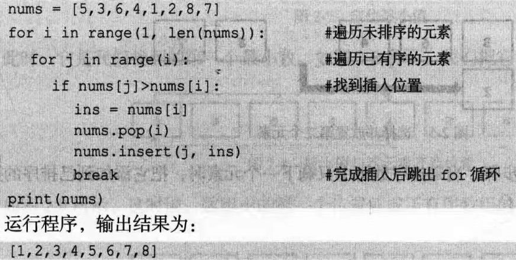

### 排序算法:

##### 1. 插入排序:

做法:将元数组的元素按顺序依次插入至数组左部分中,最终得到完整数组


时间O(n^2)

空间O(1)  (输出部分不计)

稳定排序算法

稳定:相同关键字的元素排序后顺序不变

如:冒泡,插入,归并

不稳定排序如:选择,希尔,快速法等


如图,直接在数组中进行操作,空间复杂度为O(1)

程序如上

第一个for用来遍历未排序元素

第二个for遍历已排序元素

所以最小O(n),平均O(n^2)

##### 2.选择排序

每次从未排序数组中找到最大(最小)的元素,放到有序数组开头(结尾)

如果是原地版,则从未排序部分中找到最大(小)值,和有序部分的开头(结尾)呼唤

不占空间的选择排序

第一个for指有序数组后的第一个位置,第二个for用来找最小的值

时间O(n^2)

空间O(1)


#### 3.冒泡排序

采用重复遍历数组并依次两两比较相邻元素,最大(小)的数字向末尾浮

每次遍历最后剩下的肯定是最大(小)值

最小时间O(n)

最大时间=平均时间:O(n^2)

空间O(1)


这里用>而不是≥从而维护了排序算法稳定性(相等时相对位置不变)

展示以下代码,从后往前

8被丢到最后面了

#### 高级排序算法:

#### 1.归并

归并运用了分治思想

分治算法的基本思想是将一个规模为N的问题**分解为K个规模较小的子问题**，这些**子问题相互独立且与原问题性质相同**。求出子问题的解，就可得到原问题的解。即一种分目标完成程序算法，简单问题可用二分法完成。(常用递归法)

空间复杂度O(1)

空间复杂度O(nlogn)


n是指每一行的两两比较,平均操作次数为n的线性次

logn(log_2  n)是指将8个元素分成2个一组所需的次数,红色线以下每一层代表进行了一步操作


这里先进行分组,递归然后再输出,空间显然不是O(1),但是递归可以少考虑很多情况

而想要空间为O(1),则需要使用迭代,直接在原数组上操作(递归也许也可以?)

最后的result+=为了避免未被迭代的元素被遗漏,从而实现合并数组

### 快速排序(快排)

选一个数为基准,小的左边大的右边,然后递归实现(实际上也是一个分治，不过不是均分)

平均时间=最小时间=O(nlogn)

最大时间:O(n^2),不过很少见

空间:O(nlgn)

这是一个不稳定的算法,

理想情况下速度可达归并和堆排序的数倍


#### 希尔排序：

一轮步骤如上图

1.取增量(如题增量为n/2)，然后对得到的每组数进行插入排序


2.增量减半，再进行下一轮,如上图

3.增量为1时，结束排序

```python
def shell_sort(array):
    interval = int(len(array) / 2)
    while interval > 0:
        for i in range(interval, len(array)):
            cur_index = i - interval
            while cur_index >= 0 and array[cur_index] > array[cur_index + interval]:
                array[cur_index + interval], array[cur_index] = array[cur_index], array[cur_index + interval]
                cur_index -= interval
        interval = int(interval / 2)
    return array


if __name__ == '__main__':
    array = [10, 17, 50, 7, 30, 24, 27, 45, 15, 5, 36, 21]
    print(shell_sort(array))
```

#### 堆排序:

构建近似完全二叉树,随着每次堆变化更新堆顶最大最小值,并同时满足堆积的性质：即**子结点的键值或索引总是小于（或者大于）它的父节点**。堆排序可以说是一种利用堆的概念来排序的选择排序。

不稳定,时间O(n logn)

堆元素i的父节点为 (i-1)//2

**1、大顶堆：**每个节点的值都**大于或者等于**它的左右子节点的值。

大顶堆性质：arr[i] >= arr[2i + 1] && arr[i] >= arr[2i + 2]

**2、小顶堆：**每个节点的值都**小于或者等于**它的左右子节点的值。

小顶堆性质：arr[i] <= arr[2i + 1] && arr[i] <= arr[2i + 2]

https://leetcode-cn.com/problems/kth-largest-element-in-an-array/solution/shu-zu-zhong-de-di-kge-zui-da-yuan-su-by-leetcode-/

关于堆排序的部分可以看看这里https://www.bilibili.com/video/BV1fp4y1D7cj?spm_id_from=333.337.search-card.all.click  


维护堆:

假设现在插入一下,使得堆不符合堆的性质


节点1和其子节点中较大的交换(因为节点1比其子节点3,4小)


交换后节点3比其子节点8小,所以交换节点3和8


#### 快速幂:

正常的幂:

a^n=a* a * a......

时间:O(n)

空间;O(1)

快速幂:

a^n=(a^2)^(n//2)=(a^4)^(n//4) 偶数  or a^n=(a^2)^(n//2)*a	奇数

如上,重复计算后a^n仅需要计算log n次,时间显然缩短了很多

时间:O(log n)

空间:O(log n)	一个列表记录每次平方后的值从而让奇数项得以满足

矩阵乘法的快速幂：见

[剑指 Offer 10- I. 斐波那契数列](https://leetcode-cn.com/problems/fei-bo-na-qi-shu-lie-lcof/)


### BFS广度优先搜索:

从初始点开始,依次遍历层直至找到目标结点


### DP动态规划

#### 1.DP基础：[¶](https://oi-wiki.org/dp/basic/#_5)

t贪心由来：由于尝试所有可能性的代价太高(时间太长),而且对于该问题，**全局最优的各个局部都是最优的**，所以只需要找到**各个局部最优决策**，即可找出**全局最优决策**

dp由来：前面的决策影响后面的做法，所以

1. 得到最优解的结构特征
2. 需要递归定义最优解
3. 算出最优解的值，通常是自下而上地计算
4. 利用计算中的信息得到最优解（需要最优解的时候要，第三步就得到最优解的值了 ）

这样做还有一个好处：我们成功缩小了问题的规模，将一个问题分成了多个规模更小的问题。要想得到从开头到结尾的最优方案，只需要知道从当前到下一步最优方案的信息就可以了。设g()为f()的最佳方法，则

##### 转移方程

f(x+1)=g( f(x) )

这时候还存在一个问题：子问题间重叠的部分会有很多，同一个子问题可能会被重复访问多次，效率还是不高。解决这个问题的方法是把每个子问题的解存储下来，通过记忆化的方式限制访问顺序，确保每个子问题只被访问一次。(空间换时间，非常常见的做法)


#### 能用动态规划解决的问题，需要满足三个条件：**最优子结构，无后效性和子问题重叠。**

##### 具有最优子结构：

反证法：假设其中一个结构的解个不是最优的解，可以得到全局最优解。那么可以从原结构的解中找到更优的解，从而得到全局更优的解，从而与原问题最优解的假设矛盾。

##### 无后效性

已经求解的子问题，不会再受到后续决策的影响。

##### 子问题重叠

如果有大量的重叠子问题，我们可以用空间将这些子问题的解存储下来，避免重复求解相同的子问题，从而提升效率。


##### 基本思路[¶](https://oi-wiki.org/dp/basic/#_6)

对于一个能用动态规划解决的问题，一般采用如下思路解决：

1. 将原问题划分为若干 **阶段**，每个阶段对应若干个子问题，提取这些子问题的特征（称之为 **状态**）；
2. 寻找每一个状态的可能 **决策**，或者说是各状态间的相互转移方式（用数学的语言描述就是 **状态转移方程**）。
3. 按顺序求解每一个阶段的问题。

如果用图论的思想理解，我们建立一个 [有向无环图](https://oi-wiki.org/graph/dag/)，每个状态对应图上一个节点，决策对应节点间的连边。这样问题就转变为了一个在 DAG 上寻找最长（短）路的问题。

基础(斐波那契等)

例1：[1143. 最长公共子序列lcs](https://leetcode.cn/problems/longest-common-subsequence/)

子序列不需要在原序列中占用连续的位置。而最长公共子串（要求连续）和最长公共子序列是不同的。


```python
class Solution:
    def longestCommonSubsequence(self, text1: str, text2: str) -> int:
        m,n=len(text1),len(text2)
        dp=[[0]*(n+1) for i in range(m+1)]
        for i in range(1,m+1):
            for j in range(1,n+1):
                if text1[i-1]==text2[j-1]:
                    dp[i][j]=dp[i-1][j-1]+1
                else:
                    dp[i][j]=max(dp[i-1][j],dp[i][j-1])
        return dp[-1][-1]
```

根据转移方程列出循环


#### [300. 最长严格递增子序列](https://leetcode.cn/problems/longest-increasing-subsequence/)      [¶](https://oi-wiki.org/dp/basic/#_8)

```python
# Dynamic programming.
class Solution:
    def lengthOfLIS(self, nums: List[int]) -> int:
        if not nums: return 0
        dp = [1] * len(nums)
        for i in range(len(nums)):
            for j in range(i):
                if nums[j] < nums[i]: # 如果要求非严格递增，将此行 '<' 改为 '<=' 即可。
                    dp[i] = max(dp[i], dp[j] + 1)#最优体现在这里,要不然不变,要不然从j开始+1,而j在(0,i-1)内变化
        return max(dp)
```

直接dp,对每一个起点遍历一次,

时间O(n^2)	空间O(n),dp空间

然而,O(n^2)还是太长了,有没有更好的方法呢

##### 解法二：动态规划 + 二分查找

对`for j in range(i):`这步更改一下,用二分查找即可,

时间复杂度 O(NlogN) ： 遍历 nums列表需 O(N)，在每个 nums[i]二分法需 O(logN)

```python
# Dynamic programming + Dichotomy.
class Solution:
    def lengthOfLIS(self, nums: [int]) -> int:
        tails, res = [0] * len(nums), 0
        for num in nums:
            i, j = 0, res
            while i < j:
                m = (i + j) // 2
                if tails[m] < num: i = m + 1 # 如果要求非严格递增，将此行 '<' 改为 '<=' 即可。
                else: j = m	#二分部分
                    
            tails[i] = num	#找到i的位置赋值为num(后面大了不删除,只=改小的)
            if j == res: res += 1	#res计数
        return res
```

tails用来装最大已有的数字组

#### 记忆化搜索	这部分看平板上的算法导论吧，讲的清楚多了 

记忆化搜索是一种通过记录已经遍历过的状态的信息，从而避免对同一状态重复遍历的搜索实现方式。

记忆化搜索是一种**典型的空间换时间**的思想。
记忆化搜索的典型应用场景是**可能经过不同路径转移到相同状态的dfs**问题。
更明确地说，当我们需要在有层次结构的图（不是树，即当前层的不同节点可能转移到下一层的相同节点）中**自上而下地进行dfs搜索**时，大概率我们都可以通**过记忆化搜索的技巧降低时间复杂度**。(从指数级降至O(MN))

DFS为什么效率低下呢？因为同一个状态会被访问多次。如果我们每查询完一个状态后**将该状态的信息存储下来**，再次需要访问这个状态就可以**直接使用之前计算得到的信息，从而避免重复计算**(比如在某个节点后面都不可行,那么下一次再到这个节点之间推出,减少时间损耗)。这充分利用了**动态规划中很多问题具有大量重叠子问题**的特点，属于用**空间换时间**的「记忆化」思想。


#### 背包问题

对于面试的话，其实掌握**01背包，和完全背包**，就够用了，最多可以再来一个多重背包。

如果这几种背包，分不清，我这里画了一个图，如下：


##### 01背包 


n种物品,各不相同

dp[i] [j]	i代表背包可以选择i个物品进行放入，j是背包剩余容量

1. 情况1：不放入物品i，此时 价值为dp[i-1] [j]	(少了选择,背包容量不变)
2. 情况2：    放入物品i，此时 价值为dp[i-1] [j-w[i]]+v[i]	(少了选择,少了背包容量,多了价值)

而我们的目标则是要   max(dp [ i-1] [j], dp[i-1] [j] + v[i]),即得到这俩个中的最大值

而结束条件则是背包容量满了或没有剩余物品 (dp[0] [ ]  or dp[  ] [0])


###### 根据递推公式画表:

dp[i] [j]=max(dp [ i-1] [j], dp[i-1] [j-w[i]] + v[i])

即位于[i] [j]的点必然是从**上方或左上方**(不一定是对角线上的左上角)得到的

###### 初始化 


对于i=0,j=0的情况分别初始化

而本题中i=0和j=0的列必然是要**初始化**的(初始化了下标不为0的值才能用左上角)

记得具体问题具体分析

###### 遍历顺序:

对01背包,顺序应为：

```python
for():			#物品
	for():		#背包,倒序遍历
```

下面这段代码哪里错了呢？枚举顺序错了。因为这个顺序会导致物品被多次遍历,而一个物品应当只被遍历一次.即使这道题可以用,也是有问题的

```python
for():			#背包
	for():		#物品
```

###### 为啥用一维数组就得倒叙遍历背包大小?:

使用正序遍历,因为dp[1]已经被算出,而dp[2]可能像图中那样调用dp[1]导致物品被用两次,因此使用倒叙

因为在二维数组中，dp[i] [j]是依据上一行的左边推导出来的，所以一维数组应该从右向左（倒序）遍历,才能保证dp[i] [j]上一行左边的数据不受影响(即在第i行中是一维的,所以需要倒序)


而二维数组得到的总是左上方(上一层)的值,所以不怕物品被重复使用

我们可以改变枚举的顺序，从W枚举到w_i ，这样就不会出现上述的错误，因为f_i_j总是在f_i_(j-w_i)前被更新。

即从大往小更新

```python
# Python Version
tcost = [0] * 103
mget = [0] * 103
mem = [[-1 for i in range(103)] for j in range(103)]
def dfs(pos, tleft):
    if mem[pos][tleft] != -1:
        return mem[pos][tleft]
    if pos == n + 1:
        mem[pos][tleft] = 0
        return mem[pos][tleft]
    dfs1 = dfs2 = -INF
    dfs1 = dfs(pos + 1, tleft)
    if tleft >= tcost[pos]:
        dfs2 = dfs(pos + 1, tleft - tcost[pos]) + mget[pos]
    mem[pos][tleft] = max(dfs1, dfs2)
    return mem[pos][tleft]
t, n = map(lambda x:int(x), input().split())
for i in range(1, n + 1):
    tcost[i], mget[i] = map(lambda x:int(x), input().split())
print(dfs(1, t))
```


这里的w[i]是指背包剩余空间,和上面的图不大一样,上面图是指拥有空间j时的最大容量,理解一下这个就行

```python
# Python Version
for i in range(1, n + 1):
    l = W
    while l >= w[i]:	#倒叙遍历背包
        f[l] = max(f[l], f[l - w[i]] + v[i])
        l -= 1
```

而每个物品有b个的背包则直接拓展物品数目就行

## 完全背包[¶](https://oi-wiki.org/dp/memo/#_1)


打家劫舍

股票问题

子序列

做题:

1. 创建dp数组,理解下标含义

dp[i] [ j ] 值是什么意思,i,j各自是什么意思

2. 递推公式

当然也很重要  

3. 初始化

dp数组应该怎么初始化显然是十分重要的

4. 遍历顺序

从前到后,从背包到物品 

5. 打印dp数组

  


DFS深度优先搜索


#### 自动状态机：(字符串常见)

根据题目可能遇到的情况，设置多个状态，再根据遇到的条件实现状态间的转换


如图，四个状态间切换，条件在箭头上


#### 位运算小技巧

**i/ / 2 可以通过 i >> 1 得到；**

**i*2 可以通过 i <<1 得到；**

**i % 2 可以通过 i & 1 得到；**

二进制加法可以反转数组相加

相同元素异或(^)=0

不同元素异或得到位不同的数

i&-i 得到第一位该元素的二进制数的第一位1,循环一下就可以得到所有1的位置
